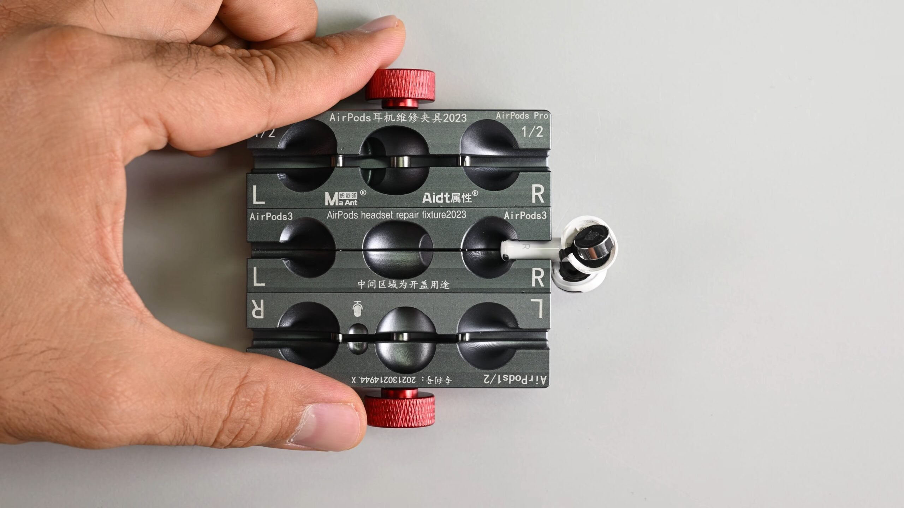
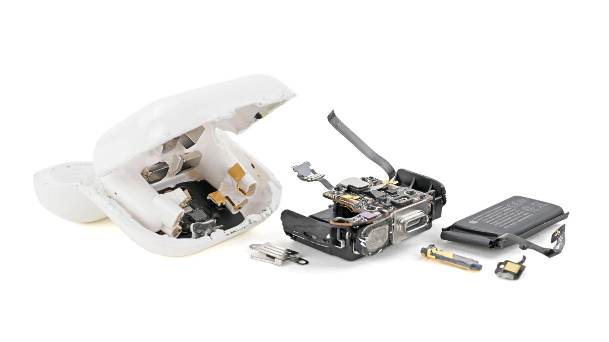

For ten years, Apple's standard AirPods racked up zeros in iFixit's repairability tests, earning a reputation as practically disposable once their tiny lithium-ion battery degrades. The fifth generation breaks that streak. The teardown iFixit published on September 29 awards the AirPods 5 a score of **2 out of 10**, the highest the specialist firm has ever given a pair of Apple earbuds, though it is still far from what counts as a genuinely repairable product.

## The AirPods 5 battery can finally be removed

The change lies in how the speaker enclosure is sealed. Previous generations required cutting through plastic or melting internal wiring to reach the cell, but on the AirPods 5 it is enough to apply gentle, controlled heat — even with a household hair dryer — along the driver seam for the housing to separate cleanly. That seam is such a fine line that it is easy to miss, just above the text with the engraved model number.

Inside, the battery returns to the prong-contact design first seen in the AirPods 3: instead of soldered leads, it has a pair of prongs that disconnect and reconnect much like a plug. To reach them without workshop tools, iFixit used a hair dryer on its low heat setting — held at a distance and kept moving so as not to melt the plastic — plus a clamp to hold the earbud. It worked, and they repeated the procedure on the second earbud with the same result.

The rest of the hardware is interesting too. Inside the stem, iFixit found the capacitive touch layer it had already seen in the last two generations of AirPods Pro — present only in the wireless charging version, according to the firm's own correction — and, beneath it, the H2 system-in-package, the chip that handles active noise cancellation with the three MEMS microphones spread between the top and bottom of the stem and the driver head.

## The left and right batteries are not interchangeable

The swap test got off to a bad start. When the left earbud's battery was placed in the right one, the app showed it was charging, but the earbud was not storing any power; putting it back brought the charge back to partial. It was not a software block or a parts-pairing scheme: on closer inspection, iFixit found the batteries' polarity was reversed and the prongs were welded slightly off-center.

They are physically different from one side to the other, so a battery that pops out easily will not work in the opposite earbud. When spare parts start going on sale, buyers will have to make sure they get the right model for the earbud they want to repair.

## The charging case is still a disaster

If the earbuds are good news, the charging case tells the opposite story. Its seams are very tight and, where screws could have been, there are plastic welds. Not even with a rework station could iFixit remove the inner layer without damaging the plastic: by the time it reached the battery, the case was destroyed. Other manufacturers have already solved this problem; Fairphone's Fairbuds, for instance, earned the first 10 out of 10 for wireless earbud repairability precisely by making the battery easy to access in both the earbuds and their case.

On top of that, Apple offers no spare parts, no repair manuals and no path for this line within its self-service repair program. The contrast with other recent teardowns is striking: in the [iPhone 18 Pro teardown](/noticias/iphone-18-pro-ifixit-teardown/), the brand had made battery replacement easier, even though the display still caused problems.

## What changes for buyers

A 2 out of 10 is still a bad score, but it breaks the pattern of zeros that turned every battery failure into electronic waste. For the first time, skilled technicians and the boldest hobbyists have a realistic chance of replacing the battery in a pair of AirPods: moderate heat and patience when prying are enough to reach the cell, something unthinkable a generation ago.

Still, it is wise not to count your chickens before they hatch. This is no simple home repair: the first attempt to open the stem had already melted plastic, and the method that works demands careful temperature control. And until Apple puts parts and manuals on sale, and the case can be opened without wrecking it, the score is unlikely to rise. The 2 out of 10 is a step forward, but it makes clear how much ground is still left to cover.
