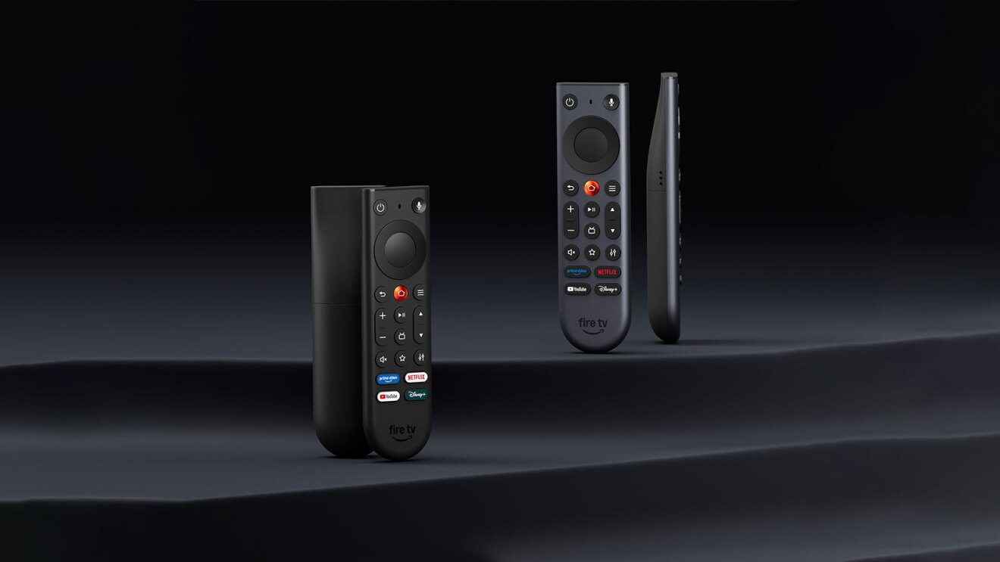

Amazon has unveiled a new Fire TV Stick 4K that confirms the company's shift toward its own software. The device goes on sale today in the United States for $59.99, debuts the Vega OS operating system instead of Android and comes with a redesigned remote. The news, announced by Amazon itself and reported by 9to5Google, leaves one clear consequence for advanced users: the ability to install apps from outside the official store is gone.

## A slimmer player with fewer cables

The new Fire TV Stick 4K adopts a more compact form factor, in line with the Fire TV Stick HD launched earlier this year, and introduces what Amazon calls Direct Power: it can be powered from the TV's own USB port with the included cable. That cuts down on cables and makes it easier to tuck the device behind the TV or take it on a trip. Amazon uses the launch to simplify its player lineup into three tiers: Fire TV Stick HD, Fire TV Stick 4K and Fire TV Stick 4K Max, with the Fire TV Cube above them.

On performance, Amazon says the device powers on and reaches content between 20% and 40% faster than a similarly priced 4K player from another leading brand, and that it beats the built-in experience of three top-selling 4K TVs across the three most popular Fire TV apps. The spec sheet lists 8 GB of internal storage, a quad-core 1.7 GHz processor, Wi-Fi 6 and Bluetooth 5.3 with Bluetooth Low Energy support, plus compatibility with HDR10, HDR10+, HLG, H.265, H.264, VP9 and AV1, with output up to 2160p at 60 frames per second.

## Vega OS: more apps, but no sideloading

The deeper change from the previous generation is the operating system. The Fire TV Stick 4K runs Vega OS, Amazon's own platform, and ships with Alexa+ and the new Fire TV experience preinstalled. According to the company, more than 2,000 apps have been added since the first Vega OS device, including Spotify, Xbox, VLC and several VPN clients, on top of Netflix, Disney+, YouTube, Prime Video, HBO Max, Peacock, Tubi, Pluto and Instagram.

The price of that modernization is the loss of sideloading, meaning the ability to add apps from outside the official store. It was a common practice among users who pushed their Fire TV devices to the limit, and there is no sign so far that it will return.

## A new remote and pricing for Spain

Alongside the player, Amazon is revamping its remote with an asymmetric design: flat on top and curved and weighted at the bottom, so you can tell at a glance how to hold it. The home button gets its own metal surface — it is pressed more than 100 million times a day across Fire TV devices —, other keys have distinct shapes or ridges so they can be found by touch, and the star button is customizable. It keeps integrated TV, soundbar and receiver controls (power, volume and mute) and works with all Amazon Ember TVs and Fire TV players released since 2019. Controlling the TV from another device is not new, as shown by the app that lets you [use a Pixel Watch as a Google TV remote](/noticias/pixel-watch-controlar-google-tv/).

The Fire TV Stick 4K costs $59.99 and starts shipping today in the United States, Canada, Japan, Mexico, the United Kingdom, Germany, France, Italy, Spain, Switzerland and Australia, with more countries later in October. In the United States it will be $29.99 during Prime Big Deal Days, half its regular price. The new remote can be preordered today as a standalone accessory for $14.99 and will ship in late October. The company has also announced the Fire TV Remote Plus, with an aluminum body and backlit buttons, arriving in early 2027 to replace the Alexa Voice Remote Pro and adding a feature to locate the remote by voice.

## What this changes for the reader

For anyone who already owns a Fire TV, the purchase makes sense above all if you want a faster start-up and a better-designed remote. For those who relied on sideloading, though, this model closes that door: the convenience of Vega OS comes at the cost of less control over what gets installed. The good news is that the rollout includes Spain from day one, which is not always the case with Amazon device launches.
