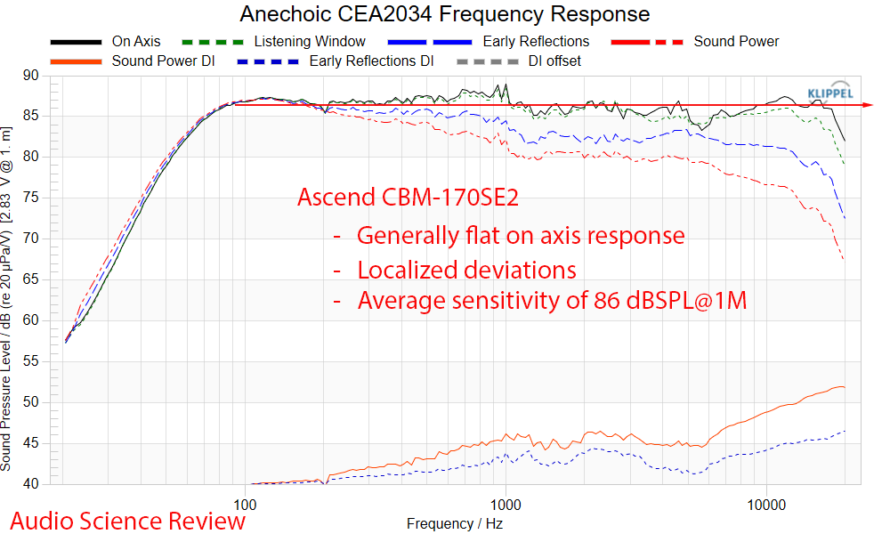
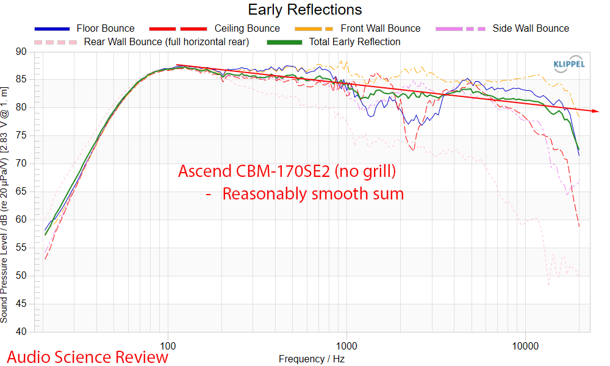
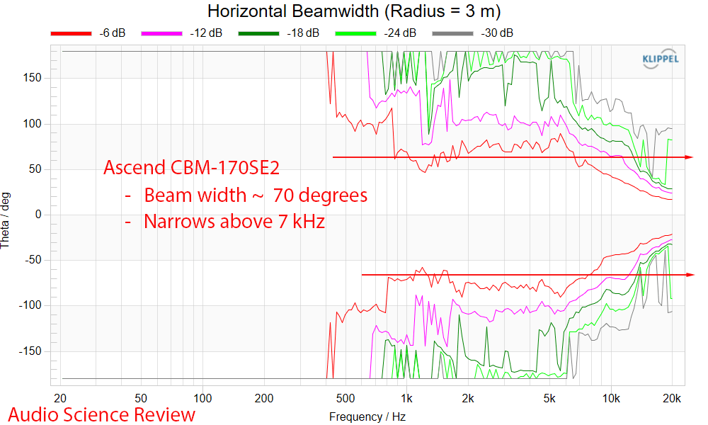
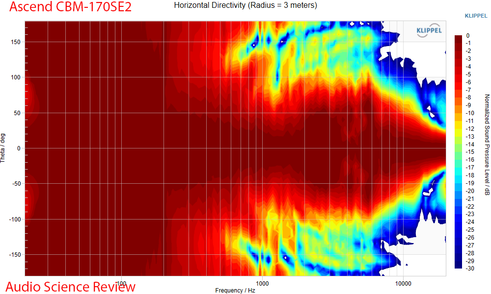
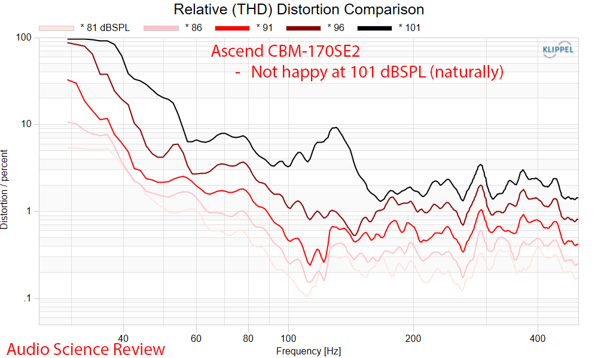

# Ascend CBM-170SE2: high-fidelity performance in a $468/pair speaker

The Ascend Acoustics CBM-170SE2 is a two-way bookshelf speaker priced at $248 per unit, $468 for the pair. Audio Science Review has subjected it to its usual battery of measurements using the Klippel NFS system, with reference taken from the center of the tweeter, and the conclusion of its author, Amir, is a firm recommendation: an American-made speaker that performs well above what its price suggests.

## The CBM-170SE2, a response designed for the room

The on-axis response is flat, which is desirable, albeit with nuances: a resonance appears around 900 Hz and 1.000 Hz, along with some minor high-frequency deficiencies. The listening window, however, is smooth, and early-window reflections sum well, indicating that the design is optimized in that regard.

The combined result yields a surprisingly good predicted room response, an area where speaker designer Dave paid special attention according to the review.

In near-field, some tweeter irregularities are visible, which integrate better into the overall response.

## Directivity, distortion and impedance

The CBM-170SE2 omits waveguides, so the tweeter produces a natural beam, with the advantage of wider dispersion in the lower treble region. The vertical response is typical of a two-way speaker: it should be listened to at tweeter height.

In power handling, the speaker held a 96 dBSPL signal without complaint, something that does not always happen. Total harmonic distortion is notably low at 86 dBSPL across the range; only from 101 dBSPL, near the start of the sweep, is some audible distortion apparent.

The measured impedance hovers around 3.5 ohms at its lowest point. The waterfall decay shows the usual resonances for this type of enclosure, while the step response is clean.

## Listening confirms what the graphs draw

The measurements hinted that some equalization would be needed, but in practice no correction was necessary: the speaker sounded clean and strong, with a fidelity that does not match its appearance or price. With eyes closed, the resulting spatial image is wide, about two meters around and above the speaker. In stereo configuration it fills a large scene with pleasant tonality and precision.

The only clear limitation is bass extension: a track with lots of sub-bass did not put it in trouble, but the speaker simply rolls off those frequencies rather than reproducing them and distorting. It is not a hidden defect, but the expected consequence of its size and price.

## Price, score and who it's worth for

The calculated preference score from the measurements is 5.80, rising to 8.16 if ideal subwoofer support is assumed. That calculation was done by an AI tool based on Amir's data, which he has not verified, so it should be taken as indicative: what stands firm are the measurements, not the note. The limitation that explains that difference lies in extension below 51.3 Hz (−6 dB), not in directivity or response smoothness.

| Specification | Value |
| --- | --- |
| Price | $248 per unit / $468 per pair |
| Type | Bookshelf, two-way, bass reflex |
| Tweeter | 27 mm, silk dome, made by SEAS (Norway) |
| Woofer | 6.5", polygel cone |
| Room response | 43 Hz – 20 kHz |
| Anechoic response | 64 Hz – 22 kHz (±3 dB) |
| Room sensitivity | 91 dB (2.83 V / 1 m) |
| Nominal impedance | 8 ohms |
| Maximum continuous power | 200 W |
| Dimensions / weight | 30.5 × 22.9 × 24.1 cm / 6.8 kg per unit |

For anyone seeking a quality bookshelf speaker for under $500/pair, the CBM-170SE2 is an option worth considering: it performs very well in everything except the deepest bass, which is resolved by adding a subwoofer. Power handling is also good, so it should not cause problems with modest power amplifiers. Those who prefer an active solution for desktop or TV use might look at the [PSB iQ2 with BluOS review](/noticias/audio/psb-iq2-altavoces/), another compact-format alternative.
