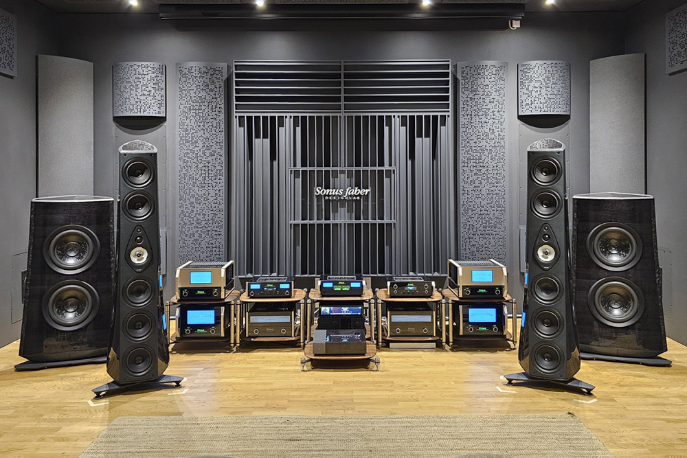
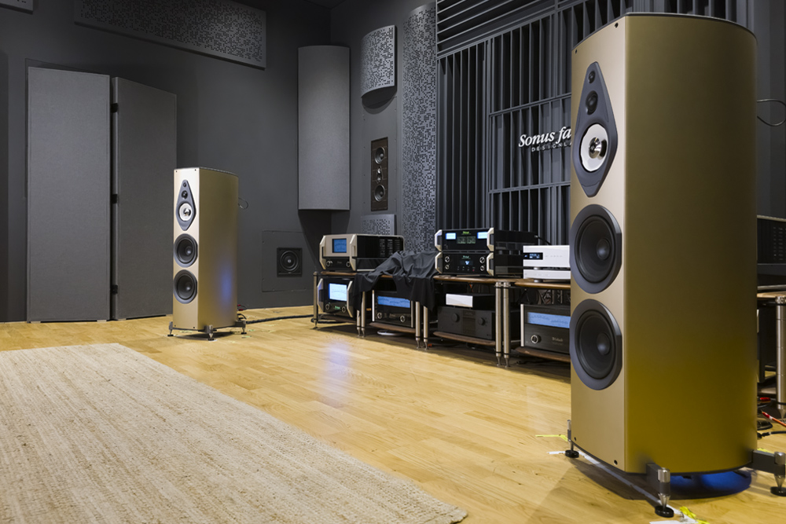
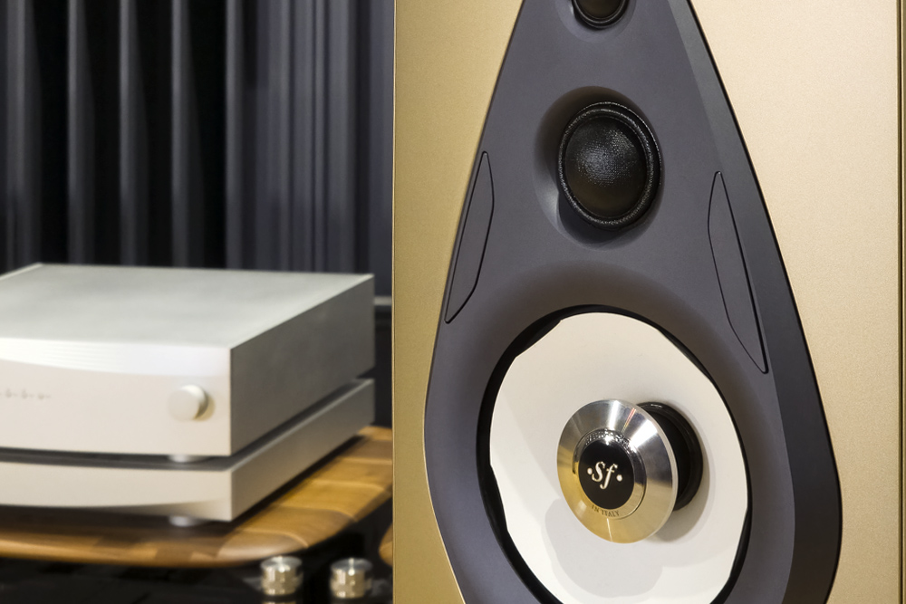
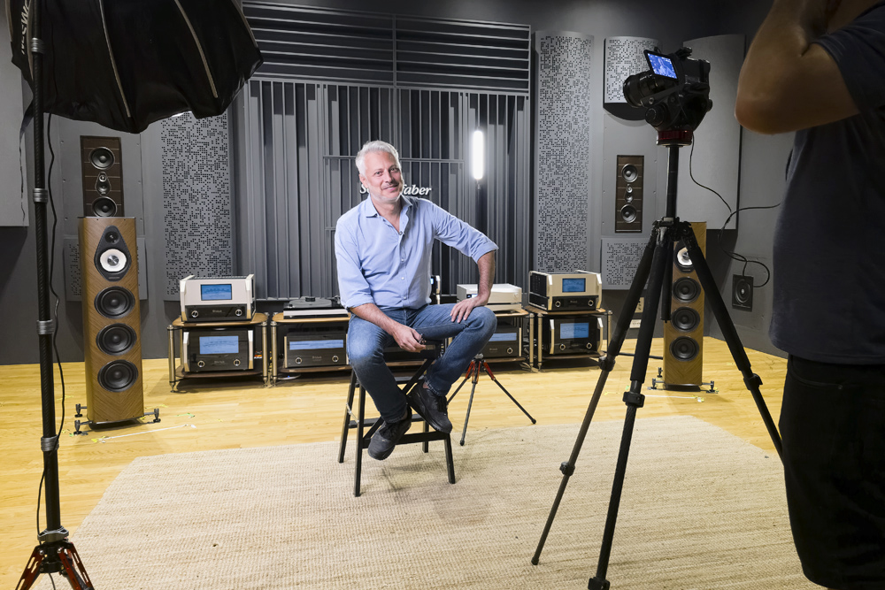
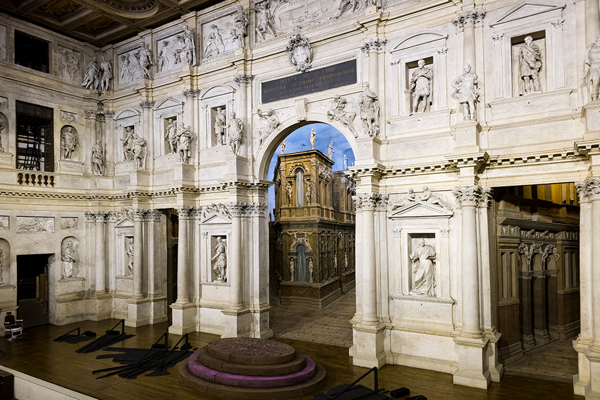

Bose closed its purchase of the McIntosh Group in November 2024 and, with it, took over McIntosh Laboratory, Sonus Faber and Sumiko. Almost two years later, the question enthusiasts asked back then is still on the table: what happens when an Italian high-end loudspeaker company lands on the balance sheet of an American corporation. The report SoundStage! Hi-Fi published after returning to Sonus Faber's headquarters in Vicenza, in September 2026, answers it with data: the Olympica G3 and the Amati Supreme show what has changed and, above all, what has not.

## Who owns Sonus Faber now

The 2024 deal placed three brands with very different histories under Bose: McIntosh Laboratory, Sonus Faber and Sumiko. Bose is neither a listed company nor owned by a private-equity fund. It remains privately held and, since 2011, most of its shares sit with MIT: founder Amar Bose donated those non-voting shares, which cannot be sold, though the institute receives their dividends. It is an unusual structure that keeps the brand away from quarterly-report pressure.

Bose groups the three companies' initiative under the name Bose Luxury and wants to use its reach to bring Sonus Faber, McIntosh and Sumiko to a much wider audience. The starting point is clear: high-end audio has spent decades selling to a small group of enthusiasts, while Bose knows how to put audio products in front of millions of people who would never walk into a specialist store.

## What has not changed

The short answer is: the essentials. According to SoundStage! Hi-Fi's report, Sonus Faber's engineering and design operation has grown with additional staff, and the woodworking factory has expanded. It used to occupy a single large building, about a 30-minute drive from the main factory; it is now spread across two. The company still designs its own drivers — bespoke designs manufactured by outside suppliers to its specifications — and the cabinets and finishes that have long defined the brand are still built in Italy.

Livio Cucuzza remains in charge of product development. He joined the company in 2010, and the Amati Futura, introduced in January 2011 at CES in Las Vegas, marked a turning point in its catalogue. The technical direction he set is still in place: the models heard in Vicenza were developed along Sonus Faber's pre-acquisition engineering line, not Bose's. The buyer's expertise and resources are available, but they barely weighed on those speakers. Where Bose's influence is visible today is in business and marketing strategy.

**The Sonus Faber team and the report's author during the 2026 visit**

## Suprema technology moves down the range

When Sonus Faber unveiled the Suprema, a complete system with two subwoofers at US$750,000, the easy reading was that of an unattainable object. The other reading, the interesting one, is that of a technology platform: much of its engineering was meant to end up in more affordable products. That trickle-down is now visible in two launches.

The first is the Olympica G3, the third generation of a line that debuted in 2013 and comprises five models: the Olympica I standmount, the Olympica III and Olympica V floorstanders, the Olympica C centre and the Olympica W on-wall. It keeps the lute-shaped wooden enclosures and the distinctive slotted port, but refines the finish with a new 45-degree herringbone pattern on the wood veneer and matte-grey aluminium details with polished chamfers. There are two finishes, Walnut and Wengé. What matters is inside: it inherits the Camelia midrange with its cork enclosure and the system the company calls Phase Coherent Crossover, designed to align the phase relationships between drivers and make several drivers behave like a single one. The Olympica V G3 costs €27,000 per pair.

The second is the Amati Supreme, launched in the autumn of 2025 at €78,000 per pair. Its origin is almost experimental: the Design Lab team asked what would happen if the three mid- and high-frequency drivers developed for the Suprema — the same ones, not cheaper derivatives, including the Camelia — were fitted into the Amati G5 architecture. Below them sit two 8″ woofers from the Amati G5, and the main cabinet is essentially that model's with different finishes. It debuted in Sabbia Oro (matte gold) and Terra Rossa (matte red), and three veneer finishes followed: Wengé, Red and Graphite.

## What it means for the buyer

The conclusion of the visit is that Sonus Faber has not gone backwards. If the Suprema served to name a V3.0 era, the Olympica G3 and the Amati Supreme do not amount to a V4.0, but rather a V3.2 or V3.5: evolutions that bring in new technology without disowning the identity that made each line work.

For a potential buyer, the practical consequence is that the flagship's improvements stop being a shop window and reach lower prices, though they remain high-end. In listening, the midrange and tonal neutrality are the traits that come up most, with the caveat that comparing models at very different prices is never linear: paying almost three times more does not buy three times the quality. There stand the €27,000 of the Olympica V G3 against the €78,000 of the Amati Supreme.

The underlying question remains open: how to take a specialist company to a much wider audience without diluting what made it special. From what was seen in Vicenza, Bose does not appear to be interfering with the engineering, and the product direction is still where it was. The question is not what has changed at Sonus Faber, but how far its new owner intends to take it. As context for the same brand, Bose has also kept its consumer-market momentum with recent moves such as the [return to USB-C wired headphones](/noticias/bose-auriculares-cable-usb-c/) and the [Auracast update for the QuietComfort Ultra](/noticias/bose-quietcomfort-ultra-auracast/).

**Livio Cucuzza, during an interview at the Vicenza headquarters**

