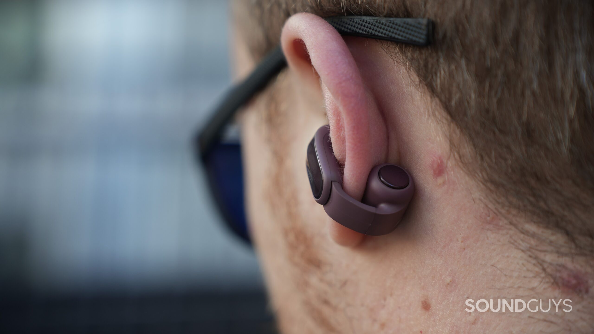
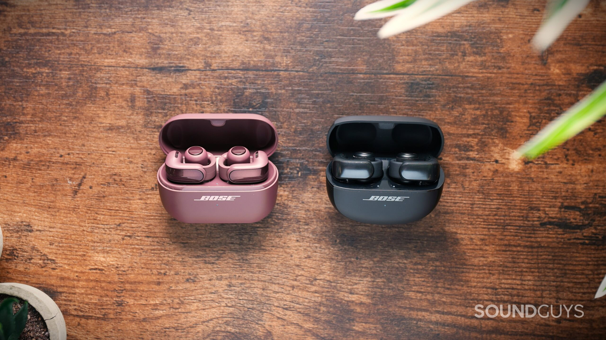
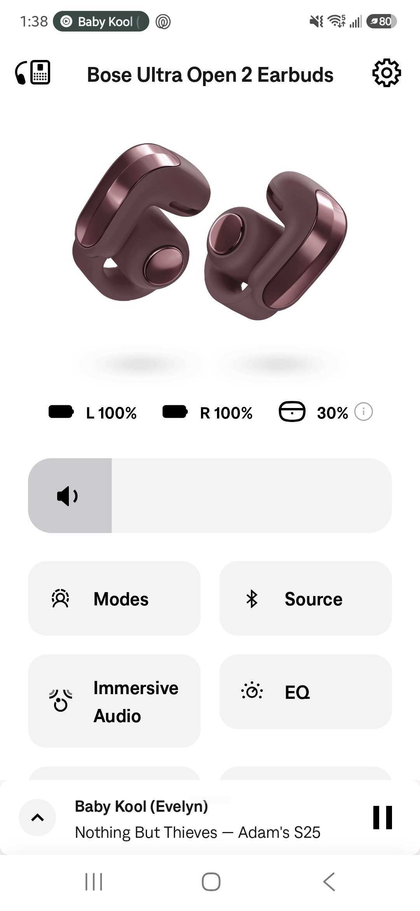
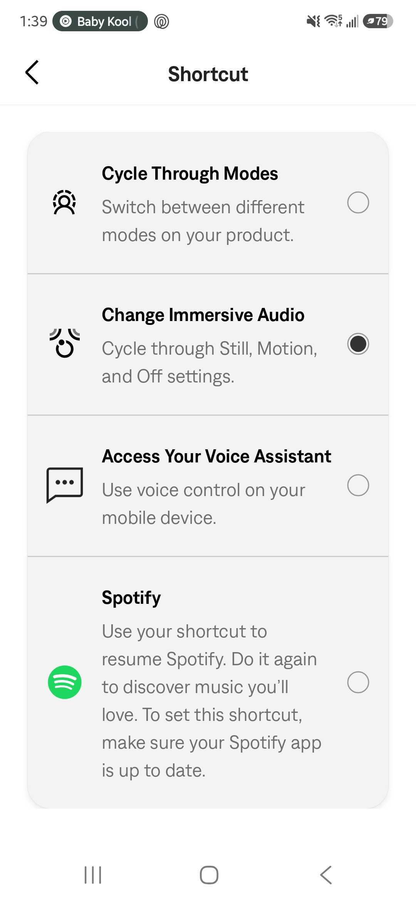

# Bose Ultra Open Earbuds 2nd Gen Improve Sound and Battery but Keep the $299 Price

Bose is selling the second generation of its Ultra Open Earbuds at the same price as the first: $299 (model 897806-0030), with a launch date of October 2, 2026. The company claims that the new version corrects the weak points of the original model—with a redesigned driver to deliver more bass and volume, new microphones, and longer battery life—without touching the clip-on design that characterizes this family. SoundGuys has already analyzed them and its verdict is nuanced: they improve what was lacking, but the price still weighs heavily.

## What Changes in the Bose Ultra Open Earbuds 2nd Gen

The form factor doesn't move. Each earbud keeps the piece that sits next to the ear canal, the silicone joint that surrounds the edge of the ear, and the battery cylinder with controls behind it. What does change is the stiffness of that joint, now looser and easier to open, and an exterior finish that looks metallic with a beveled edge that, in reality, is still plastic.

In the charging case there are more tangible usability changes. It now stands vertically on a silicone base and supports wireless charging in addition to USB-C, something that in the original model required buying a separate case. The USB-C port and pairing button move to the sides, so you can connect the case or pair a new device without tipping it over.

## What Is Measured: Sound, Calls and Battery

In sound, the second generation wins where the first failed. Bass has more presence and treble stops sounding harsh whenever listened to at a contained volume. Isolation, however, does not improve because it is not the product's goal: since it doesn't seal the ear canal, there is barely any measurable attenuation and no active noise cancellation. For good, it lets the environment through; for bad, music competes with street noise and it's easy to turn the volume up too much.

Calls were the weakest point of the original and Bose has worked on them. Each earbud now combines a microphone with a voice pickup unit that detects vibrations from speaking, and SpeechClarity processing uses both to separate voice from noise. Under ideal conditions the recording sounds clear, but in an office, on the street, and especially with wind, the voice comes out muted and is hard to understand. SoundGuys also warns that its tests are done on a mannequin head that doesn't vibrate like a real one, so it calls for taking voice results cautiously.

In battery life, Bose claims up to 9 hours of playback, but in the medium's standardized test the earbuds lasted 13 hours and 1 minute, more than four hours longer than the previous generation in the same test. The case adds another 19.5 hours, for a total of 28.5, with fast charging of about 10 minutes for about 2 hours of listening. That margin drops to 5 hours when spatial audio modes or automatic volume are activated.

## What It Means for Someone Looking for Open Earbuds

The new Cinema mode, designed for video and podcasts, widens the soundstage without displacing dialogue from center, and Bose's app keeps its three-band equalizer with presets, more limited than those of competitors like Soundcore or Sony.

The automatic volume inherited from the first model still overcorrects: in the test it jumped the level abruptly because it detected ambient noise that was barely audible. Bose has promised a firmware update with Google Find Hub, integrated Alexa+, and an Apple Music shortcut.

In connectivity everything is up to date: Bluetooth 5.4, SBC/AAC/aptX Adaptive codecs, and multipoint by default for having two devices linked at once. What doesn't arrive is Auracast, the function that allows tuning into audio broadcasts in public spaces or sharing sound between multiple earbuds.

Is it worth it? SoundGuys concludes that these earbuds correct most of the original's defects—more bass, less aggressive treble and a better-resolved case—but that $299 is hard to justify in an increasingly crowded market. The Bose Sport Open Earbuds cost $199, the Sony LinkBuds Clip 229.99, and the CMF Clip Pro stays at $79, with an experience that, according to the analysis, comes close enough for most people at a much lower price. In the catalog there are already examples of this more economical offensive, like the [Ugreen ClipBuds Pro 2](/noticias/audio/ugreen-clipbuds-pro-2/), which bet on the same open format at $99.99.
