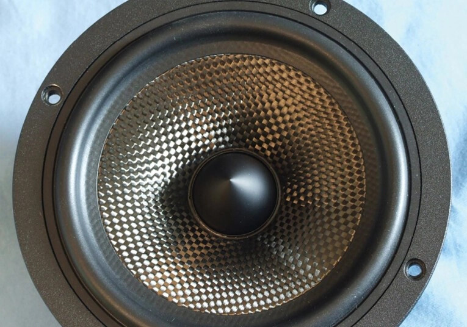
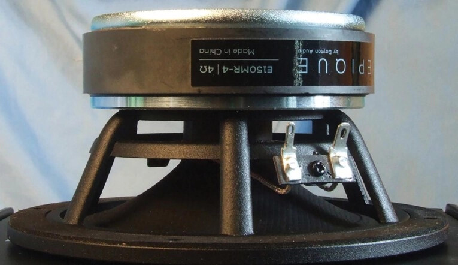
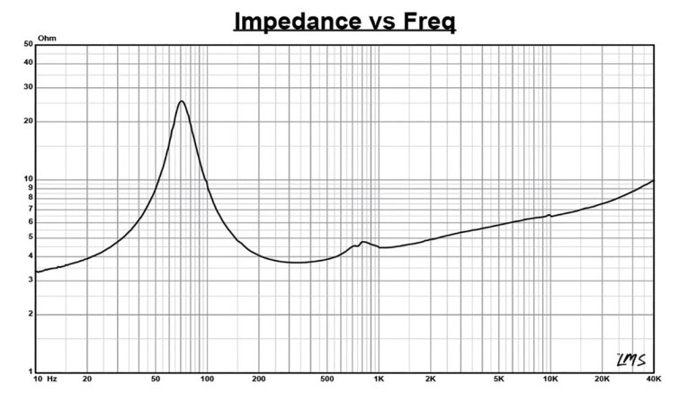
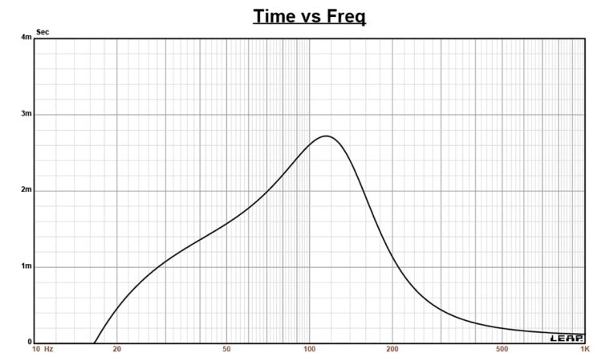
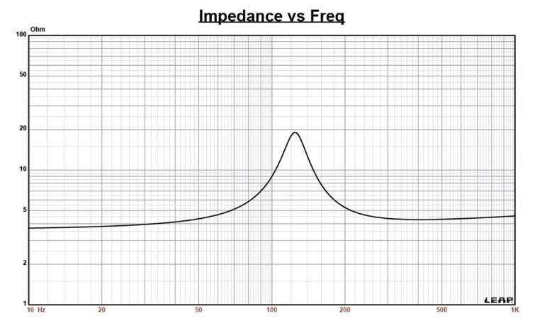
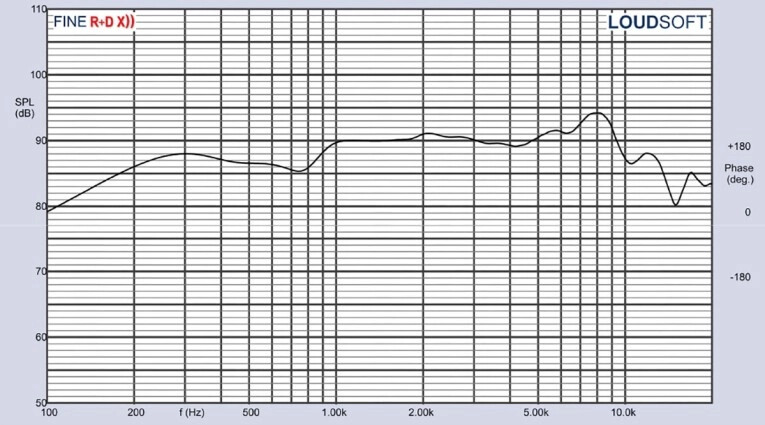
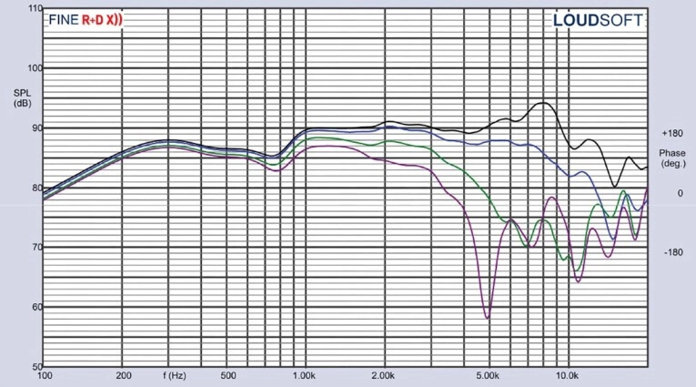
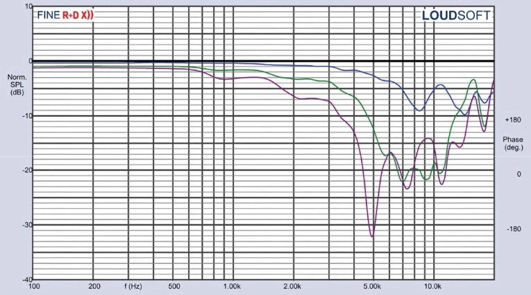
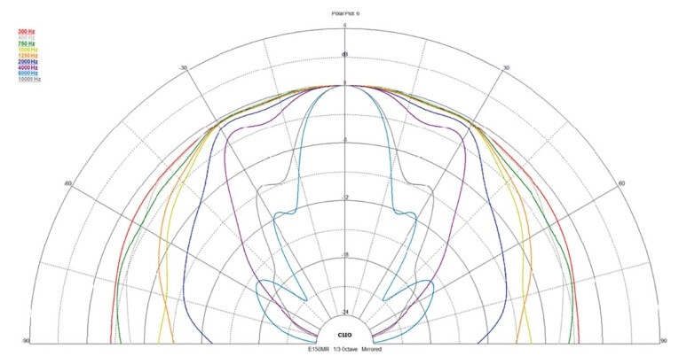
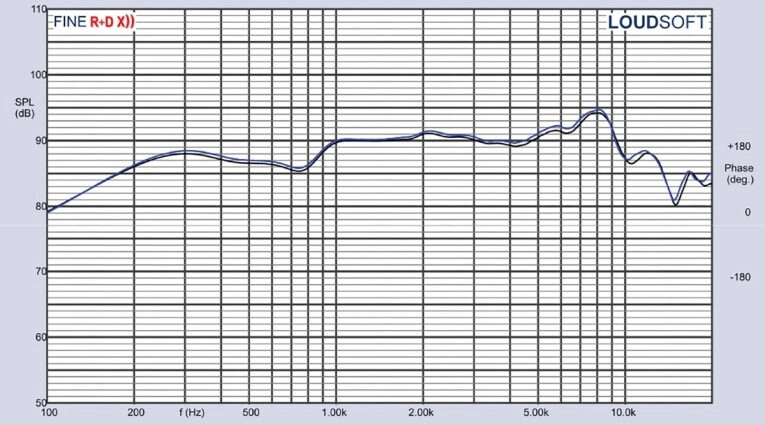

# Dayton Audio E150MR-4: A 5.5-Inch Carbon Fiber Midrange Driver for $59.95

Dayton Audio sells the E150MR-4 for $59.95, a 5.5-inch midrange driver with a carbon fiber cone that is part of the Epique line, the brand's high-end and affordable price range transducer series. Voice Coil has run it through its test bench, and the results back up the label: expensive-sounding speaker materials at a cost that fits any build budget.

## High-End Materials in an Affordable Driver

The E150MR-4 uses a titanium voice coil former, a material that is stiffer than aluminum and less prone to deformation during large excursions. Additionally, it is paramagnetic and, in its pure form, does not conduct magnetism, which avoids parasitic effects on the motor.

The chassis is a six-arm cast aluminum basket with narrow spokes between 8.5 and 10 mm, tuned to reflect little. It remains completely open below the spider mounting platform, and that opening serves as the motor's primary cooling system: this driver has no pole vent, so air channels toward the front plate rather than exiting from behind. This is a useful scheme in a driver that won't be working below 100 Hz.

The moving assembly combines a molded carbon fiber cone with a curvilinear profile, which aesthetically recalls old woven fiber cones but is a solid piece, topped with an aluminum phase plug. The suspension consists of a positive roll NBR rubber surround with a smooth transition to the cone, completed by a 3-inch diameter flat cloth spider.

The motor uses a ferrite magnet, with the T-pole provided with a copper shorting ring (a Faraday screen) and an aluminum sleeve over the pole. The voice coil measures 30 mm in diameter, has two layers of round copper wire on the titanium former, and Xmax sits at 2.7 mm, a fairly generous figure for a midrange. Power handling is rated at 60 W RMS and the terminals are solderable Faston type, located on one side of the chassis.

## What the E150MR-4 Measurements Say

Voice Coil analyzed two samples with a single admittance and voltage sweep at 1V using the Physical Labs IMP box, rather than the multi-voltage protocol typically used for drivers that work lower down. The goal was to set enclosure volume and determine resonance frequency and Q factor, useful data if designing a passive high-pass filter, and irrelevant if active filters are used.

The calculated parameters match quite well with those published by Dayton Audio, with one exception: the measured 2.83V/1m sensitivity comes out higher than what factory parameters predict, which were probably taken as an average. Still, box simulation using manufacturer data stays within less than 1 dB of the measured result, a sign that resonance frequency and Q relationships are very close.

In Dayton Audio's recommended 0.12 cubic foot sealed box with 50% fiberglass stuffing, response falls 3 dB at 111 Hz (F6 of 92 Hz) with a Qtc of 0.89. That is more than adequate behavior for a midrange that will cross over above.

On-axis response is moderately smooth and rising: it stays within ±2 dB between 200 Hz and 750 Hz, rises about 5 dB between 750 Hz and 1 kHz, and from there flattens with ±1 dB up to 7 kHz, with a 3 dB peak centered at 8 kHz where the second-order roll-off begins. Off-axis, the 3 dB drop at 30 degrees relative to axis falls between 2 kHz and 3 kHz, so a crossover point in that region, or somewhat lower, gives good power response.

The two samples behave very coherently: comparison of their sound pressure curves stays between 0.5 dB and 1 dB across the entire working range. That is the kind of consistency you appreciate when buying multiple units for the same box.

In distortion, measured at 94 dB at 1 meter with pink noise and the microphone at 10 cm, a very low third harmonic stands out in the working region and a second-harmonic peak centered at 750 Hz. Spectral decay graphs complete the portrait of the motor.

## What Changes for Those Building Speakers

For those building boxes, the E150MR-4 presents itself as a midrange to cross between 100 Hz and 200 Hz at minimum, mounted in a small sealed enclosure with the low-pass filter in the 2 kHz to 3 kHz region to care for power response. It does not need a resonance correction filter if active filters are used; if a passive option is chosen, F0 and Q data allow designing a conjugated LCR filter that facilitates that high pass.

What matters is not each figure separately, but the combination: titanium former, carbon fiber cone, and dual shorting ring are solutions typically seen in more expensive transducers. At $59.95 at Parts Express, and less at OEM price, it leaves room to dedicate project budget to the parts that actually need it. Is it worth it? For a midrange that doesn't go below 100 Hz, the measured data and its price make it a hard-to-beat value option.

For more audio analysis and news, the [Audio section](/noticias/audio/) collects the rest of the coverage.
