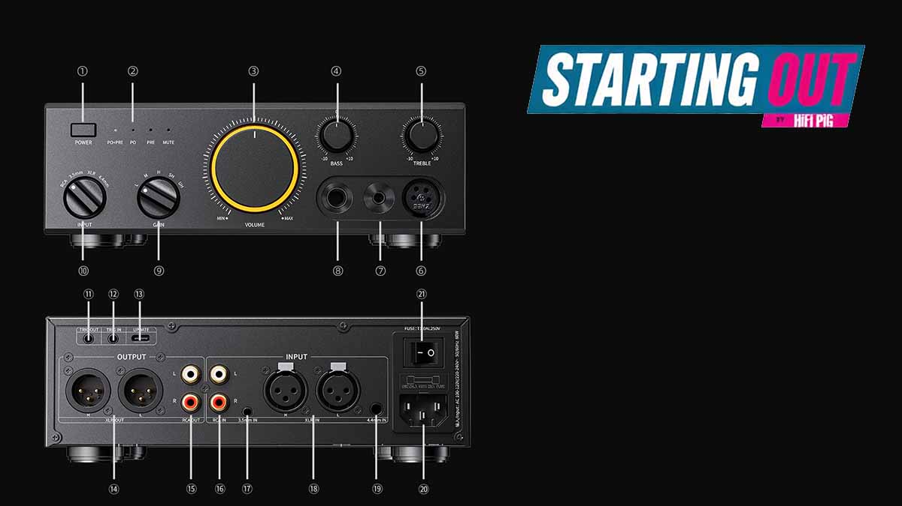

FiiO has put the CLASS A on sale for £379.99 in the UK. It is a desktop headphone amplifier that also works as a volume-controlled preamplifier for active speakers. The unit is analogue from end to end: it includes neither a DAC nor a power stage, so it needs a source and, if that source only has a digital output, an external converter in between.

## FiiO CLASS A: what Class A means

In a Class A circuit the output devices remain active throughout the signal cycle. That approach avoids one type of switching distortion, but it uses more electricity and tends to make the case warm. On its own it does not guarantee better sound: it is an architecture, not a certificate of quality.

FiiO uses a fully discrete circuit, with individual transistors, resistors and capacitors instead of a single integrated chip. The company says it matches and adjusts the components of each channel during manufacture.

## Power and controls

The company quotes up to 4,000 mW per channel into a 32-ohm load through the balanced headphone connection. That is a maximum specification under stated conditions, not a listening level to aim for: start with the volume low. The CLASS A offers five gain settings to match headphones of different sensitivity.

Separate bass and treble controls allow adjustments of up to 10 dB in either direction. They are useful for taming a pair of headphones that sounds a little heavy or bright, although subtle settings are usually easier to judge than extreme ones.

## Connections for a system that grows

The 3.5 mm and RCA inputs accept ordinary analogue sources, while the balanced 4.4 mm and XLR inputs open up other routes for compatible equipment. Its three headphone outputs —a 6.35 mm jack, a balanced 4.4 mm and a four-pin XLR— cover the usual full-size plugs and balanced models, although a balanced socket only helps if the headphone cable is made for it.

The RCA and XLR line outputs let the amplifier control the level sent to active speakers or a separate power amplifier. It cannot drive passive speakers on its own, and a computer using USB audio will need a DAC between the computer and one of the analogue inputs.

## Price, availability and fit

The CLASS A is listed at £379.99 in the UK. FiiO says overseas shipments are being arranged progressively and that local stock may vary; black and silver versions have been reported.

This is a specialist component for someone who already has headphones and a suitable source, or who plans to build a separates system over time. FiiO positions it alongside its DP11 CD player and its WARMER R2R DAC, but those are separate purchases. Is it worth it? Compared with the output of a laptop or a phone, an amplifier like this only makes sense when the headphones ask for more voltage or current than the source provides; anyone already listening to a pair of [Technics EAH-A1000 headphones](/en/news/technics-eah-a1000-review/) from a basic setup will find the next step in the chain here, not just one more accessory.
