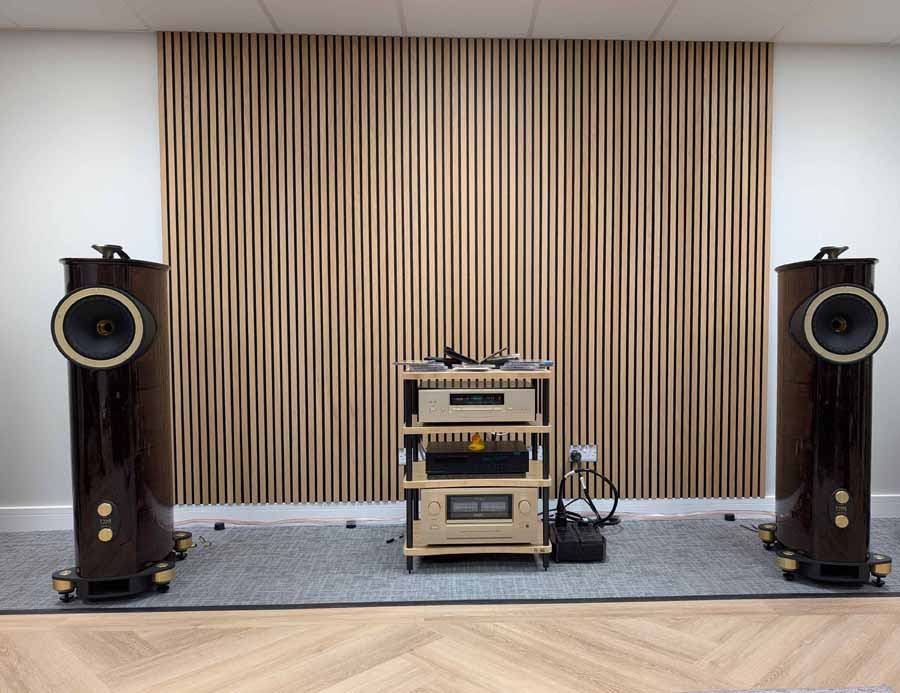
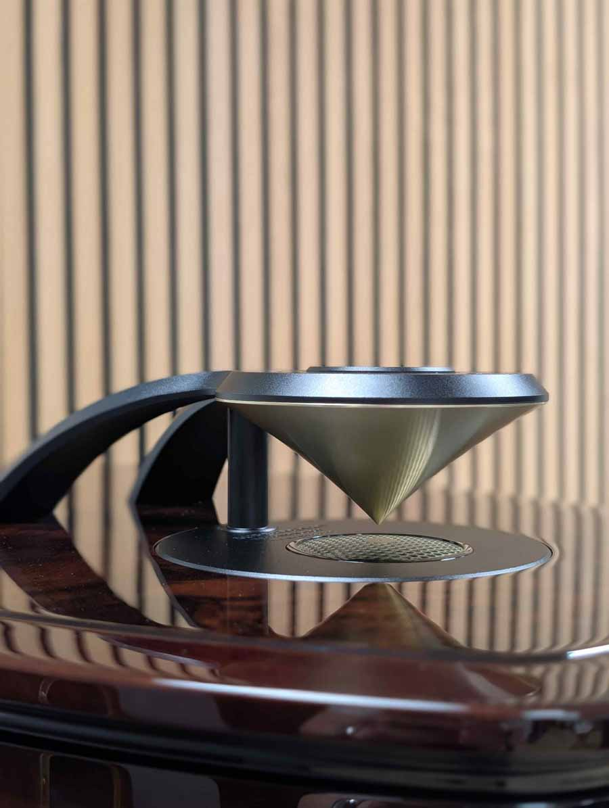
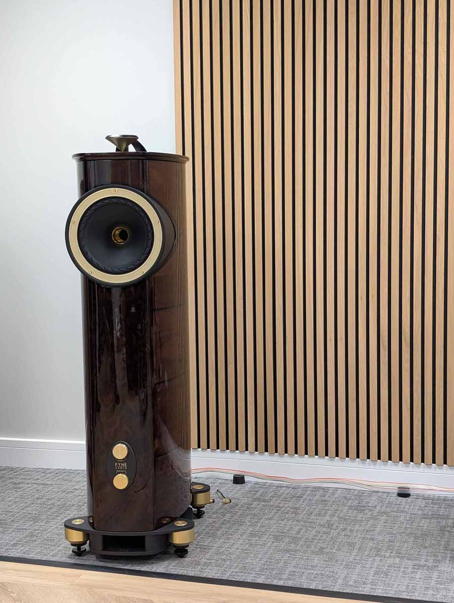

# Fyne Audio F1-10 Anniversary: 30 pairs to celebrate ten years of the Scottish brand

The Fyne Audio F1-10 Anniversary is a limited-edition tower speaker in 30 numbered pairs worldwide with which the Scottish firm commemorates ten years since the original F1-10, the first model to bear its name. The price is £36,999.99 (US$49,999.99; €42,999.99) per pair and can already be ordered through the brand's authorized distributors. Each pair is built, assembled, finished and tested at Fyne Audio's plant in Glasgow, with 100 hours of break-in applied before delivery.

Hifi Pig, which heard the model at the company's headquarters in Glasgow during a visit to its factory, maintains that this is not merely an aesthetic update. The F1-10 Anniversary combines a redesigned IsoFlare driver, SuperTrax technology integrated directly into the cabinet, and a hand-built crossover, plus tweaks to the bass system.

## A redesigned IsoFlare for the F1-10 Anniversary

The heart of the F1-10 Anniversary is a 250 mm point-source IsoFlare driver. The main novelty lies in the 75 mm compression tweeter, which debuts an aluminosilicate glass diaphragm instead of the metal dome of the original model. The mid-bass cone, made of multi-fibre, retains the FyneFlute suspension, and the high-frequency path uses a chemically treated ultra-thin glass diaphragm to gain rigidity without adding mass.

The compression driver works up to a crossover point of 750 Hz. Fyne Audio has also developed a computer-optimized annular waveguide for the new glass diaphragm, with the aim of preserving the IsoFlare's point-source characteristics and controlling its dispersion. The material change in the treble path points to more restrained behaviour at the top end; as yet the brand has not published frequency response or distortion graphs, so that effect will have to be confirmed with measurements.

## SuperTrax is integrated into the cabinet

The F1-10 Anniversary is the first Fyne Audio speaker to incorporate SuperTrax as an integral part of the enclosure. It is a 25 mm supertweeter with a Thin Ply Carbon diaphragm mounted horizontally on the top panel and oriented upwards, where it meets a machined Tractrix-profile diffuser.

The assembly generates a 360-degree wavefront and extends the system response beyond 60 kHz. The SuperTrax is temporally aligned with the IsoFlare driver and includes a ±3 dB energy adjustment in the band from 16 kHz to 60 kHz. In speakers of this type, the supertweeter does not seek so much to sound on its own as to distribute high-end energy more uniformly throughout the room.

## Crossover, bass and hand-finishing

The crossover has been developed specifically for this edition. It uses low-loss laminated-core inductors, non-inductive thick-film resistors and ClarityCap polypropylene capacitors of PUR grade. Instead of being mounted on conventional printed-circuit boards, it is wired directly onto rigid fibre panels, and each unit undergoes the brand's deep cryogenic treatment process. The signal path includes internal Neotech PC-OCC cabling and WBT Nextgen gold-plated bi-amplifiable terminals, with a fifth ground terminal and ±3 dB treble and presence controls.

At the low end, the BassTrax Tractrix Diffuser system is integrated into a double-layer aluminium plinth and converts the downward-facing port output into a 360-degree spherical wavefront. An internal dual-cavity system manages standing waves and cone behaviour around the tuning frequency of the port.

The enclosure retains the curved shape of the original F1-10 and combines high-density birch wood with internal reinforcements, to which the IsoFlare assembly is mechanically attached. The finish is American walnut veneer with contrasting high-gloss burl walnut, solid walnut mouldings and champagne gold details, all under a piano lacquer resistant to UV rays.

Each numbered pair is delivered with machined floor protection cups, an adjustment tool, Neotech jumper cables, an individually signed anniversary booklet, approval certificates, engraved limited-edition Glencairn whisky glasses and an optional black driver trim kit.

## Price, availability and review

The F1-10 Anniversary sells for £36,999.99, US$49,999.99 or €42,999.99 per pair, with production limited to 30 numbered pairs and immediate availability through the Fyne Audio distributor network. The engineering figures go beyond a finish change: there is a new diaphragm in the treble path, a revised IsoFlare, SuperTrax integrated for the first time into the cabinet, and a redesigned crossover, plus improvements to the bass system.

The launch also arrives in a context of consolidation in the high-fidelity speaker segment, as shown by [Bose's acquisition of Sonus Faber](/noticias/audio/bose-compra-sonus-faber/). For most listeners, €43,000 per pair is out of reach; what matters is checking whether some of these solutions eventually filter down to more affordable models. Is it worth it? As a collectible object, yes for anyone seeking a numbered series; as a speaker to listen to every day, its real interest lies in the testbed it represents for the brand.
