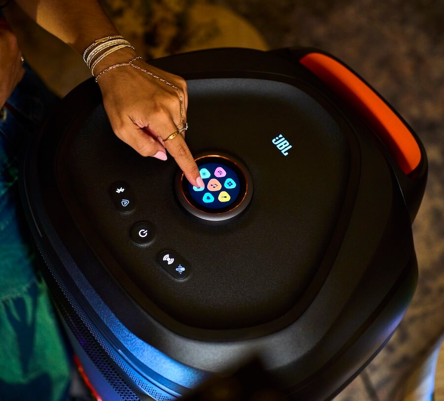
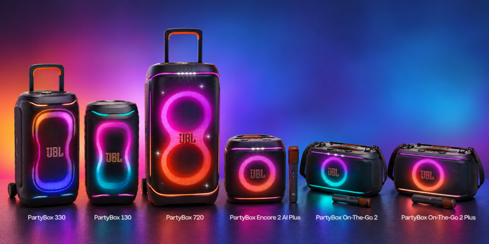
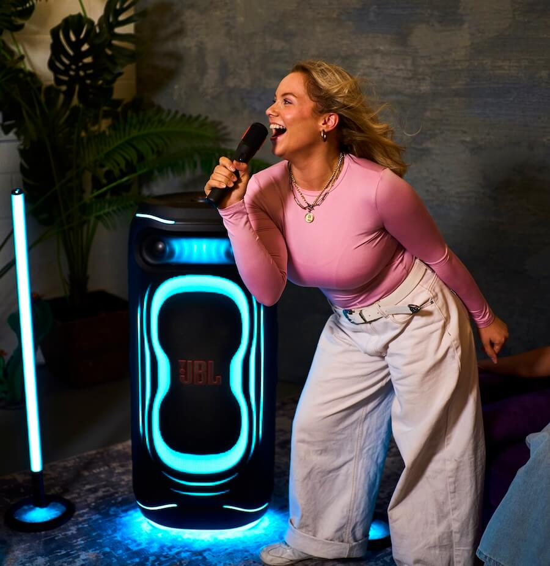
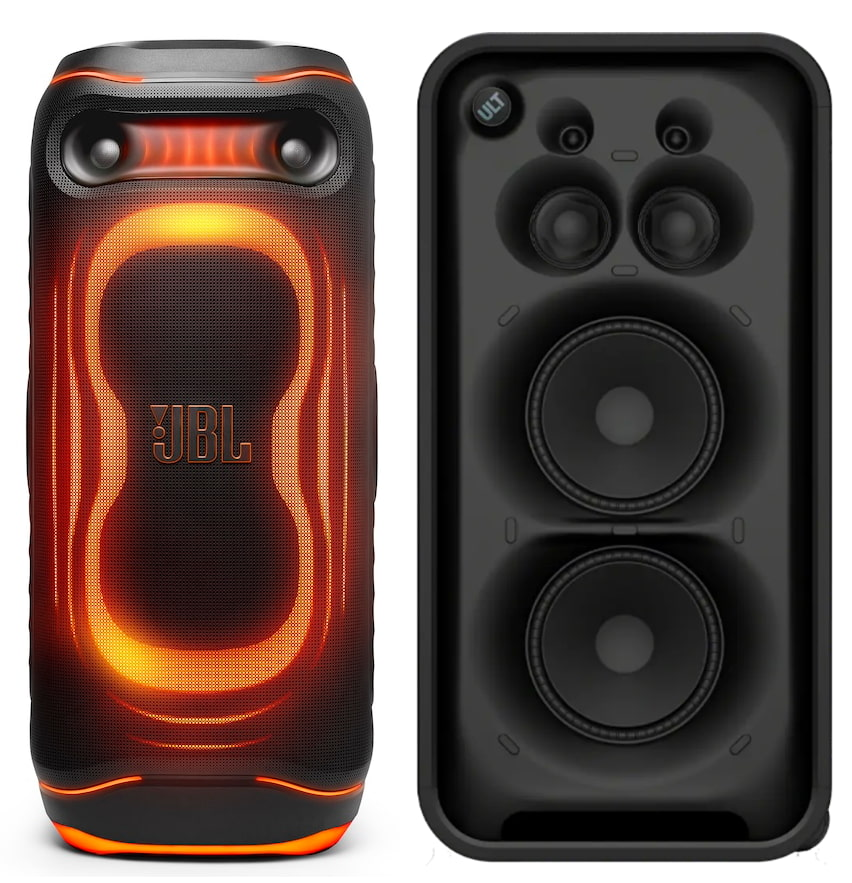

JBL has put a price on the **PartyBox Ultimate 2**: $1,799.95 in the United States. It is the brand's most powerful party speaker and replaces the original PartyBox Ultimate, whose idea it keeps while reworking the acoustic architecture. The official spec sheet claims **1,500 W RMS**, two 10-inch woofers, two 5-inch midrange drivers and two horn-loaded tweeters inherited from JBL's professional-audio experience. The whole unit weighs 47.68 kg (105.12 lb) and measures 466.7 × 1,052.5 × 493.3 mm. There is no battery: it only works plugged into the mains.

## What changes on the PartyBox Ultimate 2 versus the original

The jump is not just about watts. The previous model started at 1,100 W and used two 9-inch woofers, 4.5-inch mids and larger conventional tweeters; the Ultimate 2 fits bigger woofers and mids and adds horn-loaded tweeters. On paper, the claimed frequency response runs from **28 Hz to 20 kHz (-6 dB)**.

Two processing features are added on top: **AI Sound Boost**, which analyses the incoming signal in real time to adjust output and contain distortion as the volume rises, and **Smart EQ Mode**. It is also the first PartyBox with an integrated touchscreen: the top-mounted volume control doubles as a display and a control hub for music, lighting and settings, without relying on a phone. The light show is redone as well, with ripple effects across the whole panel, multilayer illumination and floor projection.

## More of a network speaker than a party speaker

The connectivity is the least expected part of a speaker like this. The Ultimate 2 supports **Wi-Fi 6**, **Bluetooth 6.0**, Bluetooth LE Audio, **Auracast**, AirPlay, Google Cast and Spotify Connect, and is managed with the JBL ONE app. Through its Wi-Fi platform, JBL also lists **TIDAL Connect, Qobuz Connect and Roon Ready**. The USB-C port plays lossless audio and Auracast links several compatible speakers for larger setups, an ecosystem the brand already uses in products such as the [Cinema SB MK2](/noticias/jbl-cinema-sb-mk2/) soundbars.

In practice, this places it above many party speakers in network-audio credentials, and below them in something more basic: carrying it from one place to another.

## The PartyBox 720 range and EasySing's AI karaoke

The Ultimate 2 does not arrive alone. JBL is refreshing the PartyBox family and introducing **EasySing**, a technology aimed at singing. As [Gizmochina](https://www.gizmochina.com/2026/10/05/jbl-partybox-new-speakers-easysing-ai-mics/) reports, the new flagship of the series is the **PartyBox 720**: 800 W RMS with two 9-inch woofers and 30 mm dome tweeters, up to 15 hours of playback, wheels, an ergonomic handle, IPX4 resistance and two XLR inputs for microphones, guitars or DJ equipment. Below it sit the PartyBox 330 (280 W, two 6.5-inch woofers, up to 18 hours) and the PartyBox 130 (200 W, two 5.25-inch woofers, up to 15 hours).

The portable PartyBox On-The-Go 2 models deliver 100 W and up to 15 hours; the **AI Plus** version adds EasySing AI Vocal Removal, pitch support and natural reverb, and includes an EasySing microphone. JBL also sells the **EasySing Mics** separately as a pair, with AI vocal removal, voice boost, natural reverb, echo control and AI noise suppression; they claim 10 hours of battery life and 30 metres of wireless range. On the Ultimate 2, that same vocal removal sits alongside microphone and guitar inputs, an optical input for TV karaoke and an XLR line input for connecting DJ equipment.

In India, the PartyBox 720 is priced at Rs 99,999, the 330 at Rs 64,999 and the 130 at Rs 46,999; the On-The-Go 2 AI Plus and Encore 2 AI Plus come in at Rs 44,999 and Rs 39,999, and the standard On-The-Go 2 at Rs 39,999.

## Price, portability and alternatives

Portability comes with a catch. JBL calls it transportable and, technically, it is: it has larger wheels and a sturdy handle. But it weighs 47.68 kg (105.12 lb) and has no internal battery, so you can move it around, just not far from an outlet. The enclosure adds an **IPX4** rating, enough for drinks and light rain, not for serious exposure to water.

Against the competition, the price is the debatable point. The direct rival is the Sony ULT Tower MAX, launched last month for $1,499: it is half an inch taller, about 19 kg heavier and has more drivers, but claims 310 W and offers no vocal removal. Marshall, whose Bromley family we already covered with the [Bromley 150](/noticias/marshall-bromley-150/), sells the Bromley 750 for $1,299 with two 10-inch woofers, a claimed 127 dB maximum SPL, more than 40 hours of battery life and IP54, though without JBL's Wi-Fi ecosystem, touchscreen or AI karaoke. The SOUNDBOKS 4, at $1,199, bets on ruggedness: a claimed 126 dB, about 16 kg and a swappable battery.

Is it worth it? For anyone hosting large parties, renting event spaces, DJing or running karaoke in a venue, the Ultimate 2 brings together in one unit the power, network audio and vocal processing that other products require you to add separately. For anyone looking for a genuinely portable Bluetooth speaker, it is still a 47.68 kg device that will not run without a plug.
