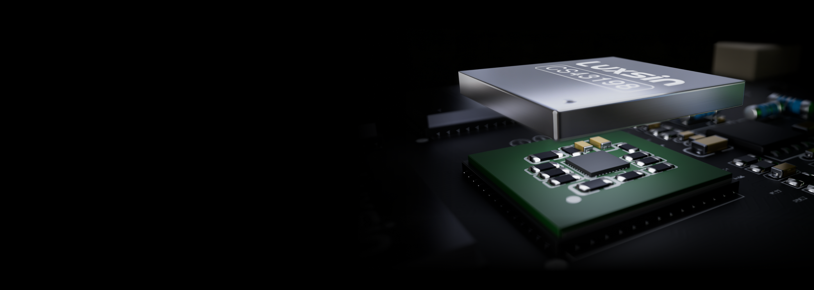

Eight Cirrus Logic CS43198 converters, a proprietary DSP core, and AI-assisted equalization for $699. It is the introduction of the Luxsin X8, the Chinese brand's second desktop DAC and headphone amplifier, arriving six months after the X9 with a more digital focus than its predecessor.

## The X8 stacks eight CS43198 DACs in parallel

The eight CS43198 converters operate in a true dual-mono architecture: four per channel, with independent power, routing, and signal paths for left and right. According to Luxsin, summing the analog outputs in parallel reduces noise and improves dynamic range and signal-to-noise ratio. Each chip incorporates its own shielding cover to isolate it from the rest of the digital electronics.

The digital section is signed off by the Digital Audio Core, a module based on a dual-core HiFi-5 DSP with ARM STAR architecture and a clock frequency above 500 MHz. It is the block that Luxsin describes as the foundation for future functions and for audio processing within the device itself.

## AI-assisted equalization: what it promises and what remains to be seen

The X8 debuts the AI-assisted equalization system that the brand announces as the first of its kind. The idea is for the user to adjust the general tonal profile or fine-tune specific details with a voice or text command, and for the AI to translate that request into a curve. Control is performed via the mobile app (Android and iOS) or from the PC web interface, with multilingual support.

It is worth separating the measurable part from the promise. The parametric equalizer (PEQ) electronics already existed in the X9 with ten bands, and Luxsin confirms that the X8 maintains those ten bands. What is new is the AI layer that decides the adjustments. The brand itself has indicated on the forum that it will first gather feedback from X8 users before deciding if those features arrive via firmware to the X9.

## Amplification, power supply, and connections

The output stage combines OPA1612 operational amplifiers and high-current TPA6120A2 drivers to drive each channel separately. Luxsin declares an L+R ≥ 4840 mW + 4840 mW power at 16 ohms on balanced output, and L+R ≥ 2900 mW + 2900 mW on unbalanced output, with an output impedance below 1 ohm. Impedance detection now covers the three headphone outputs (6.35 mm jack, 4.4 mm, and 4-pin XLR) and adjusts gain accordingly.

The power supply is linear and separates digital circuits from analog ones, with an analog voltage setting of 12 V or 15 V. As for connectivity, the X8 accepts USB-B and USB-C, optical, coaxial, and IIS—with up to eight custom configurations—and adds 12 V triggers to integrate it into a pre-built system. It also incorporates 2.4 GHz and 5 GHz Wi-Fi and Bluetooth 5.1. The screen is touch-sensitive, 4 inches with 960×480 pixels, with the front panel inclined 15 degrees over an machined aluminum chassis.

## Price and placement in the lineup

The X8 sells for $699 and €699, with no variants announced. The brand keeps the X9 above in the hierarchy: that one uses a high-end AKM DAC, femtosecond clock, and R2R volume control—components not included in the X8. Therefore, the difference is not in raw power but in the approach: the X8 bets on more converters and digital processing.

For those who already have a desktop DAC, it is worth considering whether the jump offers something tangible. Compared to alternatives like the [SMSL SU-3](/noticias/audio/smsl-su-3/), a desktop DAC with 32-band parametric EQ for $189, the X8 costs almost four times as much and justifies itself, especially through its amplification stage and screen. Those looking only for desktop amplification have options like the [FiiO CLASS A](/noticias/audio/fiio-class-a/). The open question is whether AI equalization ends up being a useful function or an extra that is used rarely; until units are in users' hands, it remains a promise, not a measured data point.
