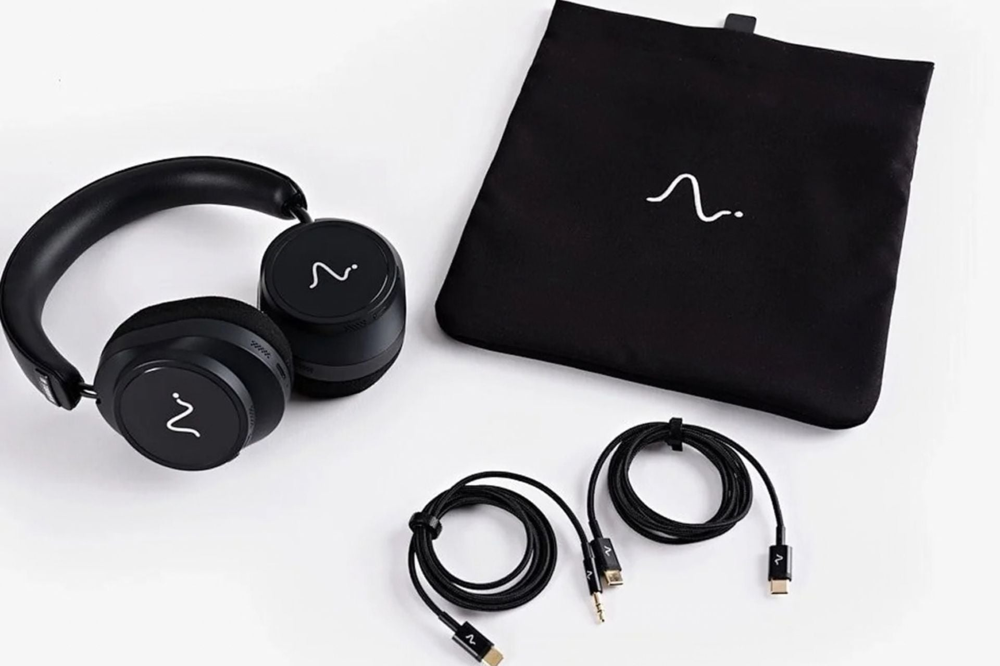

Neurable has opened preorders for the Neurable One at $499. They are its first wireless over-ear headphones built on its own, and they keep the company's signature feature: electroencephalography (EEG) to read brain activity and turn it into metrics such as focus level or anxiety. The deeper change from the previous generation is that the company is dropping Master & Dynamic, its hardware partner until now, and taking the design in-house.

## What the Neurable One adds: "capacity"

The headline addition is a measure Neurable calls "capacity," meant to estimate how much you can focus before reaching burnout. Alongside it comes alpha peak frequency, which the company describes as a kind of "heart rate variability for your brain." The headphones also change how they collect data: they take passive readings while you are wearing them, instead of limiting capture to specific sessions, which makes it possible to observe trends over time.

## The audio side: 40mm drivers, ANC and 22 hours

On paper, the sound section stays on reasonable ground: 40mm drivers, active noise cancellation (ANC) and 22 hours of battery per charge. That figure drops by almost half, to 12 hours, when the EEG is running. It is the energy cost of reading brain activity continuously, and it is worth keeping in mind: the 22-hour number does not apply if you use the feature that sets these headphones apart. Anyone looking for all-day audio alone will find more efficient alternatives at a similar budget, such as the [Technics EAH-A1000](/noticias/technics-eah-a1000/), designed around battery life and cancellation rather than biometrics.

## What to treat with caution

The limits are set by EEG technology itself. IEEE Spectrum notes that signals are picked up better when hair does not obstruct them, a relevant detail for anyone after a reliable reading. And while long-term insights can be useful, real-time data from a home EEG remains inconsistent. Is it worth it? It depends on what you ask of it: for $499, an over-ear model with ANC and 40mm drivers does not stand out against rivals focused on audio alone. The value is in the brain metrics, and there accuracy is not guaranteed yet.
