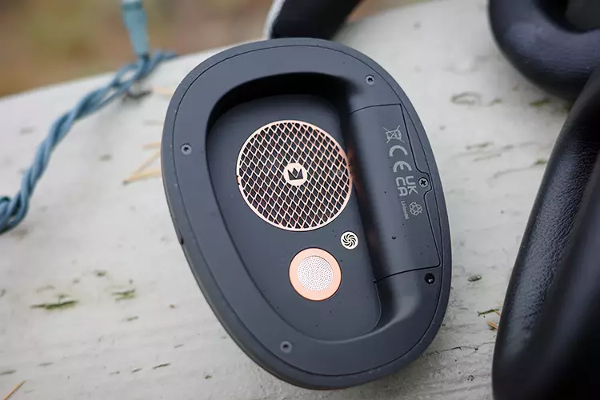
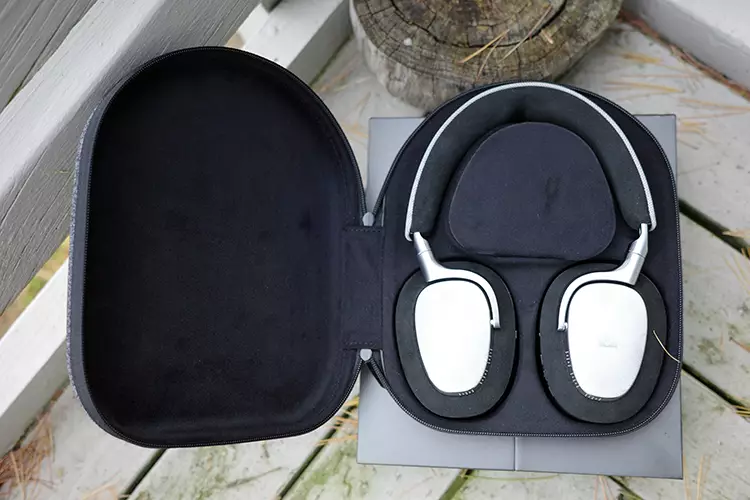
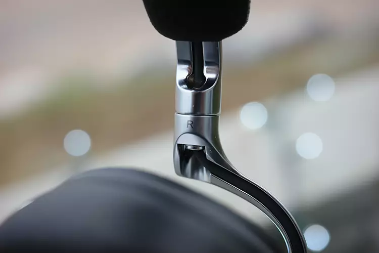
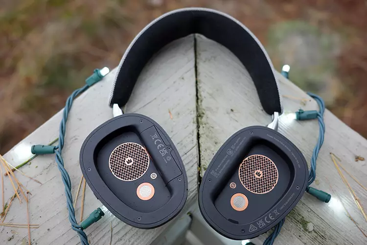

# Noble Audio FoKus Artemis: Wireless ANC headphones with triple driver and $899 price

Noble Audio has launched the FoKus Artemis, closed-back over-ear wireless headphones with active noise cancellation (ANC) that sit above the FoKus Apollo and Apollo Pro within its catalog. The starting price is $899 and their most identifiable feature is a three-way driver system combining a dynamic driver, an armature balanced unit, and a planar driver.

## Triple driver to cover the full spectrum

The Artemis's bet is to distribute work among three types of transducers instead of relying on a single unit for all sound. The dynamic driver handles the low end, the balanced armature — common in IEMs due to its small size — covers mids and highs, and the planar driver fills where needed. According to Headfonics, using a planar gives Noble more room to fine-tune the signature, both in bass and overall.

This marks a difference from previous models. The original Apollo was known for its amount of bass, and the Apollo Pro trimmed that extreme in search of a more balanced presentation. The Artemis seeks a more neutral and mature profile supported by the three drivers, with the possibility of recovering that deep bass through app adjustments.

## Connectivity, autonomy, and app

In the wireless department, the Artemis uses Bluetooth 6.0 over the Qualcomm QCC3095 chip and supports multipoint connection. In addition to high-resolution codecs LDAC and aptX HD, it now includes aptX Lossless, an improvement over the Apollo. Headfonics also highlights a very long connection range: in their tests, it reconnected at around 50 meters.

The declared autonomy is slightly more than 55 hours without ANC and more than 35 hours with active cancellation. The medium verified these last ones with three full downloads, averaging 35.5 hours. A ten-minute fast charge provides between 3 and 5 additional hours of listening. The app allows sound customization with the "Personal Sound" hearing test, a 10-band equalizer, and Audiosphere mode, available in subtle or immersive versions.

## Design and isolation of the FoKus Artemis

The Artemis bets on robust and repairable construction: IP52 certification, replaceable parts, and a battery that the user can change themselves — an uncommon detail that extends product life. The ear pads are removable and expose the battery cavity. The headband has a central cutout to avoid pressure points, although Headfonics notes it is the part below high-end level.

In isolation, the brand does not pursue maximum decibel reduction like Bose, Sony or Sennheiser, but integrates ANC into its own sound signature. In their tests, cancellation did not subtract detail with high active mode, and external noise disappeared as music began. The clamping pressure also seemed correct.

## What it means for those seeking high-end headphones

The Headfonics review closes with an overall rating of 8.9 out of 10, with a 9 in sound quality and design and 8.9 in comfort and features. Among its strengths it points to the recovery of the "fun factor" in the signature, excellent fit, and replaceable battery; among weaknesses, a headband one step below top-of-the-line and mids that can result in being too frontal on some songs.

Against direct competition, the $899 places the Artemis in an demanding segment. For example, the [Technics EAH-A1000](/noticias/technics-eah-a1000/) that we covered a few weeks ago promise up to 90 hours of battery and also compete with ANC, although autonomy-wise the Artemis fall behind with their 35 hours with active cancellation. Noble's proposal is not about more hours or more noise reduction, but sound with three drivers and very careful customization from the app.

In summary: if you are looking for wireless ANC headphones that perform well in sound and can be maintained over years thanks to their replaceable parts, the Artemis is an option to consider. If your priority is maximum autonomy or more aggressive isolation, there are alternatives that play other cards. As always, it's advisable to try before spending: the three-way signature is perceived differently depending on the adjustment and type of music.

