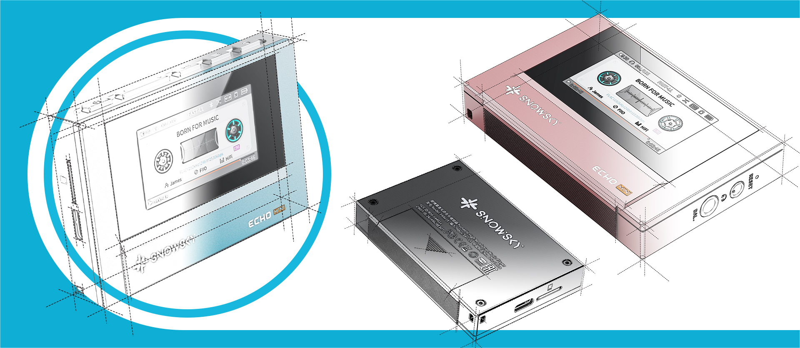

# SnowSky Echo Mini, the Retro Player from FiiO's New Subbrand

The Echo Mini is the first product of SnowSky, the subbrand with which FiiO revives its line of "pure" music players. It features dual CS43131 DACs, 3.5mm and 4.4mm outputs, and an aesthetic that mimics cassette players but includes a color screen and physical buttons.

## A Small Player with Hi-Fi Ambitions

It weighs around 55 grams and is just slightly larger than AirPods Pro. The case reproduces the front of a radio cassette player, with controls on the edge and a color IPS screen that recreates tape rotation via animations; above it, the album cover and song lyrics are displayed.

In addition to volume control, it allows adjusting gain, saving favorite tracks, and applying custom equalization, with a 120-step volume control. It can also function as a USB sound card. It is offered in four finishes: titanium gold, black, cyan, and pink.

## The Echo Mini Bets on Dual DAC and Balanced Output

The strong technical point lies in the analog section: two CS43131 converters, one dedicated to each channel, with an unbalanced 3.5mm output and a balanced 4.4mm output capable of delivering up to 250 mW. In a player of this size, balanced output is uncommon and is what sets it apart from a basic-tier model.

In terms of formats, it supports native DSD, WAV, FLAC, APE, MP3, M4A, and OGG. It includes 8 GB of internal storage and can be expanded with microSD cards up to 256 GB. Bluetooth transmission is version 5.3, though limited to the SBC codec: sufficient for listening without cables, but below what other players offer with LDAC or aptX.

## What Changes for the User

For someone who listens to local music and wants to get the most out of wired headphones, the Echo Mini covers the essentials: a solid digital base, balanced output, and an affordable price. The declared autonomy is up to 15 hours with a 1,100 mAh battery, though SoundGuys lowers the figure to around 14 hours in typical use.

The reference price is around $60 in the United States, and the player is sold through FiiO's official store on AliExpress. It is not a substitute for an Android player with streaming, nor does it aim to be: anyone seeking more power for demanding headphones has the [FiiO Class A desktop amplification](/noticias/audio/fiio-class-a/). Is it worth it? If you're looking for a pocket-sized player for your own files, with balanced output and without depending on your phone, the proposal fits; if you need streaming or high-quality Bluetooth, this is not your device.
