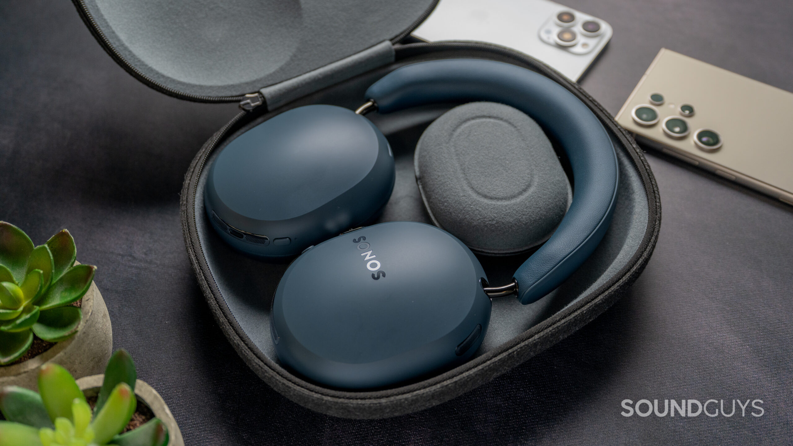
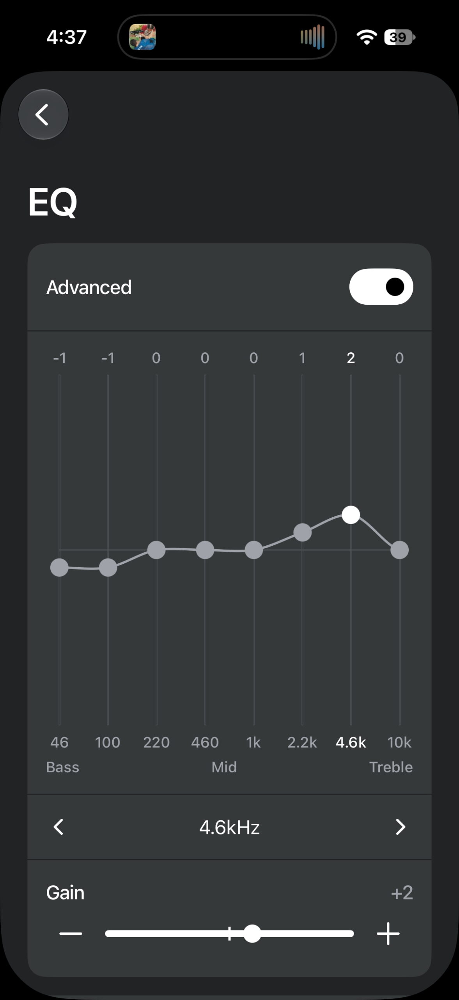
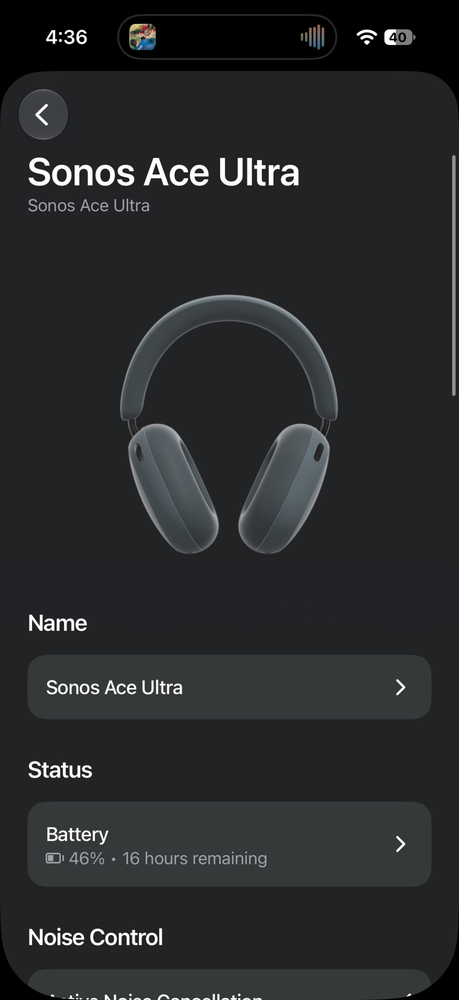
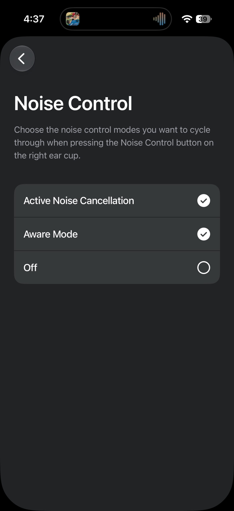
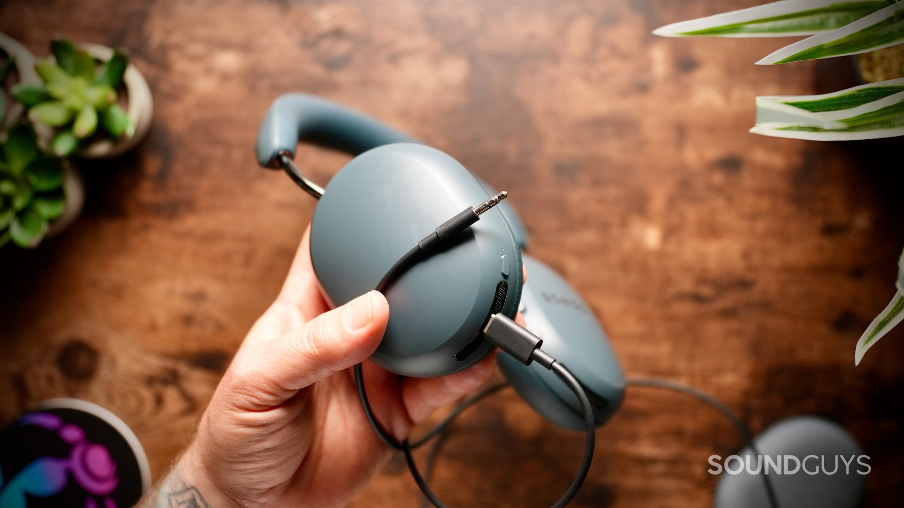

The **Sonos Ace Ultra** are already on sale for $449 and arrive as an evolution of the original Ace, not as a pair of headphones built from scratch. Sonos keeps the design, the premium build and active noise cancellation, but adds two changes you actually notice in daily use: an 8-band equalizer and a replaceable battery. SoundGuys awards them 7.9 out of 10 after two weeks of testing.

## Sonos Ace Ultra: an Ace with tweaks, not a redesign

The Ace Ultra does not stray far from the original Ace where it counts. The Blue Agave finish is new and more colors are available, but the shape, the materials and the mix of plastic and metal stay the same. Sonos still bets on physical controls: the combination of buttons and the Content Key slider can be operated by feel, without relying on touch-sensitive surfaces.

The price of that sturdy build is weight: 322 grams, well above the 254 grams of the Sony WH-1000XM6. SoundGuys notes they are not uncomfortable to wear, but it is worth keeping in mind if you travel a lot with them. The headband and ear cushion padding keeps a good seal, even with glasses, and the clamping force feels right. The weak spot for large ears is the inner space of the ear cushions, which is a little tight but not a deal-breaker.

Here is one of the meaningful upgrades: the ear cushions are magnetic and easy to swap, and the battery is replaceable too. Sonos sells an official replacement kit, although it is not a one-minute job: you have to remove the left ear cushion, open the housing with a Torx screwdriver, disconnect several internal components and remove the circuit board before reaching the cell. As a trade-off, there is no IP rating, so rain remains a risk.

## What the measurements say: noise cancellation and battery life

In SoundGuys' measurements, passive isolation reduces the perceived loudness of outside noise by an average of 69.7%. With active cancellation on, the figure rises to 88.1%, a result that puts them alongside industry benchmarks such as the Sony WH-1000XM6 at around 87% and the Apple AirPods Max 2 at 89.4%.

Against the original Ace, however, there is no meaningful improvement: the previous model already sat at around 88% with ANC. Differences in fit, glasses or how the headphones sit on your head account for that minimal variation. In real use, performance stays solid at cutting down traffic and the ambient noise of a city.

Battery life beats the claim. In the outlet's standardized test, the Ace Ultra reached **35 hours and 53 minutes**, above the 35 hours Sonos advertises with ANC on. A three-minute quick charge provides up to three hours of playback, and a full charge from 0% can take up to three hours. If the cell wears out over time it is replaceable, so a tired battery does not condemn a pair of $449 headphones.

As for the app, Sonos offers plenty of control: you can choose which noise-control modes the physical button cycles through, turn cancellation off completely, enable Adaptive Cancellation based on fit, use sidetone to hear your own voice on calls and fall back on Aware mode with Voice Boost. The new 8-band equalizer replaces the basic bass and treble sliders of the original Ace, and supports simple bass, midrange and treble adjustments without leaving the advanced mode.

## Connectivity and ecosystem: where the value lies

The Ace Ultra uses **Bluetooth 6.0** with aptX Lossless support and multipoint to keep two devices connected at once. SoundGuys recorded no dropouts or stutters during daily use. Wired connectivity is well handled too: you can listen over USB-C, and the box includes a USB-C to 3.5 mm cable for analog sources, so there is no need to buy anything extra.

The new feature compared with the original Ace is Wi-Fi, but with caveats: the headphones do not work as a standalone network streamer. Wi-Fi is reserved for features such as Headphone Linking with other compatible Sonos products — Era 100, Era 300, Five, Arc Ultra and the new Beam Ultra — and arrives as an Early Access feature with limitations, including no support for Bluetooth or AirPlay sources.

The ecosystem's flagship feature is TV Audio Swap: by holding down the Content Key, audio from a compatible Sonos soundbar jumps to the headphones within seconds. SoundGuys tried it with the Beam Ultra, whose review [we already published on TechSpain24](/en/news/audio/sonos-beam-ultra-review/), and describes it as a practical way to keep watching TV without disturbing anyone.

## Is it worth it?

The Ace Ultra make the most sense if there are already other Sonos products at home: features such as TV Audio Swap and Headphone Linking cannot be used without them. For those outside the ecosystem, the outlet highlights their premium build, noise cancellation and sound control, but reminds readers that $449 is a high figure if those exclusive features go unused.

SoundGuys' verdict is 7.9 out of 10, a score that reflects competent, well-built headphones, with value for money conditioned on the ecosystem. Among the direct alternatives the outlet points to are the Sony WH-1000XM6 and the Sennheiser Momentum 5 Wireless, which compete on sound, cancellation and everyday features without depending on one brand.

