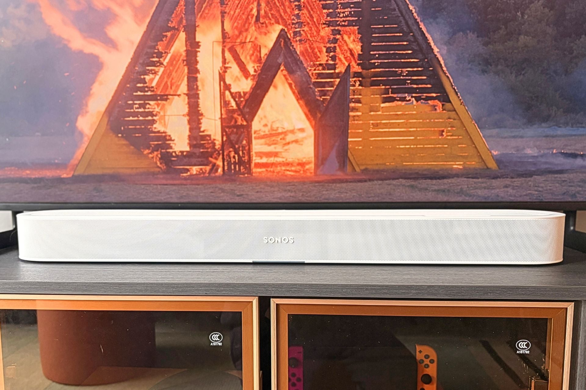
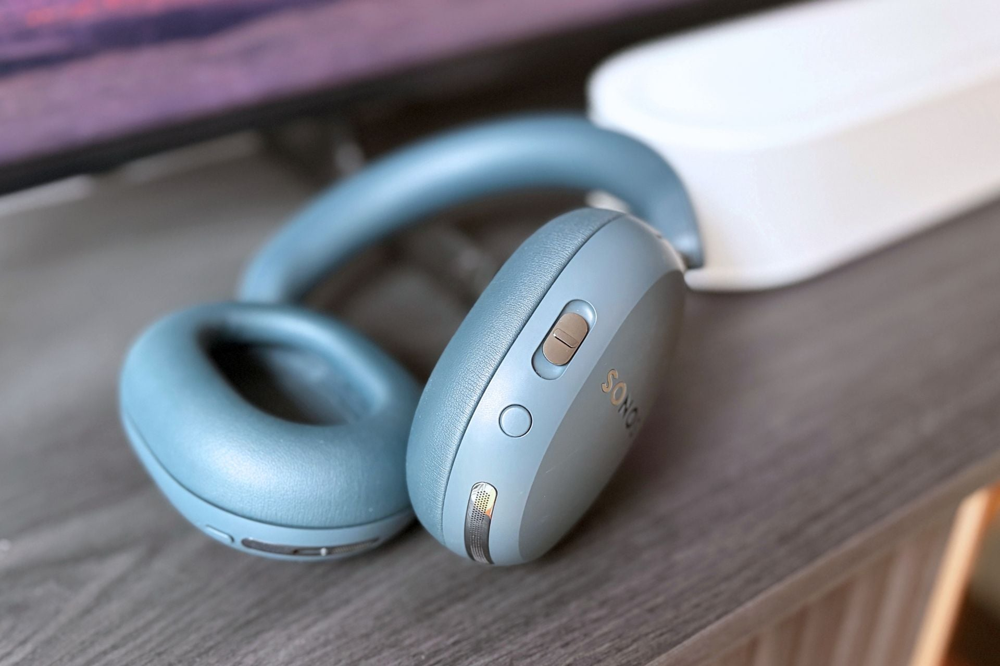
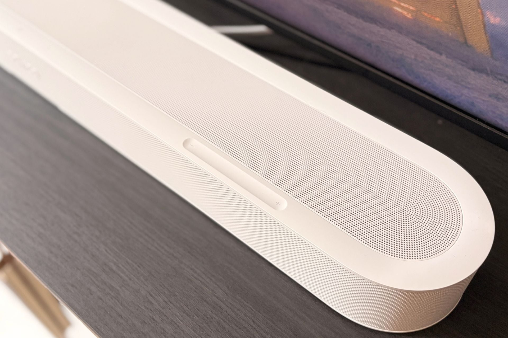
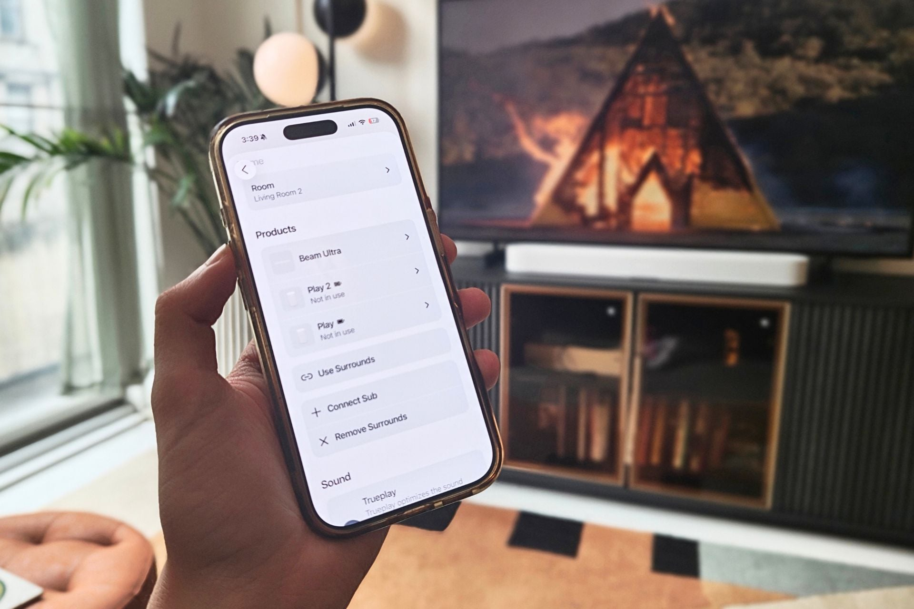

The Sonos Beam Ultra is Sonos' new compact soundbar and it launches at $699. It packs nine drivers, claims Dolby Atmos 7.1.2 and adds software features aimed above all at people who already own other products from the brand. Gizmodo has reviewed it and awarded it 4.5 out of 5, along with its Editor's Choice 2026 badge.

## What changes compared with the Beam Gen 2

The clearest hardware leap is in the driver count: the Beam Ultra carries nine, against the five of the Sonos Beam Gen 2. Sonos describes the system as 7.1.2 with "true Dolby Atmos," which in practice leaves more room to spread sound across the whole frequency range. In testing, the bar delivered a wide, immersive stage even with sound-packed content, and effects panned from side to side without the need for rear speakers. Part of that sense of space comes from the upward-firing drivers.

On bass, Sonos promises a "warmer" sound than the previous generation. The review describes it as a decent low end, though below rivals such as the Bose Lifestyle Ultra soundbar. Anyone after more punch will have to add a subwoofer: the Sonos Sub Mini costs $499 and the Sonos Sub 4, $899.

## Software that finally plays in your favour

For Gizmodo, the biggest improvement is not in the hardware but in several new features. An update lets you use wireless speakers such as the Sonos Play — launched this year — or the Move 2 as surround channels. Pairing is done from the app: just select the Beam Ultra and tap "Add surrounds." The system detects when a speaker moves away and disconnects it, then reconnects it on return without interrupting playback.

Three features stand out among the new and inherited ones. "Speech Enhancement" uses artificial intelligence to lift dialogue and offers four levels: low, medium, high and max. "Night Sound" trims volume spikes so you don't wake the house during late-night sessions. And "TV Audio Swap" moves the audio to a pair of Sonos Ace headphones with just a long press on the content key.

## Design, ports and what doesn't convince

The Beam Ultra keeps the brand's rounded, minimalist look, available in white or black, and is more compact than other soundbars on the market. It can be wall-mounted. On connectivity it includes eARC over HDMI and adds a USB-C port that works as a line-in for a turntable, a CD player or a computer, plus Bluetooth to connect a phone.

The weak point is the capacitive touch controls on top: according to the review, they miss presses when adjusting the volume and react somewhat slowly. The TV remote avoids the problem in most cases.

## Is the Sonos Beam Ultra worth it?

At $699, the Beam Ultra is expensive, and even more so once a subwoofer is added, but the review concludes it lives up to its "Ultra" name: clear dialogue, a sense of space that is surprising for its size and software that turns your Sonos speakers into a home cinema system. Anyone who already owns products from the brand will get far more out of it. Against the competition, the JBL Cinema SB Mk2 takes a different route, with Flip 7 speakers as wireless rear channels. [Bose](/en/news/audio/bose-bought-sonus-faber-what-hasnt-changed/) is trying to challenge it with its Lifestyle Ultra, but, according to Gizmodo, Sonos is still ahead when it comes to the home audio ecosystem.
