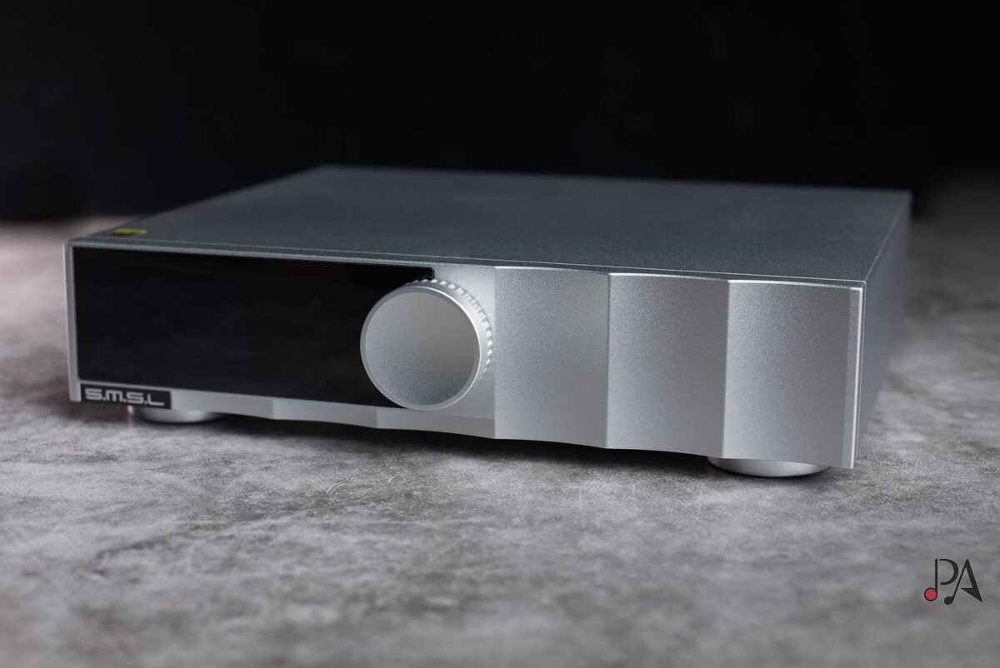

The majority of desktop converters mount AKM, ESS or Cirrus Logic chips. The SMSL D200 breaks that habit: its DAC is a ROHM BD34352EKV, an IC that analysis places in Kyoto (Japan) and which rarely appears in this price range. The unit starts at $319, the same ground where the FiiO K13 R2R and Topping D50 Mark III compete.

## What the D200 offers

The D200 relies on the USB XMOS XU316 interface, supporting up to 32 bits, native DSD512 and 768 kHz, plus full MQA decoding. Wireless connection is handled by a Qualcomm chip compatible with LDAC and aptX HD. Powering uses a linear power supply with patented adaptive voltage switching, and the unit connects directly to mains electricity: it does not need an external transformer.

Its rear panel covers balanced XLR outputs and single-ended RCA, adding optical, coaxial and USB inputs. The little detail unusual in this range is the external clock input: although SMSL's internal CK03 clock developed by the brand is correct, anyone who wants to control jitter can skip it and sync with their own reference.

The front includes a volume knob that also functions as a multi-function button and a 1.9-inch display. With the USB input active it shows volume and sampling frequency; when playing via Bluetooth, it adds song and album information. The menu is direct: it allows choosing inputs, output type (full, balanced only or unbalanced only), clock, PCM filter, DSD filter and "sound color", plus setting pre-out mode or full line and customizing the function key.

## How it sounds and what distinguishes this chip

The tonal profile described by analysis is neutral and linear, consistent with SMSL's usual line. According to this reading, the ROHM chip would be placed at an intermediate point between the warmth of R2R or AKM and the more analytical character of ESS, resulting in something that recalls the neutrality of Cirrus Logic solutions like the CS43131.

In the low end, bass has body and good full-range extension, without emphasis: control and firmness depend, as always, on the speakers or headphones receiving the signal. Where the analyst focuses is on the highs: described as light and airy, with brightness but no hardness, which in their view widens the scene and improves imaging. It is a subjective listening assessment, not a laboratory measurement.

A detail worth not overlooking: the D200 does not integrate a headphone amplifier. To use headphones or IEMs one must add a separate [desktop amplification stage](/noticias/audio/fiio-class-a/); in the test it was combined with a Burson Soloist GT4, and as an economical alternative the xDuoo MT-602 is mentioned.

## What changes for the buyer

Compared to the FiiO K13 R2R, which does include a powerful headphone stage and more organic sound due to its resistor ladder, the D200 bets on precision and detail rather than all-in-one. To build a system with speakers and an already available amplifier, analysis considers the SMSL the most logical option. The drawback noted is minor: the remote control is the usual one from the brand, light and modest in finish.

Is it worth it? At $319, the D200 includes balanced outputs, external clock input, Bluetooth LDAC and an easy-to-use menu, scoring 4.5 out of 5 in analysis. Anyone looking for a neutral converter to feed an external stage has a solid candidate here; anyone wanting to connect headphones directly will have to add the cost of an amplifier.
