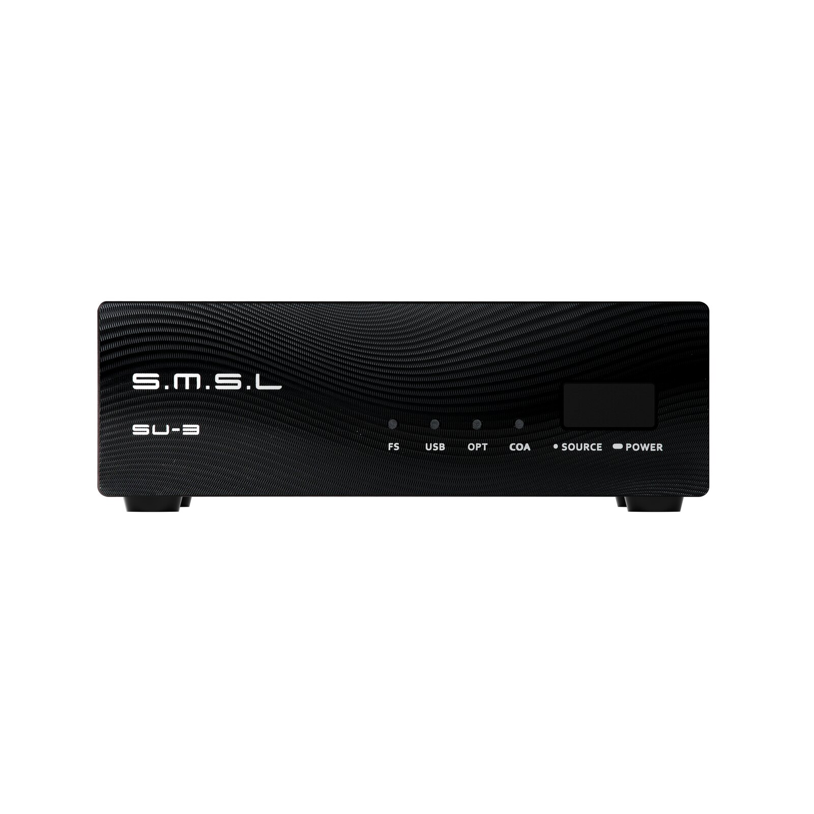
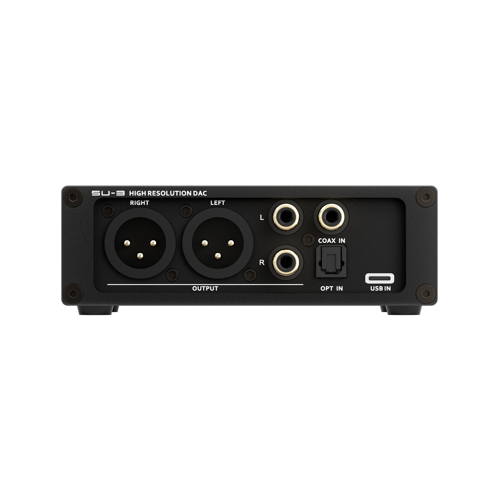

The SMSL SU-3 is now available for sale at the Apos store for $189. It is a desktop digital-to-analog converter that occupies slightly more than 11 centimeters in width and which the brand has built around an AKM AK4496 chip and an XMOS XU-316 USB interface. On paper, it supports PCM up to 32-bit/768 kHz and native DSD512, and adds a 32-band parametric equalizer that retains its settings after being turned off.

## What the SMSL SU-3 offers

Conversion is handled by the AKM AK4496, accompanied by two low-phase-noise femtosecond crystal oscillators that serve as clock references. SMSL also declares a dedicated filtering stage to clean up noise and interference from the power supplied via USB, a detail uncommon in equipment of this price and size.

As for connections, the rear panel offers USB-C, optical, and coaxial inputs, as well as balanced XLR line outputs and single-ended RCA outputs. The USB input supports asynchronous signal, while the optical and coaxial inputs are limited to PCM up to 24-bit/192 kHz: this is a limit of the format, not of the DAC. The balanced output delivers 4 Vrms and the RCA, 2 Vrms.

The chassis is CNC-machined anodized aluminum and measures 116 × 40 × 87 mm, with a weight of 310 grams. Power consumption stays below 5 W in operation and 0.1 W in standby, and the unit runs on Windows 7 or later, macOS 10.6 or later, and Linux.

## What is measured and what is perceived

SMSL specifies a total harmonic distortion plus noise (THD+N) of 0.00012% (–118 dB) and a dynamic range and signal-to-noise ratio of 126 dB on the balanced output. The brand itself publishes measurements with an Audio Precision APx555B analyzer: 0.000114% THD+N on channel 1 and 0.000125% on channel 2, measured in XLR at approximately 4.1 Vrms. These are good figures, but it is worth remembering that they describe the converter's behavior, not the final sound: that depends on the amplifier, headphones, or speakers receiving the signal.

It is worth being clear about what the SU-3 is and what it is not. It does not include a headphone amplifier or wireless connectivity: it is a line source that delivers signal to an amplifier or active speakers. For this reason, it does not compete with all-in-one DAC-amps, but rather with converters placed in front of an existing stage.

## What changes for the buyer

In SMSL's recent catalog, the SU-3 coexists with the [SMSL D200](/noticias/audio/smsl-d200/), a $319 DAC that swaps the AKM chip for a ROHM one, adds Bluetooth LDAC, and is powered directly from mains electricity, although it also dispenses with a headphone amplifier. The SU-3 is positioned lower in price and bets on parametric EQ as an argument; the D200, on connectivity and a more elaborate power supply.

Is it worth it? For $189, the SU-3 covers the basics of a desktop DAC —AKM, asynchronous USB, XLR and RCA outputs— and adds a 32-band equalizer hard to find at this price. Whoever already has an amplifier or active monitors and wants to correct the response without relying on computer software will find a sensible option here; whoever intends to listen directly with headphones will have to add the cost of a separate [amplification stage](/noticias/audio/fiio-class-a/).
