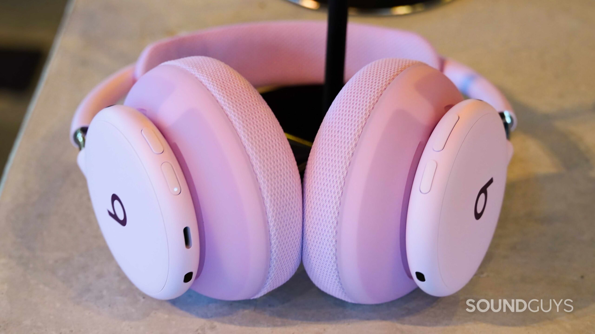
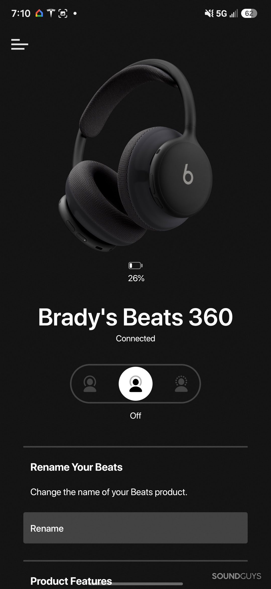
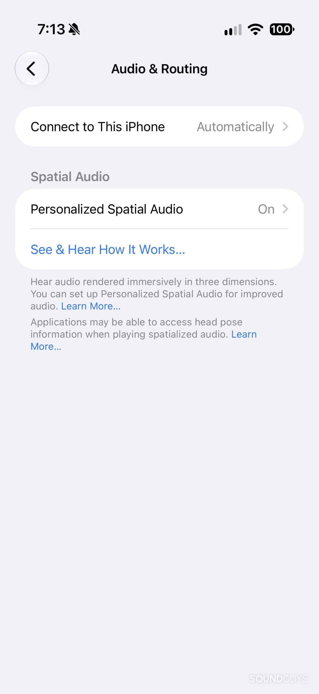
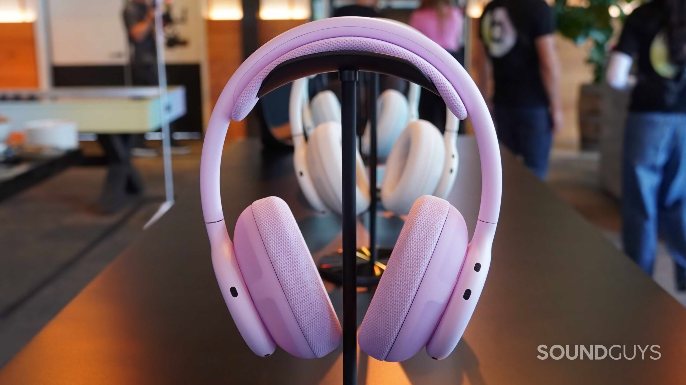
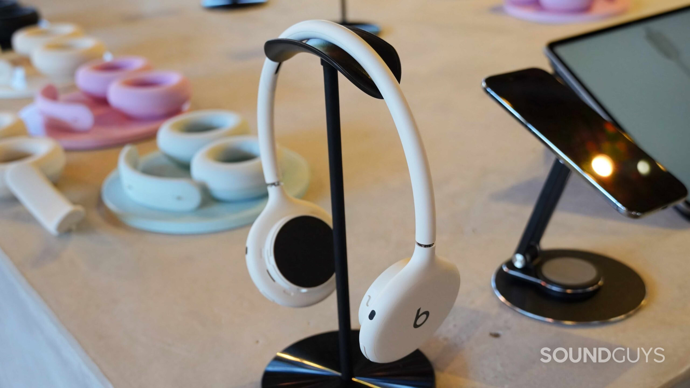
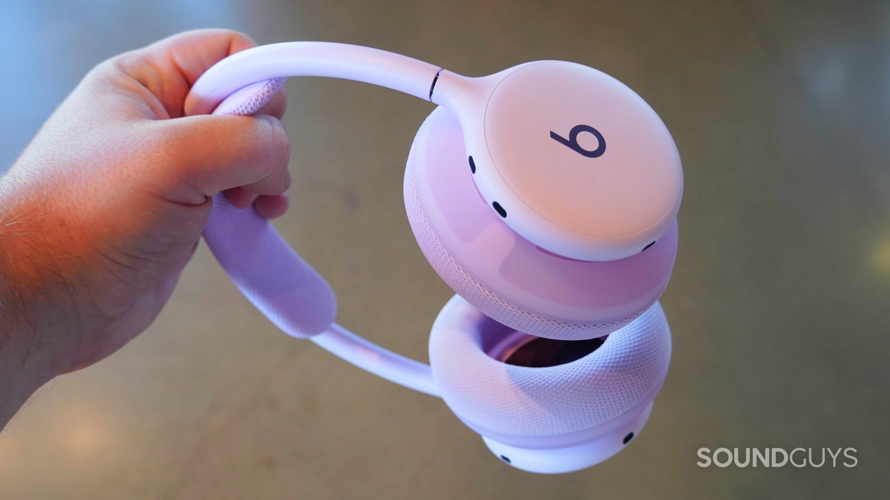

Beats has put the Beats 360 on sale, its first genuinely new over-ear headphones in several years. They arrive with a modular design that lets you swap the ear cushions and headband, IPX4 water resistance and a $349 price tag. SoundGuys tested them over nearly two weeks and its verdict is clear: they are comfortable, versatile headphones for everyday use, but not the best choice for anyone who puts sound quality first.

## What the Beats 360 are

The Beats 360 relies on a fully wireless architecture: battery, antenna and processor live inside each earcup, as they do in a pair of TWS earbuds. That enables a modular design and more balanced weight distribution. They weigh 294.5 grams, a little more than the Studio Pro, but their lightweight headband makes them feel more comfortable.

Beats offers two cushion materials. The Performance Knit ones use a new textile designed to absorb sweat and are the more comfortable option; the UltraPlush ones, made of eco-leather, seal better against the head and help noise cancelation, though they create more pressure. The brand has also moved the controls to the back of the headphones: the right earcup carries a volume rocker and a playback button, while the left has one button to cycle through the noise cancelation modes and another for power and pairing that sits flush with the chassis.

The only port is a USB-C connector on the bottom of the left earcup, and it is used solely for charging. There is no 3.5 mm jack and no USB audio, so the Beats 360 cannot play sound over a cable.

## Connectivity, battery and features

The connection runs exclusively over Bluetooth 5.3 with AAC and SBC codecs. The headphones support Apple's one-touch pairing and Google Fast Pair, plus Personalized Spatial Audio with dynamic head tracking, although that feature requires an iPhone with a TrueDepth camera to set up and is not available on Android. They are also compatible with Apple's Find My and Google's Find Hub, and with automatic switching between devices within each ecosystem.

On the settings front, the Beats 360 go without a custom equalizer. They only include an Adaptive EQ mode that tunes the sound to each user's fit and seal, and it only activates when noise cancelation and transparency are off. That Off setting is not enabled by default: you have to turn it on first from your iPhone or Mac settings or from the Beats app on Android.

The battery is rated at 32 hours of playback with cancelation or Adaptive EQ active, and fast charging delivers an hour of use from a five-minute charge. SoundGuys found real-world battery life can beat that figure: on a nearly six-hour flight with cancelation on, the headphones used only 14 %.

## What the SoundGuys review says

SoundGuys gives the Beats 360 a score of 7.3 out of 10. Its strengths include comfort, water resistance, call quality and battery life; its weaknesses, the lack of wired audio, the absence of a manual equalizer and the price.

For noise cancelation, Beats relies on eight MEMS microphones and its fourth-generation chip, and claims the 360 deliver 1.75 times more cancelation than the Studio Pro. In practice, the review notes they handle constant noise well — the hum of an air conditioner or an airplane cabin at medium-to-high volume — but do not fully eliminate voices or high-frequency sounds. The seal of the UltraPlush cushions, combined with the stronger clamping force, can become uncomfortable.

Sound is the most debated part of the review. With cancelation or transparency active, the bass dominates strongly and masks details such as hi-hats; switching to Off brings in Adaptive EQ, which reins in that bass and restores a more balanced signature. SoundGuys also notes that its lab is still completing the frequency response and cancelation measurements, and will publish the charts once it is done.

Transparency mode, by contrast, comes off well: it sounds almost as if you are not wearing headphones, to the point of letting in nearby conversations and your own breathing. On calls, the 360 pack nine microphones in total, three of them beamforming for your voice, and in a test next to the beach the person on the other end could not hear the waves.

## Are the Beats 360 worth it?

The conclusions point to a specific audience: anyone looking for a single pair of headphones for the gym, the daily commute and travel. The IPX4 rating and swappable cushions are designed for exactly that use, something unusual in over-ear headphones. The most obvious trade-off is sound quality and, above all, the impossibility of listening to lossless audio over a cable.

As an alternative within the same brand, SoundGuys still recommends the Beats Studio Pro: they cost $50 less, support USB-C audio and a 3.5 mm jack, and offer longer battery life. If comfort and swappable cushions matter more in daily use, the Beats 360 are a sensible buy; if sound is what matters, the Studio Pro remain the more logical choice.

The brand had already appeared in the site's recent coverage with another product: a rumored Apple game controller under the Beats label, a very different project that, unlike these headphones, has yet to materialize.
