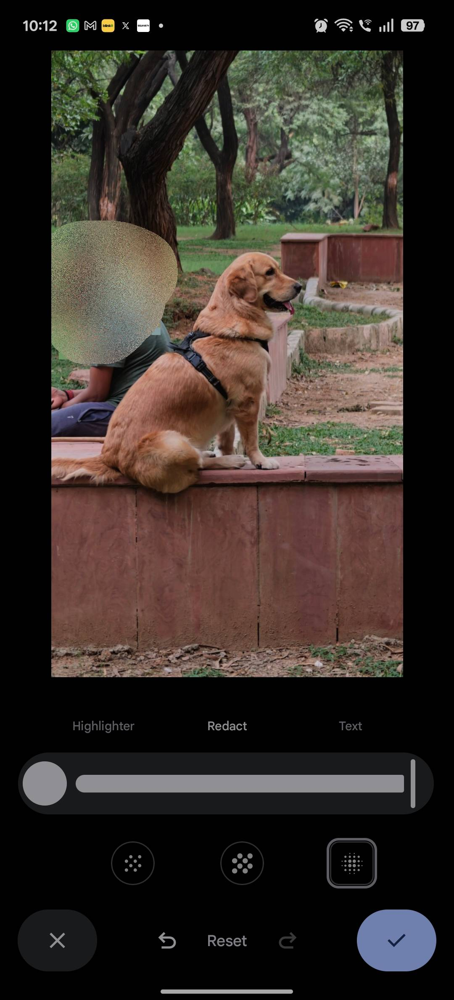

Google Photos has added a redact brush to its Markup tool that lets you blur or pixelate any area of an image. Until now, hiding sensitive data in a screenshot meant relying on third-party apps or scribbling over it with the pen. This guide walks through the new feature step by step, for anyone who shares screenshots of banking apps, boarding passes, license plates or photos of children.

Google Photos has also made moves on library management: Samsung's gallery can now be [synced with the service](/noticias/samsung-google-photos-sync/).

## Prerequisites

- An Android phone with the Google Photos app updated from the Play Store.
- The rollout is phased: if the icon has not appeared yet, the feature may not have reached your account.

## Steps to redact an image in Google Photos

### 1. Open the image in Google Photos

Open Google Photos and select the photo or screenshot you want to edit. The tool works on any image in your library.

### 2. Enter edit mode

Tap the Edit button at the bottom of the screen.

### 3. Open the Markup tool

Select the Markup option. The redact brush is new: it sits next to the pen you already used to scribble.

### 4. Tap the redact brush

Tap the redact brush icon to activate it.

### 5. Choose the style and thickness

You can pick from three redaction styles: Blur, Mosaic Light and Mosaic.

- **Blur** applies a Gaussian blur to the selected area.
- **Mosaic Light** adds small pixel blocks.

- **Mosaic** produces coarser pixel blocks.

Then adjust the brush thickness with the slider. It is worth doing this on every edit: a thick brush is enough for a face, while text needs a finer one so the rest of the image stays readable. The author of the original report prefers the Mosaic style as the somewhat more secure option.

### 6. Slide your finger over the sensitive areas

Slide your finger over the parts you want to hide. If the result is not convincing or you make a mistake, you can undo or redo the redaction without leaving the screen.

### 7. Apply the change

Tap the checkmark to confirm the redaction.

### 8. Save a copy

Choose Save as copy. The redacted image is added to your library and the original stays untouched.

### 9. Share the redacted version

Share the edited copy with whoever needs it.

## How to verify it worked

Before sharing, zoom into the redacted area and check that no detail is still visible. If the redaction came out poor or misplaced, use undo and redo to repeat it. Saving as a copy lets you go back to the original and try again if needed.

## Caveats and limitations

- For now the feature is rolling out **on Android only**. There is no confirmed timeline for iOS.
- If the redact brush does not show up, the rollout probably has not reached your device yet. Check that Google Photos is up to date in the Play Store.
- Saving as a copy is not a minor detail: it avoids overwriting the original image, which helps if you later need the uncensored file.
