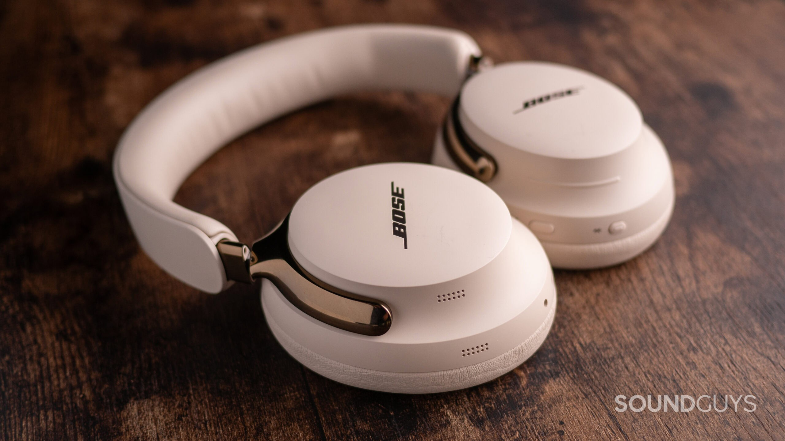

Bose has begun rolling out a firmware update that adds Bluetooth LE Audio and Auracast to its QuietComfort Ultra Headphones (2nd Gen). Both features arrive as beta for now and make this model the first pair of Bose headphones to support Auracast. The company says it plans to bring the technology to more of its devices in the future.

## What Auracast brings and why it matters

Auracast is a wireless audio technology that lets a single device broadcast sound to an unlimited number of nearby compatible Bluetooth headphones, earbuds, or other receivers at the same time. In practice, it opens the door to listening to a single source —an airport display, a TV in a bar, or a talk— through your own headphones, without pairing with each transmitter one by one.

The problem is that Auracast still isn't everywhere. Brands such as Samsung, Sony, Sennheiser, and JBL already support it, but adoption has been slow. That is why Bose's move matters: when a brand with its reach backs the technology, more users end up getting it without switching devices.

## USB-C audio: a more useful wired headphone

The update is not limited to wireless listening. Bose is also improving USB-C playback: the headphones now deliver 48 kHz audio while their built-in microphone captures at 16 kHz at the same time. That means that, when plugged into a computer, you can listen and talk at once —handy for gaming and chatting, joining a video call, or using the device as a wired headset.

## What changes for the user

For anyone who already owns the QuietComfort Ultra (2nd Gen), getting two new features through a software update, at no extra cost, is a solid bonus. Anyone considering buying them now has one more reason, though it is worth remembering that both Auracast and LE Audio support are still labeled as beta features, so their behavior may change in future versions.

It also helps to put the news in a broader context: other wireless audio platforms are moving forward in parallel, such as Qualcomm's [Snapdragon Sound Elite Gen 2](/noticias/qualcomm-snapdragon-sound-elite-gen-2/), aimed at headphones with AI-based audio processing.
