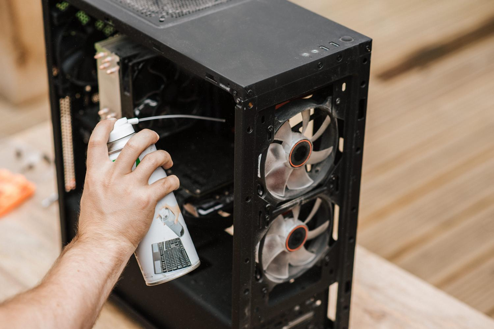
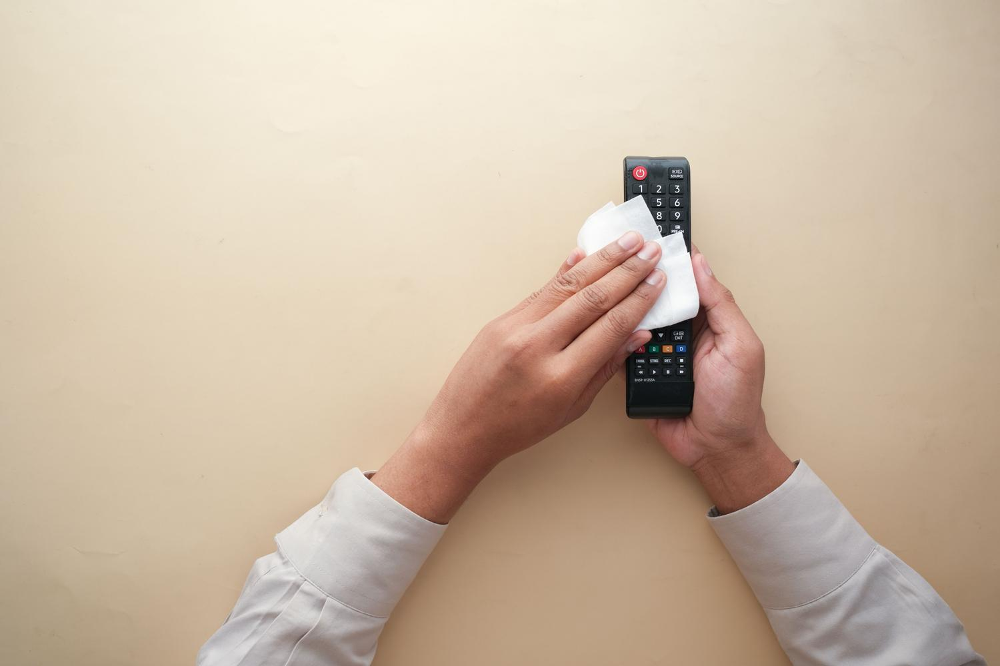

Modern TVs do not use the thick glass of older sets: their panels are built from thin layers of polymers and highly sensitive polarizing films. That is why a kitchen towel, a glass cleaner or a splash of alcohol can wipe out the anti-reflective treatment and leave permanent iridescent stains. This guide explains how to clean your TV screen step by step, whether you have just unpacked a modern panel or want to bring an older one back from dust and fingerprints. It only takes materials you probably already have at home and no special technique; the important thing is not to put your investment at risk.

## What you need

Before you start, gather a simple kit. You do not need expensive, heavily marketed products:

- A high-density microfiber cloth, ideally one of the kind used for glasses or camera lenses, because they shed no lint and do not scratch. It is a good idea to keep a second cloth for the wet stage.
- Distilled water, the safest option for the panel.
- Optional: a tiny drop of perfume-free neutral soap for stubborn greasy marks.
- A spray bottle to prepare the mix.

Avoid the yellow cloth you use for furniture, as it can shed abrasive particles. And rule out tap water: it contains lime and chlorine that leave white marks as they dry.

## Steps to clean your TV screen

1. **Turn the TV off and unplug it.** This is not only an electrical precaution: if you clean the screen while it is warm, the liquid evaporates too quickly and leaves rings that are impossible to remove. On top of that, with a black panel it is much easier to spot dust and dirt against the light.
2. **Do a dry sweep.** Run the microfiber cloth very gently to remove surface dust. It is vital not to press, because dust particles act like microscopic sandpaper when rubbed hard.
3. **Clean with a damp cloth.** Lightly dampen a second microfiber cloth. The liquid always goes onto the cloth, never sprayed directly onto the screen. Use soft circular motions from the center toward the edges, or a single direction if you prefer, always without pressing.
4. **Polish the surface.** Use the dry part of the cloth to remove any leftover moisture and leave the panel even.

## How to check it worked

The expert trick is to inspect the result with your phone's flashlight from a side angle, with the TV still unplugged. That raking light reveals rings, marks or leftover lint that you cannot see head-on. If the surface is even and free of irregular bright spots, you can plug the TV back in.

## Keeping the rest of the TV in shape

Cleaning does not end at the screen. Dust built up elsewhere on the set also shortens its useful life:

- **Rear ventilation grilles:** vacuum them with a soft brush once a month, or use a can of compressed air in short bursts. If they fill with dust, the TV can overheat.
- **HDMI and USB ports:** compressed air is the best tool to prevent image dropouts caused by dirt.
- **Remote control:** it is a breeding ground for bacteria. Remove the batteries and clean the gaps between the buttons with isopropyl alcohol, a cloth and cotton swabs.

## Care by panel technology

Not every panel takes the same treatment, so it pays to adapt your cleaning to the screen type:

- **OLED and QD-OLED:** extremely thin and sensitive to physical pressure. Press too hard and you can bend the internal glass, so take extra care.
- **QLED and NanoCell:** somewhat more robust, but their chemical coatings are very delicate. Distilled water is the only safe option.
- **Outdoor TVs:** even with water-resistance certifications, you should still avoid harsh chemicals so as not to degrade the UV protection built into the glass.

## Products and habits that damage the panel

Some mistakes are practically irreversible. These are the ones to avoid at all costs:

- **Glass cleaners with ammonia:** they dissolve the anti-reflective film and leave permanent iridescent stains.
- **Ethyl alcohol:** it attacks those same layers and speeds up wear.
- **Kitchen paper or napkins:** they are made of cellulose and create micro-scratches that, over time, leave the screen looking cloudy.
- **Tap water:** lime and chlorine dry into white marks.
- **Toothpaste for scratches:** a dangerous myth that only creates an irreversible blurry patch.
- **Isopropyl alcohol for routine cleaning:** although it is excellent for electronic circuits, on modern panels it is an unnecessary risk. It should only be used heavily diluted, sparingly and with a cotton swab for extreme marks such as ink.

Keeping a TV spotless is a matter of simplicity and patience: optical microfiber, distilled water and no abrasive products. If you also want the set to last for years, it helps to understand how manufacturers look after their software, as [LG does by cutting webOS RAM usage to extend the life of its smart TVs](/noticias/lg-smart-tv-ram-crisis-lifespan/).
