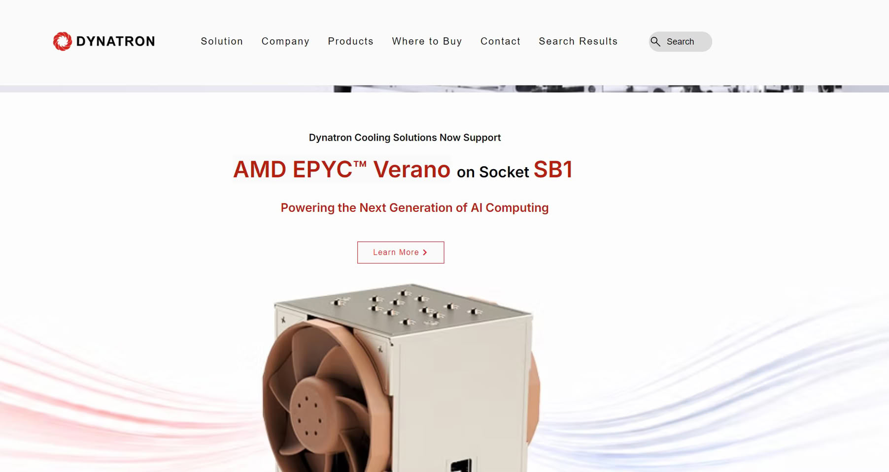

The socket that AMD's upcoming EPYC "Verano" processors will use may be called SB1. The clue does not come from AMD but from a server cooling maker: Dynatron states on its website that its cooling solutions support "AMD EPYC Verano on Socket SB1." It should be read as an indication, not a confirmation: it comes from a product listing, and AMD has not yet disclosed which socket this family will use.

## The SB1 socket, per the Dynatron listing

Dynatron still has a page up for a 4U active cooler listed as "SB1-4U-ACTIVE (TBD)," where that "TBD" makes clear the final name is pending. On the page, maximum power is also marked TBD, and the stated dimensions —128.05 × 106.6 × 130.7 mm— match those of the company's own J26 model for the SP7 socket, so they are likely provisional values carried over from another listing.

From the designation itself, it has been speculated that the "B" in SB1 points to a BGA package soldered to the board, but that is a reading of the name and there is no official confirmation of it.

## What is known about Verano

"Verano" is the codename for the EPYC 9006 LP, a chip based on the Zen 6 microarchitecture that AMD introduced alongside the rest of its sixth-generation EPYC lineup. The company positions it at up to 72 cores, with boost clocks of up to 5 GHz and 24 channels of LPDDR5X memory through replaceable SOCAMM2 modules. Its stated target is AI racks, as a host processor for GPU clusters, with a launch planned for the second half of 2027.

The "Venice" EPYC chips in that same generation use different sockets: SP7, for configurations of up to 256 cores, and SP8, up to 128. For Verano, AMD has not yet revealed the socket name.

## What it means for a build

For anyone building, the lesson is the usual one in the server segment: the socket dictates everything else. A socket change drags the motherboard, the mounting hardware and the cooler with it, and none of those parts inherits compatibility from SP7 or SP8. A 4U active cooler, moreover, constrains the height and airflow inside the chassis, so in a rack it is not enough for the processor to fit: the whole assembly has to be validated. Entry-level EPYC chips already require dedicated boards, as seen with [the ASRock Rack for EPYC 8005 Sorano](/noticias/asrock-rack-sorano-epyc-8005/). Until AMD confirms the official socket, treat SB1 as a workshop lead rather than a buying spec.
