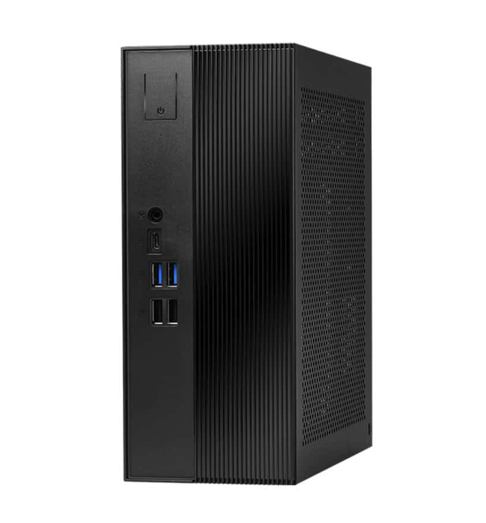
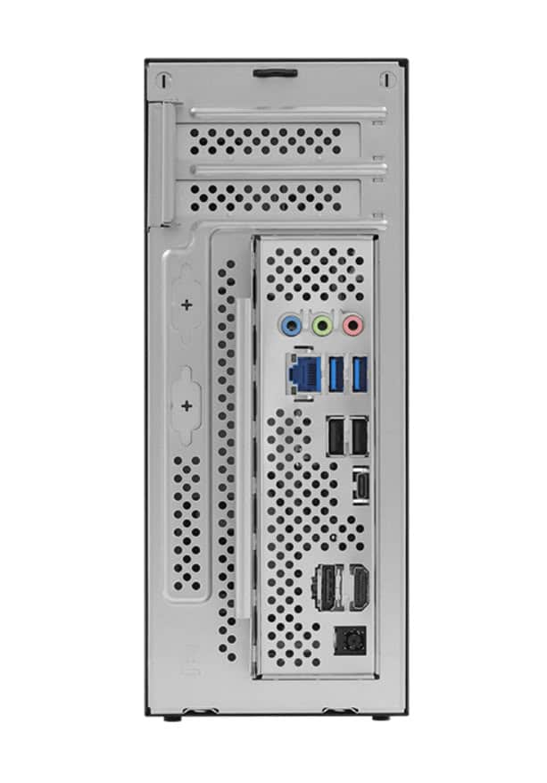

ASRock has announced official support for the Nvidia RTX PRO 4000 Blackwell SFF Edition and RTX PRO 2000 Blackwell professional graphics cards on its two compact platforms, the DeskSlim X600 and the DeskSlim B760. The company's pitch is fitting a professional-grade dedicated GPU into a chassis of just 5 litres without giving up desktop-class expandability.

## A PCIe 5.0 x16 slot in 5 litres

The detail that decides the build is the expansion slot: both platforms include a PCIe 5.0 x16 slot ready for low-profile, dual-slot cards up to 200 mm long. That physical limit is what really determines which GPU fits in the case, because the RTX PRO Blackwell SFF cards fit by design, but any other option will have to respect height and length.

With those dimensions, ASRock targets the DeskSlim at workloads that until now demanded larger towers: local AI inference, content creation, CAD design, 3D modelling and data analysis, plus multi-display productivity.

## Two DeskSlim platforms: AM5 and Intel

The series splits into two models depending on the CPU platform, and here it is worth looking at power draw before the case spec sheet:

- **DeskSlim X600:** AMD AM5 socket, compatible with Ryzen 7000, 8000 and 9000 processors, with CPU power up to 120 W.
- **DeskSlim B760:** designed for 12th, 13th and 14th Gen Intel Core processors, with chips up to 125 W.

Both share the same memory and storage base: four DDR5 UDIMM slots with up to 256 GB of RAM, two M.2 slots for SSDs and two extra SATA ports. In such a tight form factor, that combination is what makes it possible to build a work machine with room for demanding projects.

## What changes for the builder

The arrival of Nvidia's Blackwell architecture in SFF format leaves the DeskSlim as a way to have a small, quiet workstation without giving up graphics acceleration, in line with other compact proposals such as the [Minisforum MS-S1 MAX-P495 workstation](/noticias/componentes/minisforum-ryzen-ai-max-495-workstation/). Before buying the card, it is worth checking two things: that it is an RTX PRO Blackwell SFF and that its length does not exceed 200 mm, because that is the real clearance the chassis offers.

ASRock says the DeskSlim X600 and the DeskSlim B760 are already available through its global distribution network.
