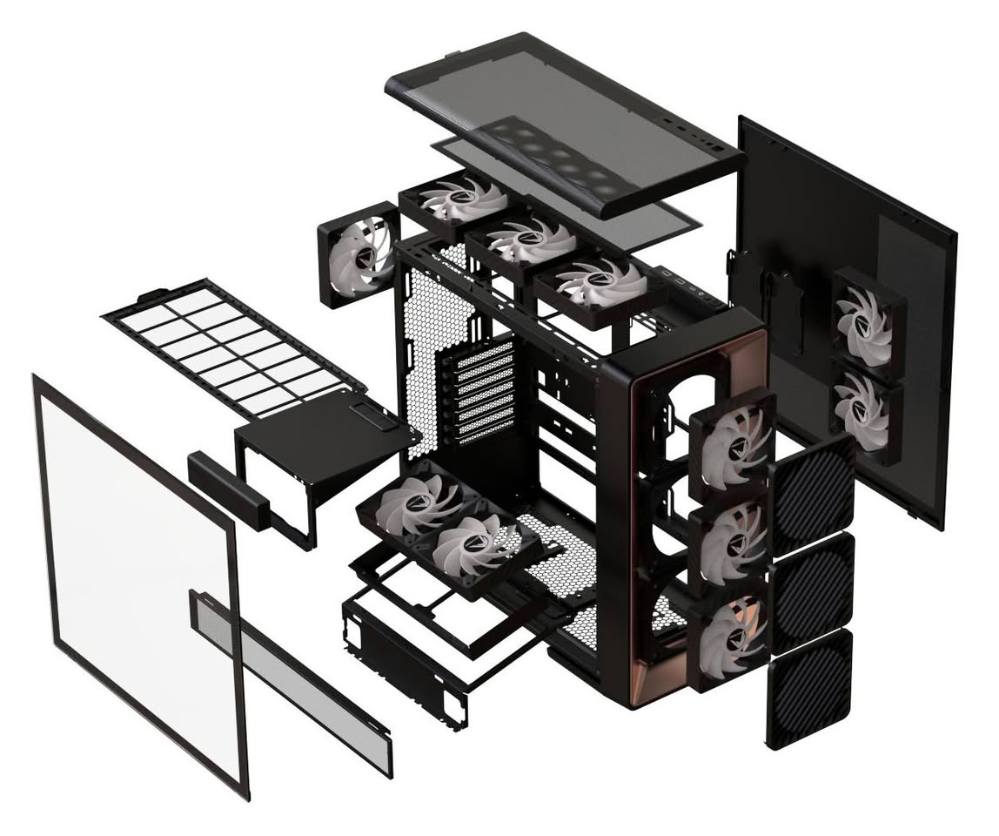
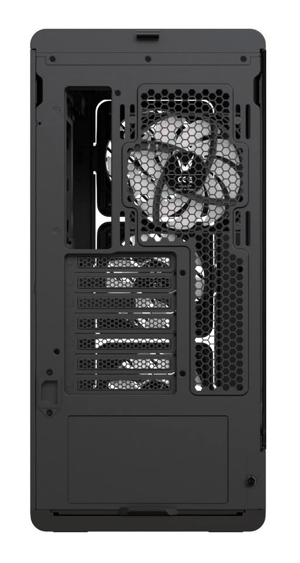

Formula V Line has made its leap into the U.S. market with the Air Power G10, a mid-tower ATX case that is already available for purchase through Newegg. The company first showed it at Computex 2026 and now puts it on sale in six different finishes, starting from $89.99.

## An Adjustable Air Intake and a Configurable Lower Chamber

Instead of fixing the three flat front fans against the chassis, the Air Power G10 mounts each one on its own adjustable bracket. Each fan can be left at 0° or tilted independently by 10°, so that the intake air points toward the graphics card or the processor depending on the build. Each fan assembly can also be removed separately for cleaning or replacement without disassembling the rest.

That per-fan adjustment is what sets this case apart from a tower with a fixed front: whoever installs a large-format GPU can direct airflow toward the card area, and whoever prioritizes CPU cooling can point the fans upward.

In the lower chamber, the power supply and the bottom fan mount can swap positions between the front and rear. This allows reorganizing the lower part of the chassis to adapt it to the hardware and airflow desired by each build. The bottom fan mount is also removable, which simplifies installation.

## Standard Cooling and Space for Hardware

The G10 comes with four PA2 fans: three 120 mm front intake fans and one rear exhaust fan, all with 4-pin PWM control and 3-pin ARGB lighting. The chassis supports up to eleven positions for 120 mm fans, and at the top, radiators of 240 mm or 360 mm. For the graphics card, there is room for models up to 420 mm in length, a detail that matters when planning large builds. If you plan to fill all those positions, it’s worth checking beforehand [which case fans are not actually controlled by the motherboard](/noticias/case-fans-wrong-headers/): the number of real headers weighs more than the spec sheet count.

## Price and Availability of the Air Power G10

The Air Power G10 is sold in six finishes. The Black, Rose Gold Black, and Wood Black cost $89.99, while the White, Titanium Silver Black, and Dark Blue Black rise to $99.99. It is already available in the United States through Newegg, which marks Formula V Line’s entry into the U.S. components market.

## Assembly Tip

When building a case like this, it’s advisable to decide on the front fan orientation before running cables: pointing all three fans at the GPU improves card cooling, but concentrating airflow toward the processor leaves less direct air for the graphics card. Before buying, it is worth checking the length of the GPU, the height of the cooler, and the position of the PSU in the lower chamber; these are the dimensions that decide whether the build fits without surprises.
