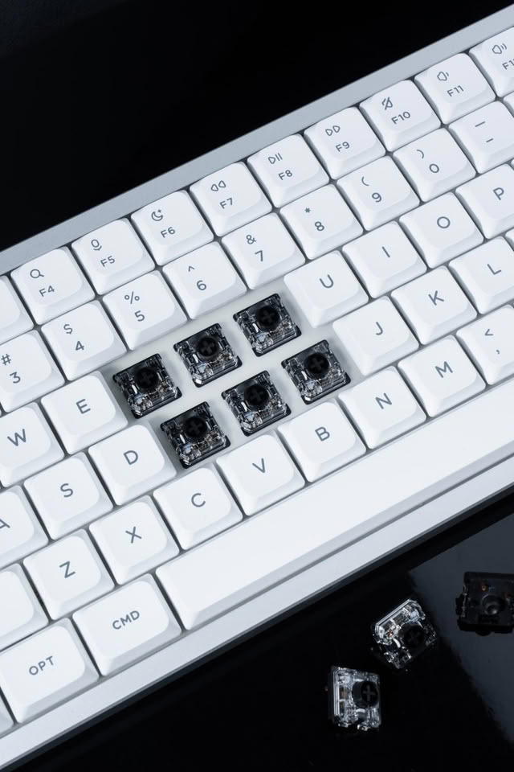
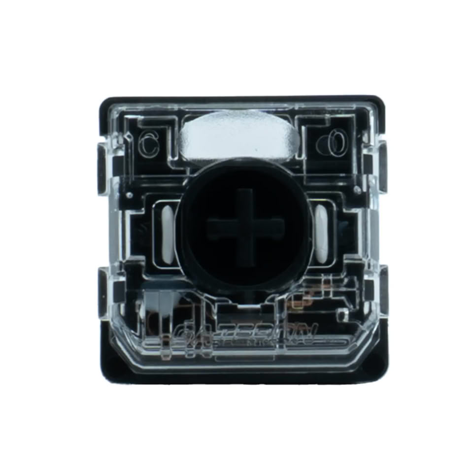

# Gateron launches the Silent Low Profile 3.0 Black, a silent switch that retains full travel

Gateron has expanded its Low Profile 3.0 family with the Silent 3.0 Black, a silent linear switch that maintains the 5-pin layout and the same socket as conventional Cherry MX switches. For those who build, that detail is what matters: the manufacturer can offer the same case in low profile or full height by simply changing the PCB, without touching the socket.

## What is the Silent 3.0 Black

It is a linear switch designed for environments where noise matters and for those who work at night or share space. Gateron uses silicone rings on the stem pieces to dampen background sounds and bottom-out/top-out noises, the usual recipe in silent designs.

The difference is that the rings do not reduce travel: it maintains 1.7mm of actuation and 3.4mm of total displacement from its non-silent equivalents. It is the heaviest variant of the Silent 3.0 family, at 50gf (±15gf). The stem is POM, with a nylon lower housing and transparent PC upper housing, and comes lubricated out of the factory.

## Why it matters for building

The transparent upper case lets backlight shine through, so silencing the keyboard doesn't require giving up key illumination — something that is often the price paid when trying to reduce decibels.

The point that weighs most in a build is compatibility. By sharing the 5-pin geometry with Cherry MX sockets, the same case can be sold with low-profile or full-height keys by simply changing the PCB: there's no need to redesign the PCB or socket. Other manufacturers are also moving pieces in the switch field, as shown by the update of the [Keychron K4 HE and K10 HE with N-pole magnetic switches](/noticias/keychron-k4-k10-he/).

## Price and compatibility

Gateron sells the Silent 3.0 Black directly from its website at $14 for 35 switches and $44 for 110 units. They arrive after the Low Profile 3.0 design has appeared in keyboards from brands like NuPhy and Chilkey.

When buying, the check that matters is not color or feel, but the socket: if the keyboard PCB accepts 5-pin Cherry MX switches, the Silent 3.0 Black is a direct drop-in replacement. It's worth confirming that detail before ordering the 110-unit pack, because an excellent switch on paper that doesn't fit the socket is useless.

