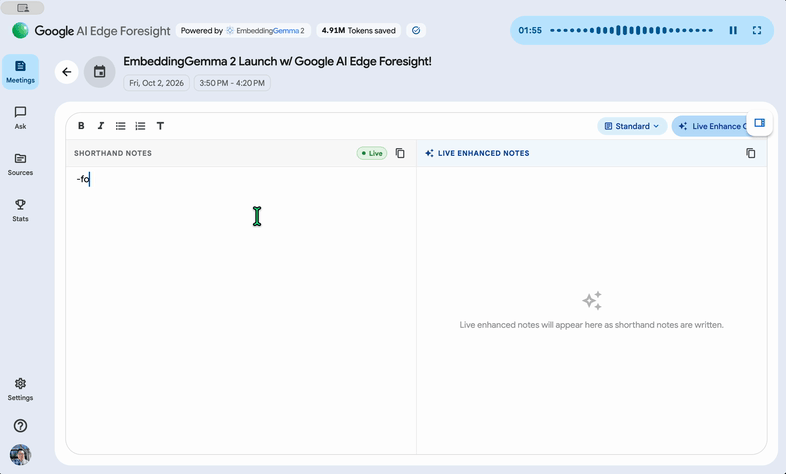
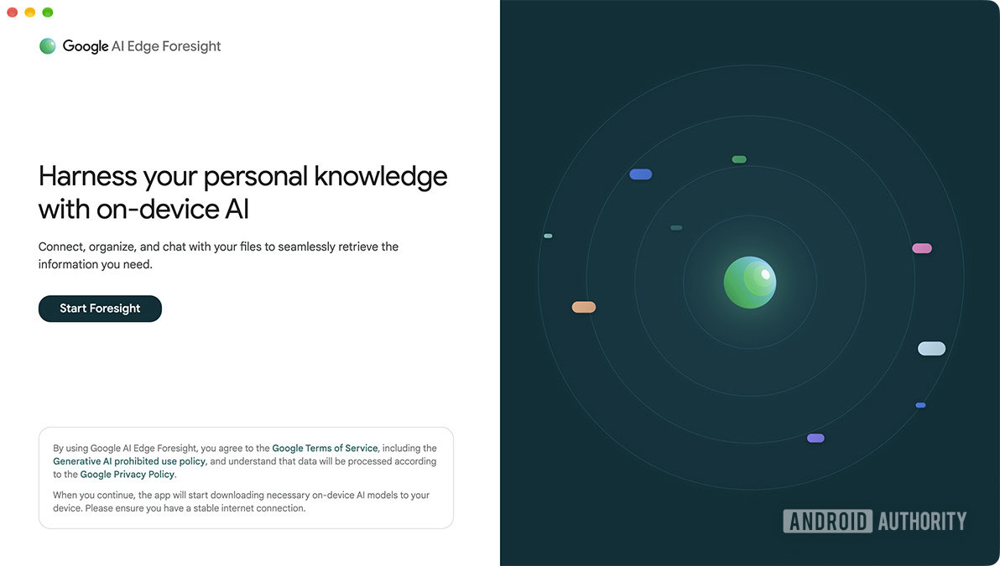
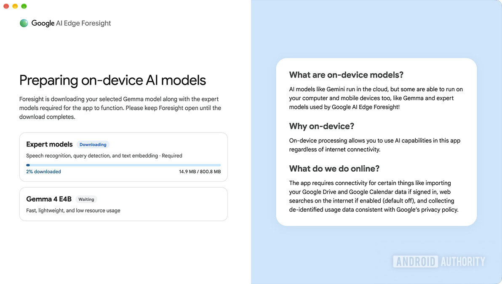
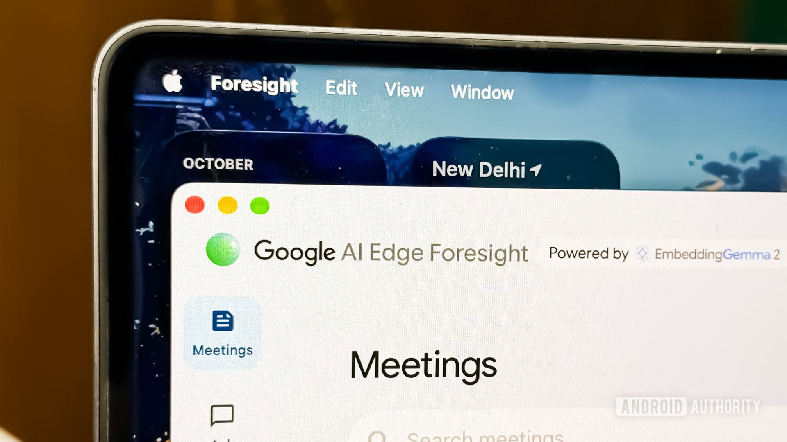

Google introduced **EmbeddingGemma 2**, a multimodal model designed to run on consumer hardware, and paired it with a macOS application called **AI Edge Foresight** that serves as a showcase. The idea is easy to state and hard to pull off: taking notes during a meeting without the audio, the transcript or the related documents ever leaving the machine.

The model is what decides whether the promise holds up on the workbench, and there the numbers matter as much as the feature.

## What EmbeddingGemma 2 demands from the hardware

EmbeddingGemma 2 has **740 million parameters**, is built on the **Gemma 4** architecture and ships under the **Apache 2.0** license. Google describes it as an "ultra-low-latency decision engine" that searches text, images, video frames and audio inside the device itself.

The figure that matters to anyone who checks the RAM before the showcase: with quantization, on a **Google Pixel 11 Pro** the model needs **about 191 MB of active RAM** for the text-only weights and **about 567 MB** for the full multimodal variant. It is not a workload that will fight the rest of the system for resources, which fits the idea of running it in the background while you work.

## What Foresight does: from scribbles to notes, with no cloud

AI Edge Foresight works during video calls or in-person meetings: it listens in the background so you only have to jot down **shorthand bullets** for the things you want to remember. The app, using EmbeddingGemma 2, "enriches those abbreviated notes into polished notes" with the meeting transcript, and it does so instantly. Both the transcript and the audio are processed **entirely on the device**.

There are more features beyond the summary. Foresight can point at your **project folders, reference materials, diagrams and calendar**: it supports local files and Google Drive, so you can ask it about specific information without first organizing the files by hand. The app includes a **chat** with conversational retrieval and summary over your personal knowledge, and a **live assistance** feature that listens and answers questions automatically.

Android Authority tested the application by pretending to be in a meeting: in its account, it quickly turned the bullets into notes and detected questions to answer them from the transcript.

## Where it runs and what it leaves behind

The app runs on **Apple Silicon** and can be downloaded for free from Google's AI Edge page. The first run requires downloading the local models, a step that can take a minute before you can start using it. Foresight thus joins the family's two other Mac applications: **AI Edge Gallery** and **AI Edge Eloquent**, the latter focused on offline transcription. On Android and iOS, the model's demos live in Google AI Edge Gallery.

This is not the first time the Gemma family has landed on consumer hardware: [we already saw how a recycled Intel Arc A750 ran Gemma-4-E4B as a local server](/noticias/intel-arc-local-llm-server/), with the graphics card as the only accelerator.

For anyone who builds and pushes hardware, the relevant detail is not the demo but the **memory footprint**: a multimodal model that makes do with hundreds of megabytes opens the door to features like this on laptops and mini-PCs with no dedicated GPU. The fine print, though, is the usual one: these figures come from Google and refer to one specific device, so real-world performance will depend on the chip, the quantization chosen and how hard you push the multimodal side.
