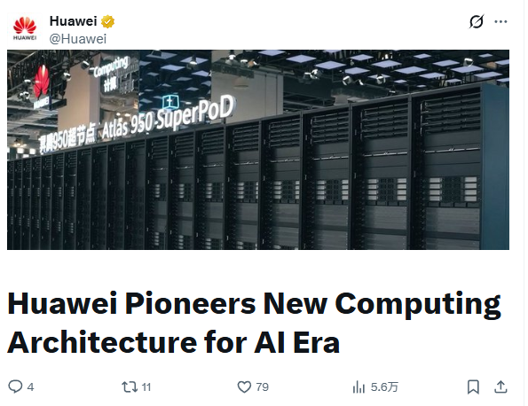

Huawei argues that its family of **Ascend** accelerators already holds a larger share of the Chinese market than **Nvidia**. The claim does not come from a third-party report but from the vendor itself: it was made by Huawei rotating chairman Xu Zhijun during a question-and-answer session with journalists at the company's Huawei Connect event on September 17, which Huawei did not publish until October 5.

It is worth reading it for what it is, a claim from an interested party. Xu himself admitted that gathering reliable data on Nvidia's share in China is difficult and that the figure he uses comes from Huawei's own statistics. With that caveat, the message is clear: the company presents Ascend as the reference accelerator inside its borders.

## Ascend ahead of Nvidia in China, according to Huawei

At the same meeting, Xu introduced the **Ascend 950 supernode** and its **Peerium** computing architecture, the first product generation built on it. The idea behind the concept is that a supernode makes thousands — or tens of thousands — of processors work "as a single computer". Peerium drops the traditional master-slave scheme and connects CPUs, NPUs, memory, SSDs, network cards and switches on equal footing, so compute, storage and network are linked without hierarchies.

That approach targets large language model training, where what is needed is not one fast card in isolation but a block that can scale without losing cohesion. It is the same logic Huawei had already taken to the Ascend 960, its supernode reserved for the Chinese market.

## No capacity to export: the Ascend 950 stays home

Asked whether the company plans to take the Ascend 950 supernode outside China, Xu replied that there is **no plan for a full international expansion**. The reason is not strategic but a matter of capacity: according to the executive, Huawei does not have enough output to meet domestic demand, let alone export. He acknowledged that several countries show strong interest, that the firm runs tests and ships some units to them, but in very limited quantities.

The point worth keeping is that one: domestic supply runs out before markets are opened. For anyone planning an AI cluster outside China, the Ascend 950 is not a component that can be ordered as usual today.

## Self-sufficiency: a path Huawei takes as inevitable

Xu framed all of the above within China's push for semiconductor self-sufficiency. His argument is that a country of 1.4 billion people and an industrial power cannot depend on others deciding whether or not it can access certain products. According to him, Chinese industry has a strong sense of urgency and will not accept that dependence.

The executive admitted that China's chip technology is still not at the expected level, but argued that a **sufficient and controlled supply** has value of its own: it lets people work without the daily uncertainty of supply. His conclusion was that the path for the country, for the domestic industry and for Huawei runs through complete self-sufficiency in chips and across the entire semiconductor value chain, and that this goal "will become reality sooner or later".

## What it means for anyone building a system

For those specifying or assembling a compute cluster in Spain or the rest of Europe, the practical consequence is simple: availability decides over the spec sheet. The Ascend 950 stays, for now, inside China, so real purchasing options in the local market still go through Nvidia or other Western alternatives.

Neither of those things is set in stone. If Huawei expands capacity, as it says it needs to, the map of AI accelerator suppliers could shift; until then, treat the share the company claims for itself as a market headline, not as a fact verified by third parties.
