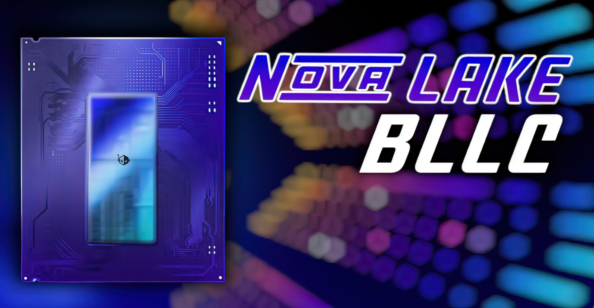

Intel's next desktop generation, **Nova Lake-S**, is starting to take shape through a leak. According to a spec list circulated by leaker LC Tech Leaks and picked up by Wccftech, the "Core Ultra Series 4" family would include **seven models** for the LGA 1954 socket, led by a Core Ultra 9 4970K BFC with 28 cores and a 125 W base power (PL1). This is, it bears stressing, a leak rather than an Intel confirmation: none of these figures is official yet.

## What the Nova Lake-S leak says: seven SKUs on a single die

The seven models would be based on a single compute tile with a maximum of 28 cores in an 8+16+4 split (P, E and LP-E). The table accompanying the leak reads as follows:

| Name | Cores / threads | Config (P/E/LPE) | bLLC | TDP (PL1) | iGPU |
| --- | --- | --- | --- | --- | --- |
| Core Ultra 9 4970K BFC | 28 / 28 | 8+16+4 | Yes (up to 144 MB) | 125 W | 32 EUs |
| Core Ultra 9 4950K | 28 / 28 | 8+16+4 | No | 125 W | 32 EUs |
| Core Ultra 9 4900 BFC | 22 / 22 | 6+12+4 | Yes (up to 144 MB) | 65 W | 32 EUs |
| Core Ultra 7 4870K BFC | 24 / 24 | 8+12+4 | Yes (up to 144 MB) | 125 W | 32 EUs |
| Core Ultra 7 4850K | 24 / 24 | 8+12+4 | No | 125 W | 32 EUs |
| Core Ultra 5 4650K | 22 / 22 | 6+12+4 | No | 125 W | 32 EUs |
| Core Ultra 5 4650KF | 22 / 22 | 6+12+4 | No | 125 W | N/A |

The leak tags the variants with added cache as **BFC**: the 4970K, the 4900 and the 4870K. The exact amount of bLLC per model would still be up in the air, with a ceiling of up to 144 MB for these single-die chips; Intel could cut it back by SKU. The **KF** suffix on the 4650K means it ships without integrated graphics, while the remaining standard models keep 32 EUs.

## What builders look at: socket, TDP and cache

For a build, the hard fact is the **LGA 1954 socket**: it is a new platform, so it does not reuse earlier boards. The leak places the Z990 and Z970 as the first chipsets to go with it, and makes no mention of compatibility with previous generations. If you are coming from a recent Intel platform, that means a new board and, almost certainly, new memory.

On power, the 125 W PL1 across most of the range stays in line with today's unlocked models, so the VRM and cooling demands should feel familiar: enough phases to sustain that budget and a cooler sized for it, not a new thermal surprise. The Core Ultra 9 4900 BFC drops to 65 W, which puts it as the least hot option in the group.

The other lever is cache. The 144 MB of bLLC on the BFC models points to the big-cache strategy Intel has been pushing, and it usually shows up more in games and memory-heavy workloads than in raw throughput. Even so, with no official per-model figures, it is best to treat that 144 MB as the family ceiling, not the value of each chip.

The parts share a graphics engine (32 EUs) except for the KF, and all of them start from the same compute die. The **dual-die** models, with up to 52 cores, would come later, so this first wave is the single compute tile one. It is the same staggered handover strategy already hinted at with the supposed [Raptor Lake Next](https://www.techspain24.com/noticias/intel-raptor-lake-next-8p/): reuse what exists at the bottom while the new architecture lands at the top.

## When they would arrive and what it changes for readers

The timeline the leak handles points to a first Nova Lake-S launch early next year, after a **CES 2027** unveiling, with the LGA 1954 socket and the Z990/Z970 boards leading the way. The dual-die variants, with up to 52 cores, would be expected around Computex 2027, the same window in which AMD is expected to answer with its Zen 7 "Olympic Ridge". On laptops, a parallel leak from Jaykihn holds that Nova Lake-HX chips will keep the four-digit scheme, while the H and suffix-less lines would stay with the current three digits.

For anyone thinking about a build, the practical reading is simple: if the machine is for work now, there is no point waiting for a leak. The real buying date will be set by boards on shelves and by measured-power reviews, not the leaked list. And if your idea was to upgrade on an existing Intel platform, the jump to [LGA 1954](https://www.techspain24.com/noticias/intel-lga-1954-nova-lake/) forces you to plan a board and memory anew, not just the CPU. Anyone with some slack can size up the ground calmly: boards and reviews first, the chip after.
