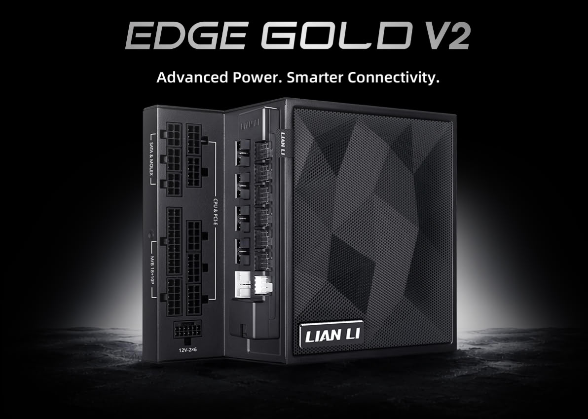

Lian Li has expanded its Edge power supply family with the new **Edge Platinum V2** units, available in 1350 W, 1200 W and 1000 W, and the **Edge Gold V2**, in 1000 W and 850 W. The company pairs them with two expansion modules, the **Edge Hub V2** and **Edge Hub ADV**, which concentrate USB ports and PWM fan channels and, on the top model, monitor the temperature of the GPU power connector. The details come from the manufacturer's press release, relayed by TechPowerUp.

When you build, what decides a power supply is not just the wattage on the label, but whether it fits the case and where the cables will run. In this lineup, the answer is an L-shaped form factor.

## The L-shaped layout of the Edge V2 power supplies

The Edge V2 keep the series' L-shaped design: the connectors are reoriented toward the outside of the chassis, so the cabling stays in the rear chamber and never crosses the main area of the build. It is an approach aimed at dual-chamber cases, where the space next to the motherboard and the GPU is the most contested.

The geometry is identical across wattages: 182 mm deep, 86 mm wide and 150 mm tall, with the same mounting. That simplifies the math up front, since switching models within the range does not force you to reposition anything. All of them are fully modular and meet the **ATX 3.1** standard.

## Edge Hub V2 and Edge Hub ADV: more USB and thermal sensors

The hubs extend internal connectivity beyond what a motherboard offers. The **Edge Hub V2** adds six independently controllable PWM fan channels and four USB ports, backed by a dual-chip architecture with 1-to-4 splitting and a direct chipset-to-USB signal path. Real-time monitoring in **L-Connect 3** helps spot load spikes before they cause screen freezes or signal drops across LCD fans, AIO displays, Strimer cables and other internal peripherals.

The **Edge Hub ADV** keeps the USB expansion and the six PWM channels but adds advanced thermal monitoring: NTC sensors that measure the temperature of up to two 12V-2×6 GPU cables and of the hub itself. A 32-bit ARM microcontroller handles visual alerts in L-Connect 3 or email notifications if the user is away from the PC. If the temperature stays above the threshold for 15 minutes, the system shuts down on its own as a safeguard. Both hubs mount magnetically and can be bought separately.

## Cabling and maintenance

Cabling sets the two families apart. The **Edge Gold V2** use flat cables with a braided-texture finish; the **Edge Platinum V2** include individually braided cables and pre-installed combs on the 20+4-pin motherboard and 12V-2×6 GPU cables, plus a dual-color 12V-2×6 housing that helps you confirm the connector is fully inserted.

The 1350 W model adds an extra set of shortened 20+4-pin and 12V-2×6 cables for back-connect motherboards and Strimer RGB builds, along with a 12V-2×6 cable with a GPU-side thermal sensor that connects to the Edge Hub ADV. On maintenance, the Gold and Platinum units carry a removable magnetic dust filter; the Platinum models add a 360-hour cleaning reminder that turns the internal LED red. Lian Li also states that the range uses 100% Japanese capacitors (Rubycon, Nichicon and Nippon Chemi-Con) and backs the power supplies with a 10-year warranty and the hubs with 2 years.

## Models, pricing and what to pair the Edge V2 with

The lineup breaks down as follows, with launch prices in dollars and euros:

- Edge Gold V2 850 W (black, no hub): $99.99 / €99.99
- Edge Gold V2 1000 W (black or white, with Edge Hub V2): $139.99 / €139.99
- Edge Platinum V2 1000 W (black or white, with Edge Hub V2): $164.99 / €164.99
- Edge Platinum V2 1200 W (black or white, with Edge Hub V2): $179.99 / €179.99
- Edge Platinum V2 1350 W (black or white, with Edge Hub ADV): $259.99 / €259.99
- Edge Hub V2 sold separately: $21.99
- Edge Hub ADV sold separately: $39.99

The L-shaped layout only pays off in a dual-chamber case with clearance for this geometry; in a conventional chassis it makes cable management harder. Those after the cleanest build are better served from the 1000 W model up, which already includes a hub. And if the system runs a high-end GPU with a 12V-2×6 connector, the appeal of the Edge Hub ADV is the thermal reading of the cable, a sensitive point that has already caused problems on cards caught up in the [16-pin connector issue](/noticias/rtx-5090-triple-8-pin-mod/). That said, no sensor replaces a properly seated connector; the protection warns and shuts down, it does not fix a faulty installation.

