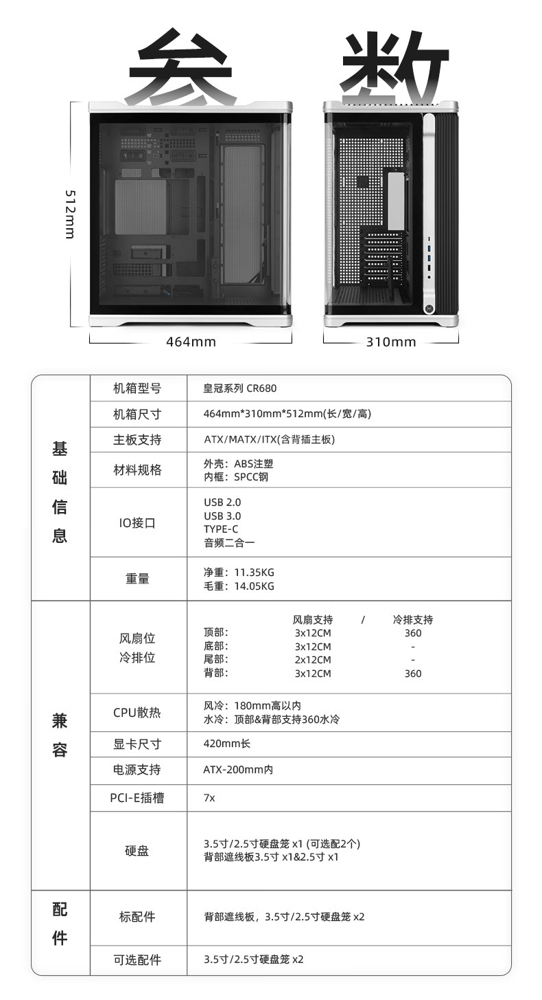
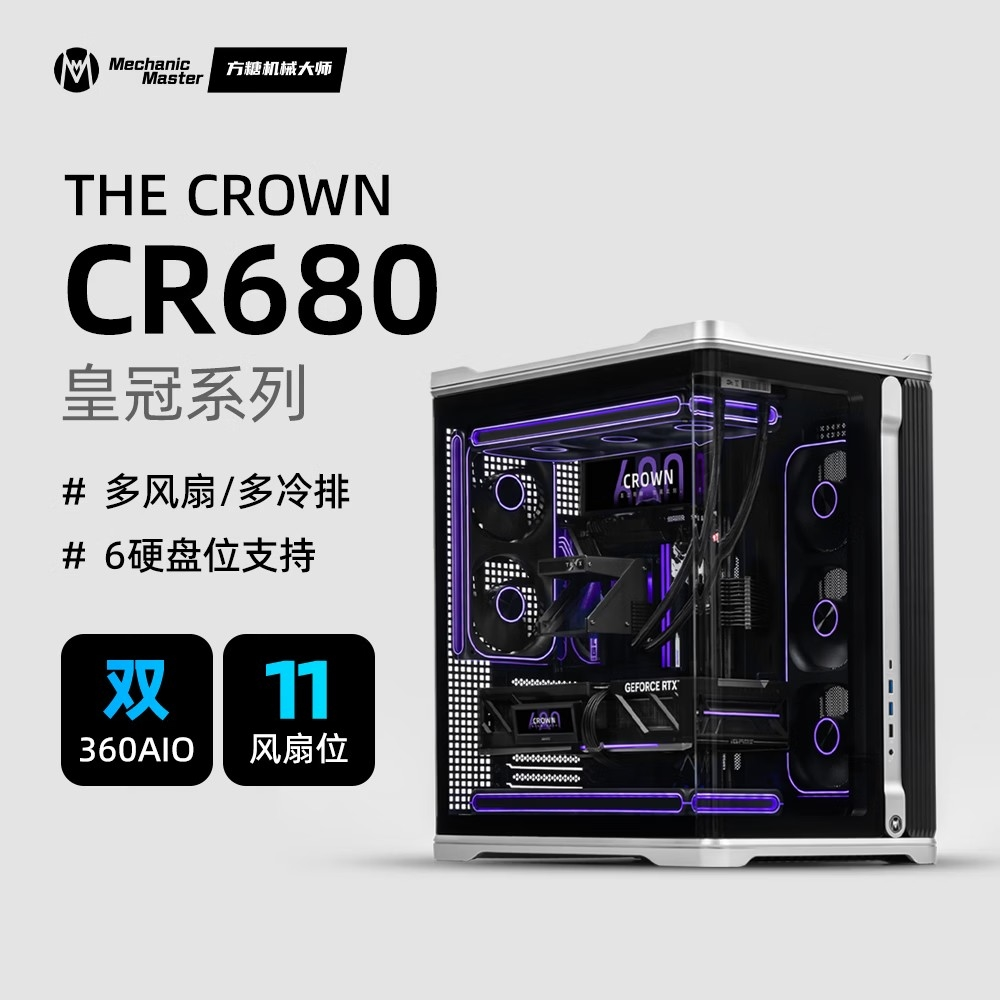
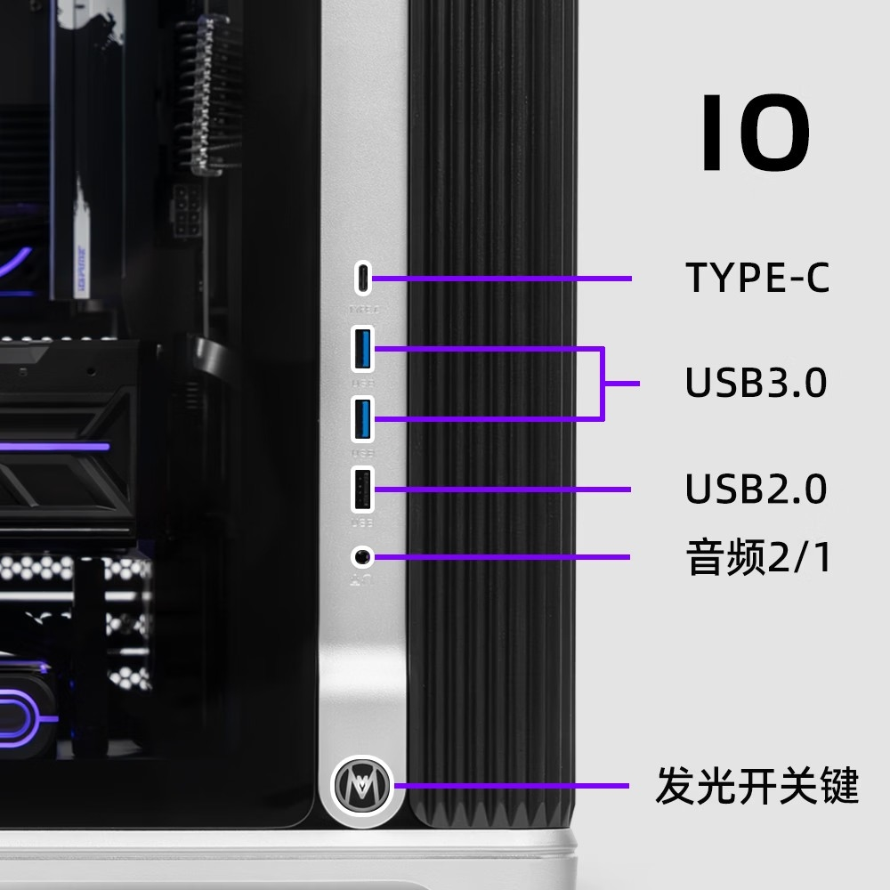

Mechanic Master has opened pre-sales for the CR680, the first chassis in its CROWN series. The reference price is 699 yuanes, although with a deposit of 99 yuanes the final amount drops to 628 yuanes. The purchase is channeled through JD.com, within the Chinese market: the source does not confirm date or price for Europe, so for now it is a reference to follow.

The proposal of this case rests on two very workshop-oriented ideas: removing screws from the equation and not forcing the choice of a single glass orientation. On paper, the CR680 is a large dual-chamber case that prioritizes quick access to the interior.

## The CR680, five screwless faces and a reversible side panel

Except for the rear, all five sides of the chassis disassemble with clips. This is what the brand presents as a five-face screwless assembly: changing a component does not require unscrewing screw by screw. In the rear area there is a shroud to hide the cabling, which the manufacturer calls one-second cable management: a panel that covers the PSU and cable pass-throughs, a detail appreciated by those who assemble in a hurry.

The side panel is tempered glass in two curved pieces and allows two mounting orientations. In the vertical position, the glass ends up on the left; if you flip the entire chassis upside down, the side panel moves to the right. It is a curious solution: the same case changes sides without needing to buy a second one.

Additionally, the top integrates a mesh designed to let air pass through and stop dust.

## What fits in: GPU, radiators, and drives

The official dimensions are 464 x 310 x 512 mm, with an injected ABS exterior and SPCC steel interior. The declared net weight is 11.35 kg and the gross weight is 14.05 kg. The figure that most conditions assembly is the graphics card length: 420 mm. The tower cooler should not exceed 180 mm and the ATX power supply, 200 mm.

On the motherboard it supports ATX, mATX, and ITX formats, in addition to boards with rear connectors, and offers seven PCI-E slots.

Cooling is the other pillar of the design. There is room for eleven 120 mm fans, distributed as three on top, three on bottom, two in the rear area and three in the back zone. Both the top and rear areas accommodate 360 mm radiators, which gives the double 360 mm circuit that the manufacturer promotes.

For storage, there are two 3.5"/2.5" bays as standard and the option to add two more; the declared maximum is five 3.5-inch drives or six 2.5-inch ones. On the front panel we find a USB Type-C, two USB 3.0 ports, one USB 2.0 port, a combined audio connector and an illuminated power button.

## What changes for someone building a PC

The CR680 is not a thermal revolution: it is a spacious case that plays in favor of someone who changes hardware often. Clip disassembly and the reversible side panel simplify access, but it is advisable to check physical compatibility first. The 420 mm for the GPU, the 180 mm for the tower cooler and the 200 mm for the PSU are generous margins; less generous is the space it occupies, with 512 mm of height and more than 11 kg empty weight, so you have to measure the desk and anticipate airflow before buying it.

With a promotional price of 628 yuan in China, the hook is building without tools. Anyone following the catalog of [PC Components](/noticias/componentes/) will find the rest of the section's news, and for the European market one must wait for official confirmation.
