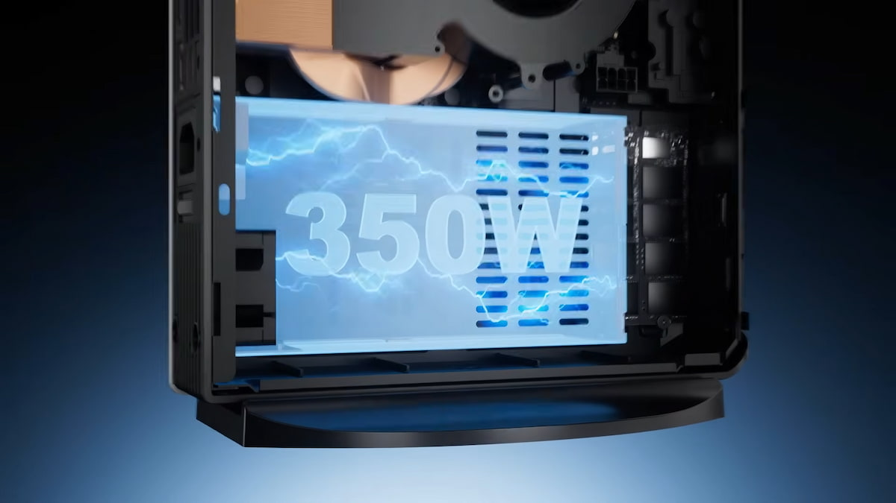

Minisforum has introduced the AtomMan G1 Pro, a gaming Mini PC that raises the bar of its compact lineup. The configuration is built around an AMD Ryzen 9 8945HX processor paired with a Radeon RX 9060 XT graphics card with 16 GB of VRAM, plus 32 GB of RAM and a 1 TB SSD. The announced starting price is $1,759, a figure that places it in high-end desktop territory.

## What the AtomMan G1 Pro brings

The core of the machine is the pairing of the Ryzen 9 8945HX and the 16 GB Radeon RX 9060 XT. According to the published information, that combination delivers solid performance at FHD (1920 x 1080), with high frame rates when image quality is kept at demanding levels. It is a card that has already been seen running CUDA workloads on Windows through [ZLUDA and ROCm](/noticias/cuda-on-amd-zluda-windows/), which hints at its headroom beyond pure gaming.

For connectivity, the AtomMan G1 Pro includes two HDMI 2.1, one DisplayPort 1.4a and one DisplayPort 2.1b, plus several USB-A and USB-C ports. That is generous video output for such a small chassis: it can drive several monitors without adapters.

## Cooling and expansion headroom

The point worth scrutinising on any gaming Mini PC is how it moves heat out of the case. The source describes a ventilation system capable of cooling a graphics chip in this class, but warns that the machine runs quite hot as a result. In a small chassis, airflow and clearance are limited, so the thermal headroom is not that of a tower: where the unit is placed and how much free space is left around it matter.

The RAM can be expanded, which gives the machine some room to grow over time. That is not a minor detail when the remaining components are integrated and cannot be swapped.

## Is it worth it over a desktop?

The comparison with building a custom PC is unavoidable. According to the outlet, putting together a desktop with similar characteristics would cost around €1,200 today, against roughly €800 a year ago, in a context of inflated prices driven by the memory crisis. In other words, the compact format's premium is real and the G1 Pro does not compete on price.

When building, the decision comes down to use: if the goal is FHD gaming at high quality, the AtomMan G1 Pro delivers the performance in very little space and with no assembly. If you plan to move up in resolution or want upgrades beyond RAM, a desktop remains the more flexible and cheaper option to maintain in the long run.
