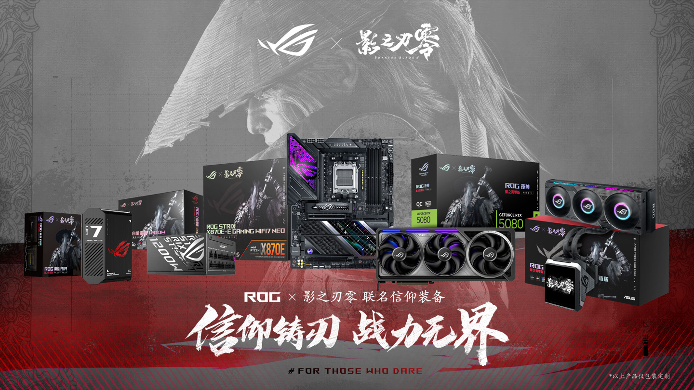

ROG has published the first images of its limited edition equipment line inspired by Phantom Blade Zero, the action and martial arts game from S-Game launching on October 29. The collection aims to cover much of what surrounds a gaming PC: monitor, keyboard, mouse, headphones, a keycap set, a NUC, and a case.

## What ROG Has Shown

The announcement arrives as images showcasing the look, with the game's aesthetic applied to each piece. The list accompanying the leak includes:

- Monitor.
- Keyboard and mouse.
- Headphones.
- Keycap set.
- NUC.
- Case.

For now ROG has not detailed specifications, prices or availability dates for these products: it has only revealed how they look. It is a common pattern in themed launches, where the finish is shown first and the technical sheet arrives later.

## The Game Marking the Launch

Phantom Blade Zero is developed with Unreal Engine 5 and is described as a dark wuxia action game. The story follows a protagonist with only 66 days of life left who must uncover a conspiracy in a martial arts world in full chaos. The combat system offers more than 30 main weapons, which combine with secondary weapons and movements specific to each one.

The date marked in red is October 29, with pre-order already open on PS5, PS5 Pro, Steam, Epic, WeGame and TapTap for PC. S-Game, the studio behind the title, has also prepared a limited batch of 20,000 physical collector's boxes.

## What Changes for Those Building Their Setup

For those assembling a PC, the announcement is mostly about finishes and not hardware: a themed collection usually doesn't bring better VRMs or better cooling, and its pieces compete on aesthetics. The two that truly weigh in the build are the case and the NUC, because they condition space and cooling; the keyboard, mouse and headphones are peripherals where design weighs more than specs.

It is advisable to wait for specifications before reserving. A game-themed case can have an interior identical to a standard model and, still, charge a premium, so it is worth comparing the internal layout, clearance for the graphics card and airflow with the standard range. If interest lies in the case, ROG already presented a few weeks ago the [Cronox ARGB and Eurux GR120 fans](/noticias/asus-rog-cronox-eurux/), a reference from the current catalog with which one can compare before deciding.
