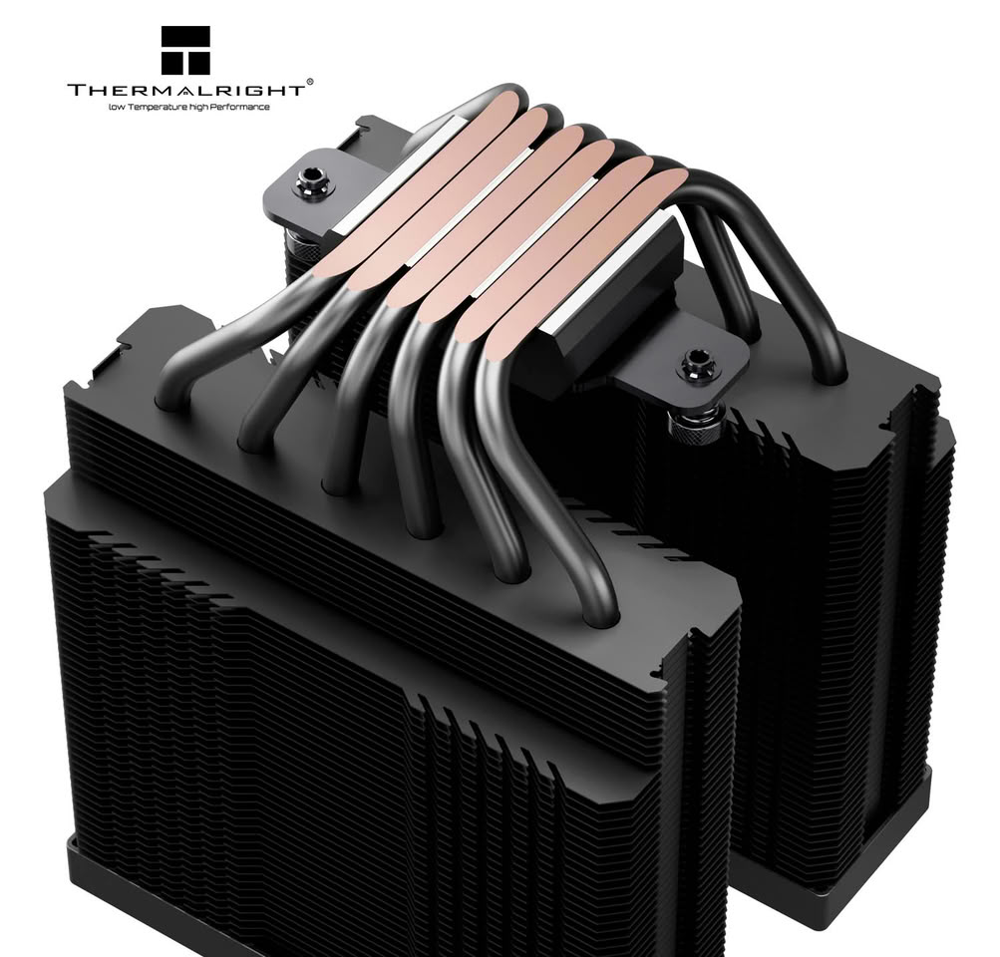
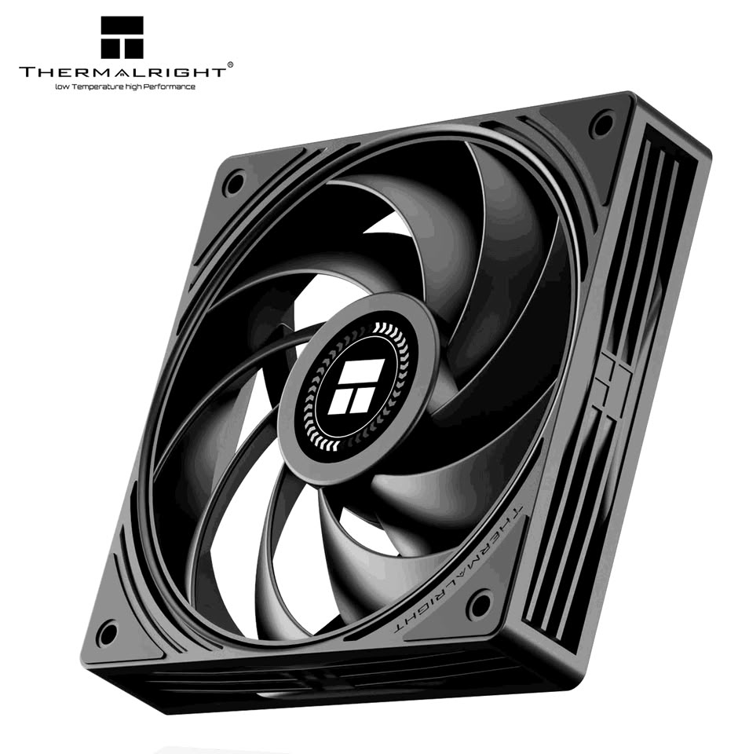
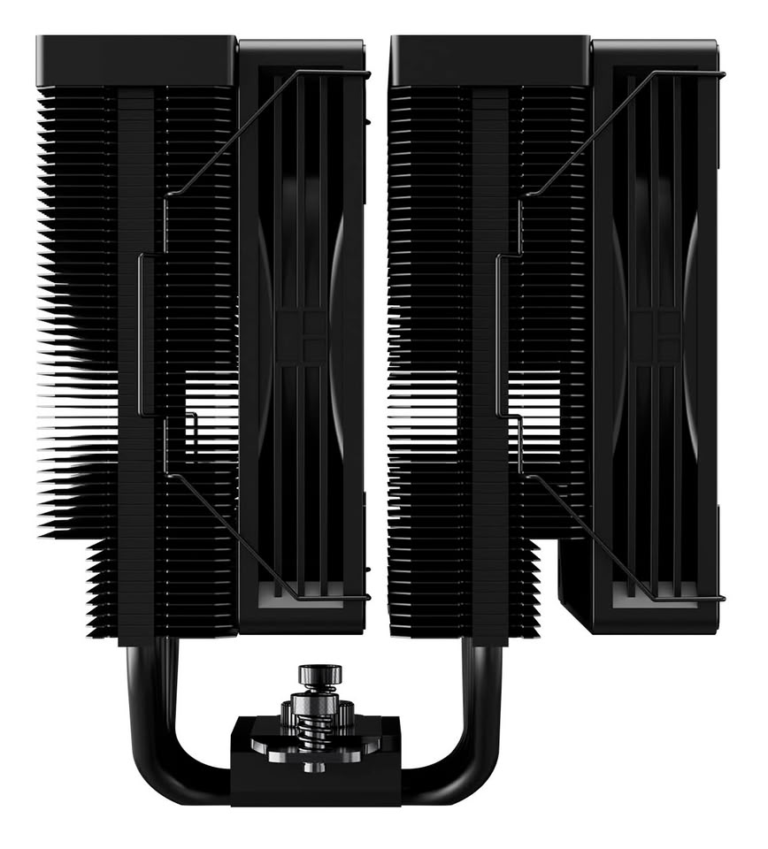

Thermalright has expanded its Peerless Assassin family with the **Peerless Assassin 120H-A Dark**, a dual-tower variant finished in black on every part. The company keeps the recipe of the existing Black models — six copper heat pipes, two fin stacks and a pair of fans — but raises the fan speed to shave off a few extra degrees under sustained load. The launch follows the recent single-tower Assassin X 120-A Dark, which shares the dark finish as its main selling point.

## All-black dual tower with six direct-touch heat pipes

The block moves heat away through six 6 mm U-shaped copper heat pipes that run through both fin stacks with a direct-touch design over the processor: the pipe rests directly on the CPU, with no intermediate plate. The assembly measures 125 x 135 x 159 mm with the fans installed and caps the top with black covers, a detail meant to deliver a uniform finish and avoid the bare-fin contrast found on other coolers sold as "all-black".

As for platforms, the cooler supports Intel LGA115X, 1200, 1700 and 1851, and AMD AM4 and AM5, so it covers both recent systems and builds from earlier generations.

## The 120H-A Dark pushes its fans up to 2400 RPM

The real difference from the standard Peerless Assassin 120 Black lies in the bundled fans. The two included TL-N12-R9 V2 units spin up to 2400 RPM, well above the 1550 RPM of the base model. Each unit pushes up to 85.35 CFM at 2.95 mmH2O of static pressure, and the rated maximum noise is 33.3 dB(A), with S-FDB bearings and 4-pin PWM control.

That extra headroom is what sets this version apart from the rest of the lineup: with more airflow and more pressure, Thermalright aims at more demanding processors, where the stock fans fall short once the load holds over time.

## Pricing and availability

Thermalright has not yet announced a price or which regions will get the cooler. TechPowerUp points to an estimate of around $55, using the 120 SE Black as a reference, which is listed on Amazon for around $43. That is the outlet's calculation, not a price confirmed by the manufacturer, so it is worth waiting for the official announcement before taking it at face value.

## Mounting advice

Before buying, measure first. The 159 mm height with fans is the figure to cross-check against the case's internal clearance, and the dual-tower shape means checking the free space around the socket and the height of the memory modules. Coming from a single-tower cooler, the gain is not in the finish but in airflow; and if your case is shallow, make sure the two fans do not clash with the side panel.

Physical compatibility comes before any spec sheet, and [an oversized cooler can completely change the thermal behavior of a build](/noticias/rtx-4090-cooler-on-rtx-3060/) even when the paper promises otherwise.

