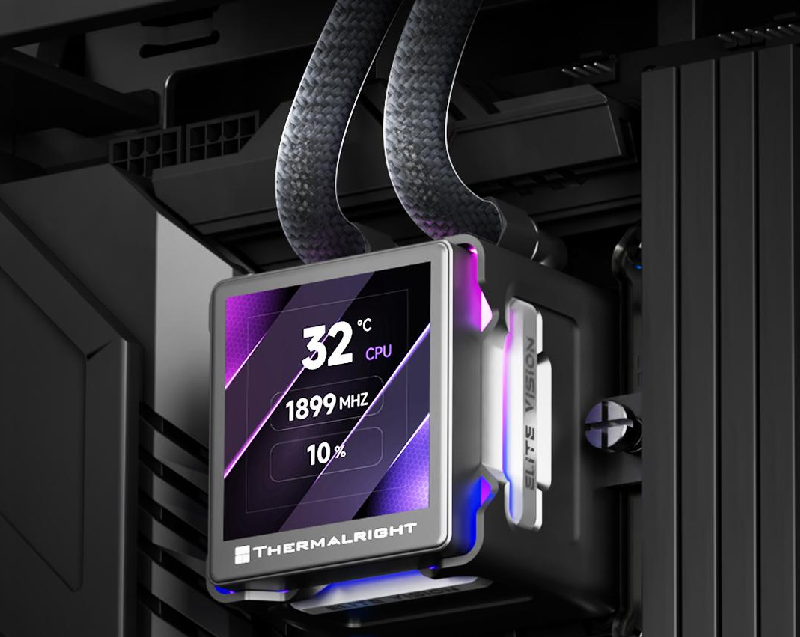

Thermalright has presented the TR-A30 ARGB and TR-A30 Vision cases, two panoramic ATX towers that share a structure and differ in a single detail: the Vision version adds a magnetic screen. The starting price is 299 yuanes in the Chinese market.

## Two Versions of the TR-A30 on the Same Base

Both models start from the same design: an internal structure of two stepped chambers —one upper and one lower— with an ARGB strip integrated into the edge and a hidden duct for the liquid cooling system tubes above the motherboard. Tempered glass covers the top, side, and front, so the case allows viewing the interior from multiple sides at once.

The difference lies right in that hidden duct: the TR-A30 Vision incorporates a 9.16-inch magnetic screen there with a resolution of 1920 × 462, intended to display system parameters or dynamic effects. The TR-A30 ARGB keeps the integrated lighting and without a screen.

## Clearances and Ventilation: What Decides the Build

Both cases measure 440 × 232 × 512 mm and accept Mini-ITX, Micro-ATX, and ATX motherboards. The maximum height for the CPU cooler is 165 mm; the maximum length of a graphics card is 400 mm, and an ATX power supply can reach up to 220 mm. There are seven full-height PCI slots.

For storage it offers an independent modular support with one 3.5-inch bay and two 2.5-inch bays. The front panel includes a USB Type-C port, two USB Type-A ports, and audio/microphone jacks.

For cooling, Thermalright allows mounting up to seven fans: three 120 mm ones on the side (with compatibility for 120, 240, and 360 mm radiators), one 120 mm fan at the rear (for a 120 mm radiator) and three 120 mm fans at the bottom. The detail worth keeping in mind is that it does not include any fans as standard, so the real build cost rises when adding them. If you plan to fill it up, it’s worth reviewing beforehand [why many fan connectors are not truly controlled by the motherboard](/noticias/case-fans-wrong-headers/).

## Price and What to Consider Before Buying

The launch price starts at 299 yuanes in China. For someone building a system with a 360 mm radiator on the side and a large graphics card, the TR-A30 fits regarding clearances; however, since it does not come with fans, they must be budgeted separately and airflow verified, especially if the case is heavily loaded. The Vision screen is a showpiece extra: useful for displaying telemetry, dispensable if what matters is cooling.

As a build tip, it’s advisable to plan the order: install the motherboard and radiator before closing the tube duct, and reserve the three bottom fans if the graphics card is going to work near the base. It is a case where glass rules and ventilation is solved by hand, in line with the [twin-tower Peerless Assassin](/noticias/componentes/thermalright-peerless-assassin-120h-a-dark/) that the brand presented a few days ago.
