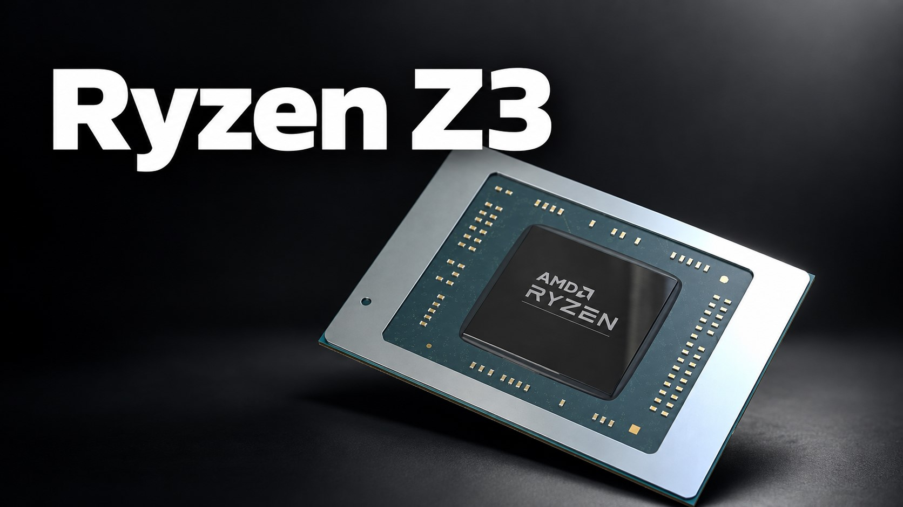

The next generation of Windows gaming handhelds is back in rumor territory. On October 1, leaker Gotou_3rd (@Gotou_kai3) posted a short list of specifications attributed to the AMD Ryzen Z3 on X, the chip meant to succeed the Ryzen Z1 in devices such as the ROG Ally or the Legion Go. The leak, picked up by Wccftech, points to a semi-custom design on the same base as Medusa Point, with Zen 6 cores and a 12-compute-unit RDNA4m GPU. It is worth saying from the start: AMD has confirmed nothing, and the leaker himself admits doubts about the final configuration, so what follows should not be read as an announcement.

## What is known about the Ryzen Z3 and the Z3 Extreme

The most concrete detail of the leak is the packaging: the Ryzen Z3 would use a 25 × 25 millimeter FF6 package, smaller than the FP8 used by Strix Point. On a handheld every millimeter counts — less board area, more room for battery or cooling — so the size reduction is exactly what someone playing on the move hopes for.

On the architecture side, the leaker describes a semi-custom design that shares the Medusa Point IP, AMD’s Zen 6-based mobile family, but with a configuration of its own instead of recycling a laptop SoC. He mentions four high-performance Zen 6 cores plus two low-power cores, for a total of 6 cores and 12 threads that the author himself flags with a “may change” note in his message.

The GPU would be the other strong point: 12 compute units based on RDNA4m. Wccftech recalls that RDNA4m is in fact an evolution of RDNA 3.5 and should not be confused with RDNA 4, which AMD has reserved for dedicated graphics cards. As for power, the Ryzen Z3 would be optimized for around 15 W, while the Ryzen Z3 Extreme variant would target around 25 W.

## What changes for someone playing on a handheld

In everyday terms, the leak sketches two different profiles. A 15 W Z3 would fit thin, quiet devices with battery life as the priority; a 25 W Z3 Extreme would target the other end, for those who prefer to push the GPU even if the battery lasts less. The open question the leaker himself leaves is whether both models will share the same 12 CUs or whether the Extreme keeps the full configuration.

The segment is in full ferment: a few days ago it leaked that the [Steam Deck 2 would bet on an AMD “Gainsborough” APU with Zen 6 and RDNA 5](/en/news/consolas/steam-deck-2-gainsborough-apu/), a roadmap that competes directly with the Z chips.

For the player, the relevant question is not how many teraflops the spec sheet adds, but what catalog it runs and for how long. If the jump to RDNA4m comes with improvements in upscaling and ray tracing, the difference will show in the games that today force you to lower quality to keep the frame rate, not in a specifications figure.

## A leak, not an announcement

Neither AMD nor the handheld makers have confirmed these figures, and the track record of this kind of leak calls for caution: configurations change, names change and timelines move. There is also no date or price attached to the Ryzen Z3, so today there is nothing to decide on.

For anyone holding a ROG Ally or a Legion Go, the recommendation is the usual one: current devices keep working and keep receiving support, and buying while waiting for a leaked chip has never worked out well. The decision will make sense when real hardware exists, along with a catalog that takes advantage of it and a generation with a long runway ahead.
