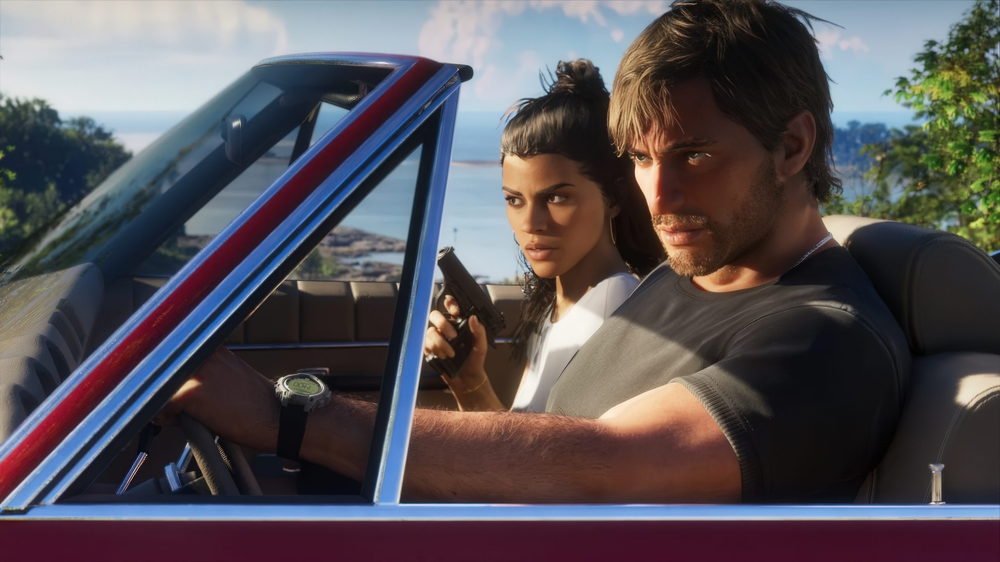

Game Informer's new cover story on Grand Theft Auto VI has gathered the biggest batch of official details since the game was revealed. Among the flood of information is a system that had barely been sketched out until now: the relationship between Jason and Lucia. Rockstar has confirmed that the player can steer that relationship toward friendship or romance, but cannot break it: the two characters' story is bound together and there is no path for the duo to split up.

## Jason and Lucia: how their relationship works in GTA 6

Jason is an army veteran working for local drug runners in the Leonida Keys when the game begins. Lucia is a Liberty City native, trained in combat sports by her father, who ended up in prison after an unclear incident involving her family. Rockstar presents them as two intertwined lives the player accompanies, not as two interchangeable pieces.

How close they become is decided through everyday interactions: holding hands, opening doors for each other, answering calls and texts promptly, or sharing activities. The company insists that engaging with any of this is optional and that **being friends or a couple grants no gameplay advantage**. What does change are certain story elements, which branch depending on the direction the bond takes.

## Pulling off heists as a duo strengthens the bond

Robberies can be tackled solo or as a duo, and pulling them off together strengthens the relationship. The approach matters too: going in loud and fast or quiet and patient determines whether the police show up and in what way. When they do, the returning six-star Wanted level arrives alongside a new Heat system, in which officers gather information about the pair's appearance and whereabouts.

That is where covering your tracks comes in: changing hairstyles and clothing, and ditching the getaway vehicle, helps them escape. If the police know they are chasing two people, splitting up can divide their attention.

## The car, the money, and the WAiNK app

Car theft gains layers. Some vehicles can be stolen the old-fashioned way, but the expensive ones require specialized tools and come with sophisticated security systems and even trackers. A new phone app, WAiNK, lets players scan a vehicle to learn its security, how much it would cost to register it as their own, and what a fence would pay for it.

Money matters beyond cars: some missions only unlock once Jason and Lucia have accumulated enough cash. It is a way of pushing the player to explore and earn resources before going for the big scores.

## No gameplay advantage, a branching story

The approach fits the idea Rockstar has repeated throughout this cover story: decisions, big and small, noticeably alter the direction of the story, and the game is designed to invite multiple playthroughs and reward those who take the time to explore Leonida. For the player, the takeaway is simple: the relationship is not a statistics bar to optimize, but an optional narrative layer built on gestures rather than bonuses.

That philosophy extends to the rest of the world. Leonida doubles the size of GTA V's map, with more density, detail, and interactivity, spread across six regions ranging from Vice City to Mount Kalaga National Park. Art Director Aaron Garbut himself described Florida as "America dialed up to 11" and explained that the team made repeated trips to Miami and South Florida for research. You can get a sense of the scale in our breakdown of the [GTA 6 map and how it compares to Los Santos](/noticias/gta-6-mapa-vice-city/).

With an eye on November 19, the Game Informer information confirms that GTA 6's catalog of activities and social systems aims to sustain the playthrough well beyond the main campaign.

