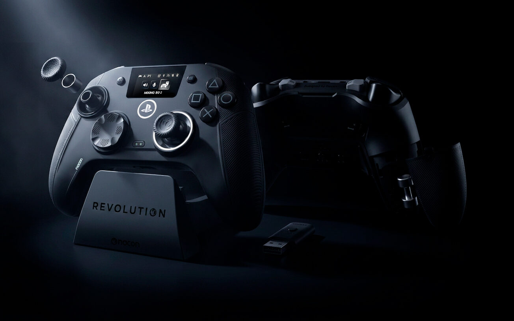
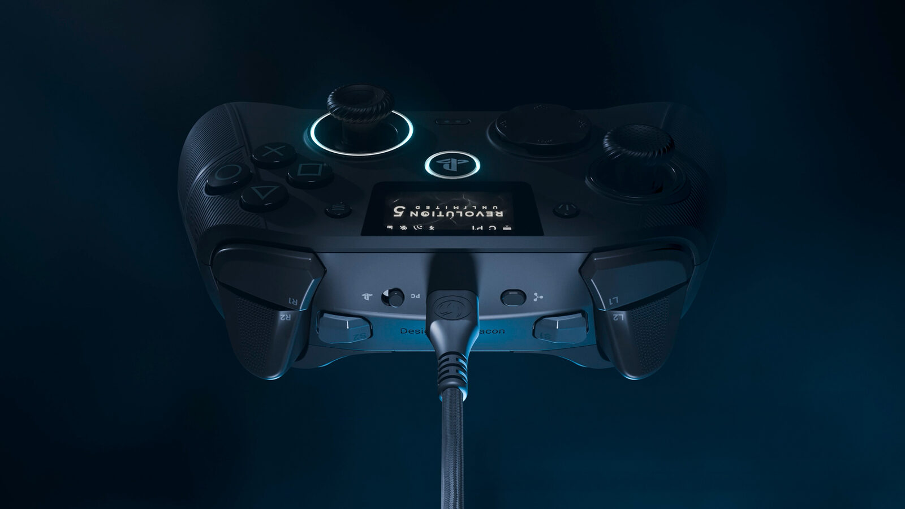
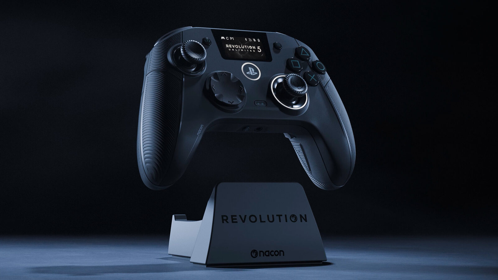
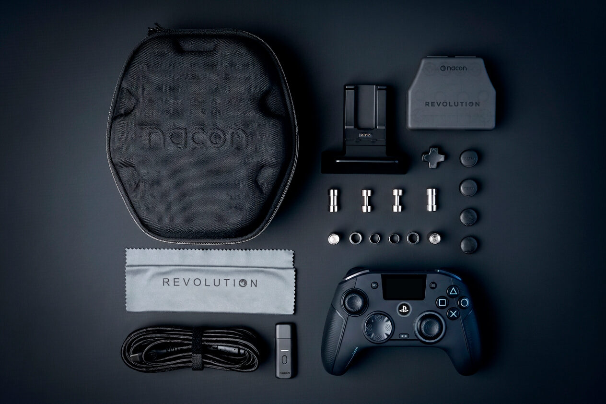

Nacon has announced the Revolution 5 Unlimited (R5U), a high-end asymmetric controller officially licensed for the PlayStation 5 that bets on a feature rarely seen among accessories: a control screen built into the controller itself. The French company presents it as the first officially licensed Sony controller to include this solution, designed to adjust settings without leaving the game. Pre-orders are already open at $229.99, £179.99 or €199.99.

## A built-in screen for adjusting without leaving the game

The point of that screen is to avoid the constant trip back to the console menu. Nacon says it lets players adjust audio mixing, joystick sensitivity and shortcut mapping on the fly, without leaving the match. The R5U is also the first controller from the brand to use TMR (*Tunneling Magnetoresistance*) magnetic technology, a type of sensor the company presents as a leap in reliability, precision and power consumption over conventional joysticks, and one already adopted by other officially licensed controllers such as the [Turtle Beach Rematch for Switch 2](/noticias/turtle-beach-rematch-switch-2-review/).

## The Revolution 5 Unlimited, built for competitive play

The rest of the spec sheet is clearly aimed at competition. Nacon talks about micro-switch action buttons, Trigger Blockers with "instant trigger" technology that let players switch from an analog pull to an ultra-short click, and several remappable shortcut buttons. On top of that comes a Shooter Pro mode that removes joystick dead zones to gain response and precision.

The controller ships with a carry case and a dedicated charging dock, a practical detail for those who juggle long sessions, and it is Nacon's first officially licensed PS5 controller, so charging and connecting are handled in the same place. For connectivity it offers a triple path — PS5, PC and Android smart TVs — and relies on a mobile app to fine-tune advanced settings, plus a dedicated PC mode that promises ultra-low 1 ms latency.

## What changes for the player

"With the Revolution 5 Unlimited, Nacon demonstrates its ability to set new standards in the competitive gaming peripherals segment," said Yannick Allaert, director of Nacon's accessories division. The company frames the launch within a category — officially licensed asymmetric controllers — where other manufacturers have been moving for years.

The price, however, places the R5U at the very top of PS5 accessories: at €199.99 it sits in the same league as other premium pro controllers, such as the [SteelSeries Aeon Pro](/noticias/steelseries-aeon-pro/), which also leans on a charging dock. The usual question with this kind of product is not how much technology it carries, but how much of that advantage shows up in play and how long it will keep receiving support across the generation. On that front, the closest reference the brand has is the Revolution 5 Pro, which TechRadar called "a fantastic controller that falls just short of being essential." It remains to be seen whether the built-in screen and the TMR sensors are enough to take the step it then missed.
