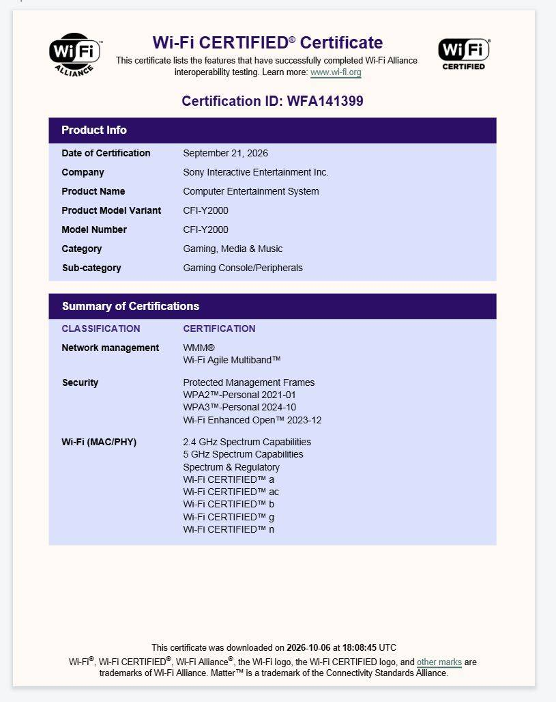
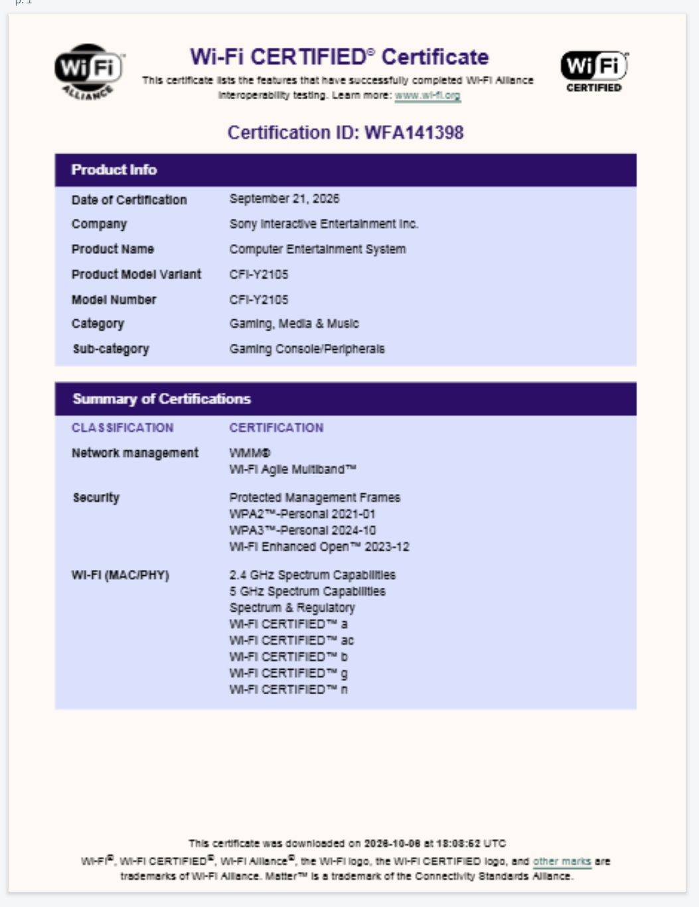

The Wi-Fi Alliance has certified two PlayStation devices that Sony has not announced yet, and everything points to at least one of them being a revision of the PlayStation Portal, the PS5's game-streaming device. The company has confirmed nothing and did not reply to requests for comment, so the information is best treated as what it is: a hint in the records of a certification body, not an announcement.

## What the certifications say

The listing classifies both products as a "Gaming Console/Peripherals" and assigns them the model numbers CFI-Y2000 and CFI-Y2105. The PlayStation Portal sold today carries the CFI-Y1001, so the new identifiers fit an evolution of the same product. The documents add a detail that reinforces that reading: both run Android 15, the same system the Portal already uses, whereas the home PS5 runs a custom operating system.

## An OLED Portal, still unconfirmed

On connectivity, the information is modest. Both models are certified for 1x1 Wi-Fi on 2.4 GHz and 5 GHz, with no 6 GHz and, apparently, no extra antennas. For a device meant to be played over streaming, that is not great news: image quality depends directly on the network. In early 2026, hardware leaker KeplerL2 — as reported by VideoCardz — already mentioned an "OLED version" of the Portal for this year, and the certifications do not contradict that idea, but they do not confirm it either.

## Sony's bet on streaming

Sony has defended this approach over a conventional handheld console. In June, the company said that cloud streaming "requires minimal memory," which makes it an attractive low-cost client in a market where memory prices are rising. The firm is expected to eventually announce a handheld capable of running PS5 games natively on next-gen AMD graphics; the Portal, by contrast, only streams from your home console or from the cloud. The first Portal arrived in late 2023 with an 8-inch LCD screen and, nearly three years later, has not received a refresh.

## What changes for players

The question is not how much power this hypothetical revision would bring, but whether it is worth waiting for. For now there is nothing to buy: it is an unconfirmed leak. If it does turn out to be a Portal with an OLED screen, we are talking about an upgrade aimed at those who already play a lot over streaming and notice the current model's display — to which Sony already applied an [80% charge limit to protect the battery](/noticias/playstation-portal-charging-battery-life/) — not a new console that expands the catalog. The Portal has no games of its own: its value depends on what you already own on PS5 and on your subscription. If you play at home and the current screen is fine for you, there is no rush. And if you were expecting a PS Vita successor, this leak is not it.
