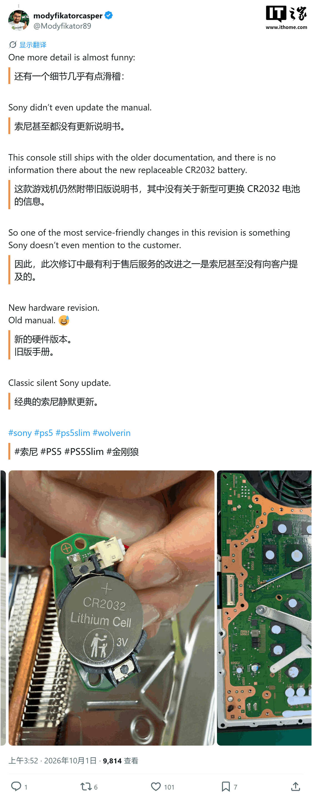
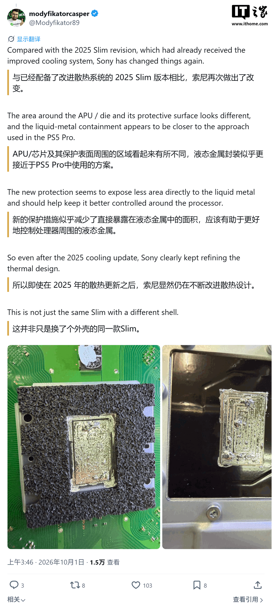

Every time Sony retouches the PS5 on the inside, the player's question is the same: does this change what I play, or how long the console will last me? The short answer is that the catalogue and the services stay the same, but the machine leaving the factory does not. A teardown of the Wolverine limited edition — the variant that accompanies the launch of Marvel's Wolverine — has revealed a hardware revision Sony never announced: a new EDM-051 board, a replaceable CR2032 battery and cooling closer to that of the PS5 Pro.

Repairer @Modyficator89 published the result of opening that unit on X on 1 October. Under the shell there is no simple cosmetic change: the console carries the latest PS5 Slim board number, EDM-051, with a redesigned internal layout and several components that differ from the earliest Slim revisions. The author sums the revision up in six points:

- A different board layout, with the EDM-051 as the reference.
- A replaceable CR2032 CMOS battery instead of a fixed unit.
- A redesigned, simplified internal layout.
- Revised cooling with a PS5 Pro-style liquid-metal interface.
- A heatsink with noticeably different construction and materials compared with earlier revisions.
- A new HDMI retimer, cheaper and with an optimised circuit.

## The PS5 Slim's new board and a battery you can finally replace

The change with the most impact for the user is small and cheap: the battery. The PS5 has historically relied on a coin cell that keeps the system clock and part of the firmware settings. Once it runs out, the console can drag around time and boot issues, and replacing it is not a household task. On the EDM-051 board that cell becomes a standard, accessible CR2032, meant for anyone to swap with the console opened up.

The almost comical detail, as the teardown's author points out, is that Sony has not updated the documentation: the console still ships with the old manual, which makes no mention of the new battery. The most service-friendly change is precisely the one the company does not tell customers about.

## Liquid-metal cooling closer to the PS5 Pro

The area drawing the most attention is cooling. The 2025 PS5 Slim had already received a revision of its thermal system, and this new board moves pieces again. According to the teardown, the area around the APU and its protective surface is different, and the liquid-metal containment looks closer to the approach used in the PS5 Pro.

The goal is to reduce the surface exposed directly to the liquid metal and to keep it better controlled around the processor. It is a technical nuance, but a relevant one: liquid-metal cooling has been a sensitive point on the PS5 for years, with migration and corrosion of the compound among the most cited issues on older units. Less aggressive contact points to a more stable design over the console's lifetime.

## What changes for the player

On the performance front, nothing. This revision promises no extra FPS and no better load times, and anyone expecting a generational leap will not find it here. What changes is the ownership experience: a replaceable battery, cooling built to last and a cheaper HDMI retimer are reliability and cost improvements, not catalogue ones.

For anyone thinking about buying a PS5 Slim, the practical read is that units built with the EDM-051 board are the most recent and, on paper, the best prepared to age well. For anyone who already owns a console, there is no reason to switch: it still gets the same catalogue, the same subscriptions and the same backwards compatibility. This quiet revision does not move the purchase decision, but it does reinforce something that matters across the generation: the console on sale today is better looked after on the inside than the one at launch.
