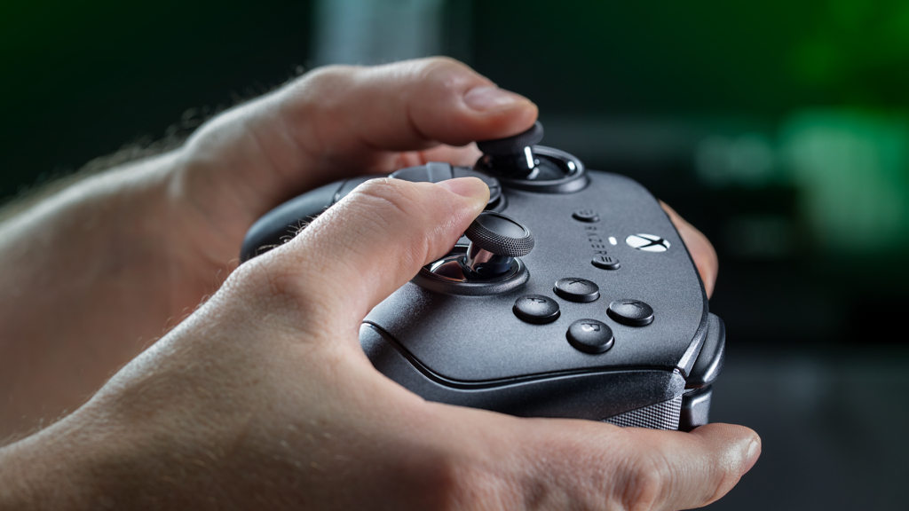
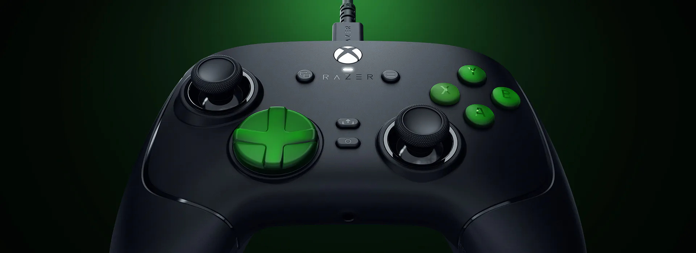
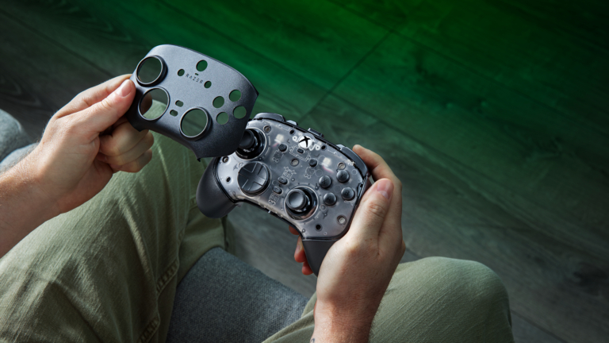
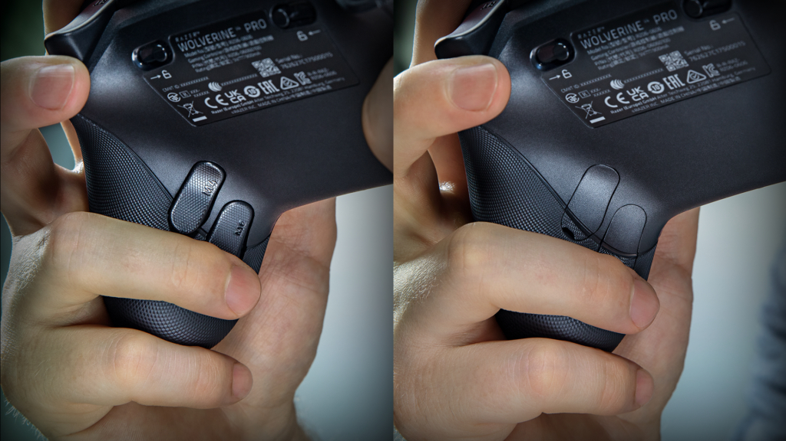

# Razer Announces Wolverine V4 Controllers for Xbox and PC

Razer has unveiled the Wolverine V4 family, consisting of two controllers designed for Xbox and PC: the wireless Wolverine V4 Pro and the wired Wolverine V4 Tournament Edition. Both target competitive gamers and share the same technical foundation, featuring capacitive touch joysticks, swappable magnetic rear buttons, and a polling rate that reaches up to 8,000 Hz on PC.

## Two Wolverine V4 Controllers for Two Ways of Playing

The lineup is divided based on how each controller connects. The Wolverine V4 Pro bets on freedom of movement and adds extra physical customization, while the Tournament Edition trims features and price for those who don't need to do without a cable. Both include six configurable action buttons, four swappable magnetic rear buttons, and two thumbstick bumpers for claw-style grip.

## Capacitive Joysticks and 8,000 Hz Response Time

The point where Razer focuses is the asymmetric joysticks, which use capacitive touch sensors combined with a 16-bit ADC chip and register around 3,000 steps of movement. According to the manufacturer, this solution offers greater resolution and better resistance to magnetic interference than Hall Effect or TMR alternatives, while also maintaining drift-free operation over time.

In terms of latency, the company guarantees response times below a millisecond on PC when using HyperPolling mode at 8,000 Hz, available both via cable and wirelessly in the Pro model. On Xbox Series X|S consoles, the connection tops out at a maximum of 250 Hz.

## Customization, Triggers, and Profiles

The Wolverine V4 also introduces Pro HyperTriggers, which allow switching between instant actuation and full analog travel, with actuation points adjustable from 1.3 mm to 8.2 mm via Razer Synapse. Construction uses textured TPU side grips, PBT mechanical-tactile front buttons, and an eight-way floating D-pad.

The difference between models is noticeable in the margin of customization: only the Pro allows changing the joystick caps and front shell. Both can store up to four profiles in internal memory with button layout, trigger settings, and dead zones configurable between 0% and 15%. The rear side, with the magnetic buttons, looks like this:

## Price and Availability

Both controllers are already available. The Wolverine V4 Pro sells for $199.99, £199.99, or €209.99, while the Wolverine V4 Tournament Edition costs $99.99, £99.99, or €109.99.

The decision for the gamer comes down to the usual: the wireless and customization extras of the Pro come with a considerable premium, and the Tournament Edition offers the same base of buttons and joysticks at half the price. If the doubt is between the two connections, it's worth reviewing [when a wired or wireless Xbox controller pays off](/noticias/xbox-controller-wired-wireless/). On console, it's also worth remembering that the 250 Hz ceiling falls far short of the 8,000 Hz that only PC can take advantage of, so someone who plays mainly on Xbox shouldn't buy based on that figure. And Razer isn't alone in this space: the [leaked Xbox Elite Series 3](/noticias/consolas/xbox-elite-series-3/) points to Hall/TMR joysticks and advanced haptics.
