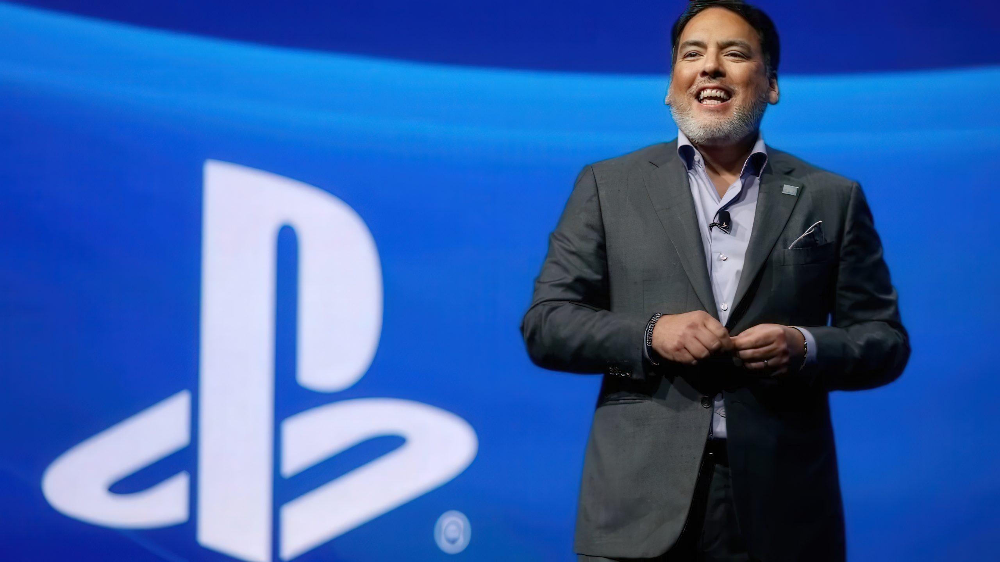

Keeping a game forever or keeping only the licence to play it. That is the difference
**Shawn Layden**, former PlayStation boss, has put on the table while weighing in on
Sony's decision to stop manufacturing discs for new PlayStation games from January
2028. The former executive, who ran SIE America and chaired SIE Worldwide Studios
before leaving the company in 2019 after a 32-year career, makes no secret of his
disagreement with a move he considers a "significant brand hit."

Layden was not the only one caught off guard. In 2025 he had argued that Sony would not
make the jump to digital because there are markets where the retail presence still
matters. The announcement on 1 July 2026 left him without that argument, and although
he had already commented briefly at the time, it is now, on the **The Expansion Pass**
podcast, that he has laid out his analysis in full.

## A "spreadsheet decision"

The former executive understands that the move responds to financial criteria he cannot
assess from the outside, but that does not stop him from disagreeing:

> Not having been in the room, I don't know what the stressors were around that and
> what the spreadsheet said, because I'm sure this is a heavily spreadsheeted decision,
> where the costs are being contained and where the profit is being extracted. […] For
> those reasons, I don't agree with that decision.

Layden acknowledges that the convenience of the digital download is unquestionable —"I
just press a button on my controller"— but he places the weight of physical media on a
small and decisive percentage: the players who buy, keep and resell. Although he does
not handle official figures, he sketches a rough split of around 80% downloads against
20% who still buy in a store.

## Collecting, showing off and reselling

For the former PlayStation boss, that 20% is not a leftover, but much of the most loyal
core of the catalogue. He compares it to the comic-book collector who buys two copies —
one to read and one to preserve— and recalls that showing off one's collection is, in
itself, part of the hobby.

Hence his deeper criticism, the one that goes beyond physical media:

> It changes the conversation from "do you own a game?" to "do you have access to a
> digital asset?" If you don't own a thing, that means you can't sell a thing. If you
> can't sell a thing, that means you don't own a thing. And if you don't own it, then
> what are you buying?

With new PlayStation games shipping without a disc, a purchase stops being transferable
property and becomes an access licence. It is the same argument Sony makes in court
against a proposed class action over digital games: for the company, reasonable
customers already know that software is licensed, not sold.

## The PSP memory and Nintendo's reaction

Layden also looked back to explain how these announcements feel from the inside. He
recalled the years when PlayStation unveiled the first PSP and the message a friend who
worked at Nintendo at the time sent him upon seeing it, a reaction somewhere between
surprise and annoyance. He also highlighted the weight **Monster Hunter** carried in
the handheld's run, an example of how a console stands, or falls, on its catalogue.

The decision, moreover, did not come out of a clear blue sky: Sony CFO Lin Tao had
already reiterated that the company would not back down despite the community's
pushback, and new PS5 boxes already carry a notice about the end of physical media.
The move had been brewing for months, as the
[talks Sony held with studios about the end of discs](/noticias/sony-reevalua-disco-fisico-ps5/) already suggested.

## What changes for PlayStation players

The date that matters is **January 2028**: from then on, new PlayStation releases will
not have a disc edition. For those who buy digitally, little changes; for those who
collect, lend or resell, the ground narrows and relies ever more on backward
compatibility and an already-published catalogue.

With the business turning towards subscriptions and licensing, the question Layden
leaves behind —"if you don't own it, what are you buying?"— is not a nostalgic detail:
it defines how long you will be able to keep and move what you buy throughout the
generation.
