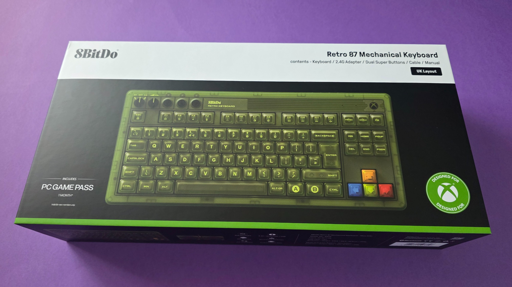
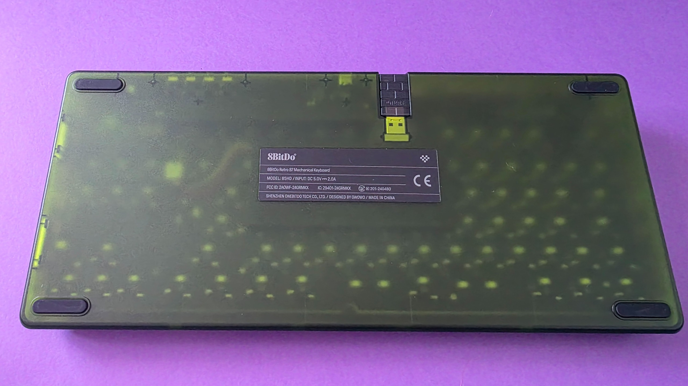
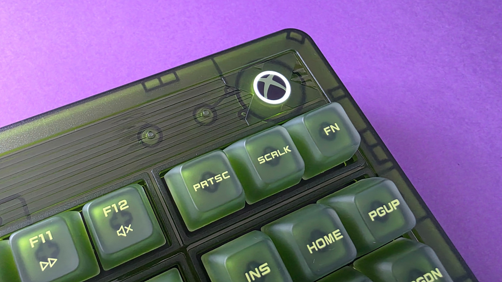
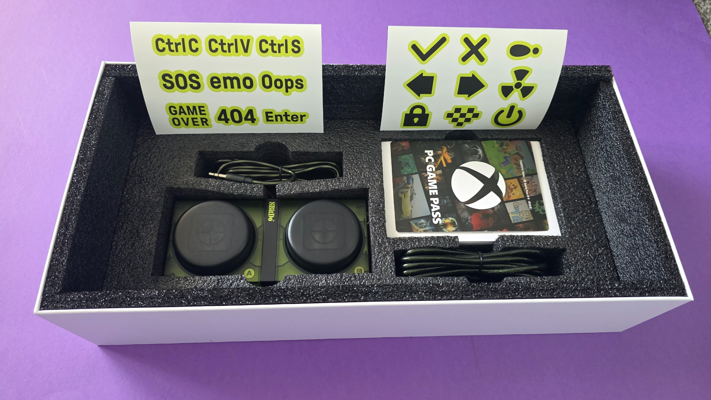
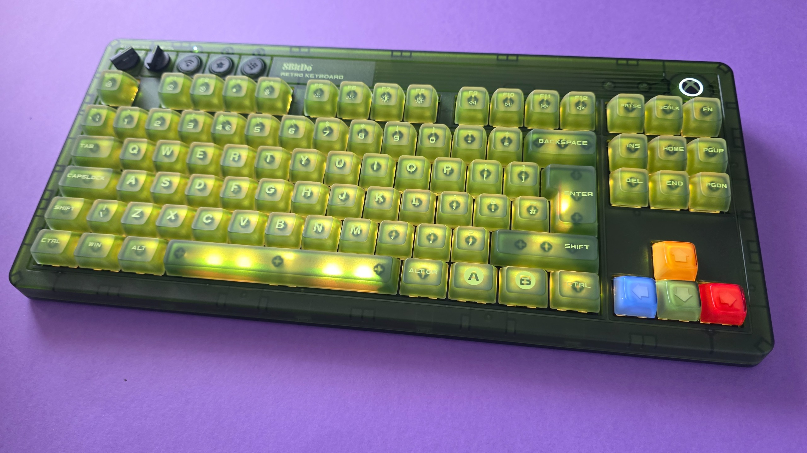
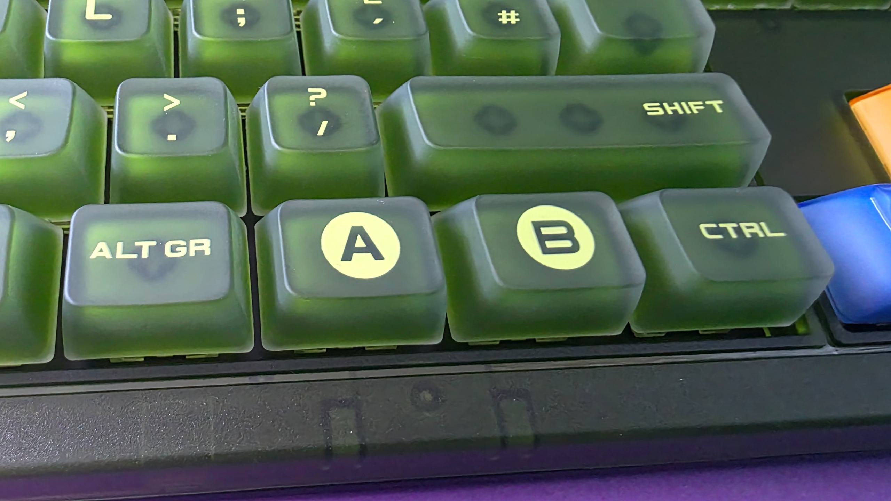
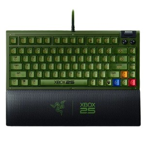
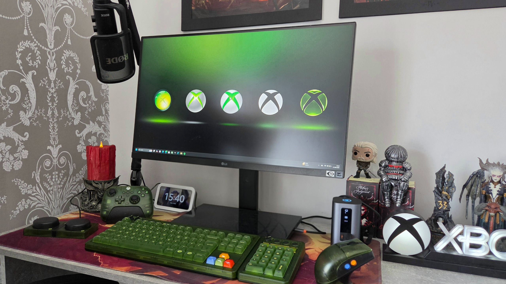

# The 8BitDo Retro 87 Xbox Keyboard, tested: green nostalgia that stands up to daily use

Xbox is about to turn 25 and the trickle of commemorative peripherals isn't stopping. Among them, one of those that has generated the most buzz is the **8BitDo Retro 87 Mechanical Keyboard (Xbox Edition)**, a mechanical keyboard with OG Xbox inspiration that accompanies an entire collection with mouse, controller, and numpad. Windows Central used it daily for about four months and published its review, concluding that green nostalgia isn't incompatible with a serious work keyboard.

## What is the 8BitDo Retro 87 (Xbox Edition) and at what price

The Retro 87 is an 87-key keyboard in Tenkeyless (TKL) format with top-mount switches, a thick and heavy design that pays homage to the translucent green of the first Xbox. Its official price is $119.99 in the United States and £99.99 in the UK, although the review places it on sale at $89.99 on Amazon, with recurring discounts reaching around 25%.

The 8BitDo collection for Xbox has existed since November 2024 and includes keyboard, numpad, mouse, and even controller. If you want the matching numpad, it is sold separately as Retro 18 Mechanical Numpad (Xbox Edition), at $44.99 or £39.99.

## What it brings: specifications and usage details

Beyond the color, what decides a long-term purchase is what's underneath. These are the key points highlighted by the review:

- **Switches:** Kailh Jellyfish X, in linear or tactile variants, on a hot-swappable PCB with full N-key rollover.
- **Keys:** Double-shot ABS with matte UV coating.
- **Connectivity:** triple mode, with 2.4 GHz wireless via magnetic receiver, Bluetooth 5.0, and USB-C cable.
- **Battery:** 4,000 mAh, with a declared autonomy of up to 280 hours in 2.4 GHz and 300 hours on Bluetooth.
- **Extras:** customizable RGB backlighting, volume dial and connection mode selector, plus the Dual Super Buttons, two programmable arcade-style buttons that connect via 3.5 mm jack.
- **Dimensions and weight:** 376.6 × 169.6 × 46.8 mm and 1,100 g.
- **Software:** 8BitDo Ultimate Software V2, available for Windows and Android.

The box includes the Dual Super Buttons, USB-C charging cable, 2.4 GHz receiver, and one month of Xbox Game Pass for PC for new subscribers.

Choosing between wired and wireless on an Xbox peripheral doesn't have a single answer, as we saw when comparing the [wired or wireless Xbox controller](/noticias/xbox-controller-wired-wireless/); here the advantage is that the Retro 87 allows switching between the three modes without reinstalling anything.

## What convinces and what doesn't

The review is clearly favorable. The reviewer highlights the tactile and sonic feel of the switches, the sturdiness of the chassis, and practical details like the magnetic compartment to store the 2.4 GHz receiver, the matching braided cable, or the volume and connection dials. The hot-swappable PCB leaves the door open to changing switches later on, and no appreciable latency is noticeable in wireless mode.

On the debit side, two nuances worth knowing before buying. The first is cleanliness: the matte-finish ABS keys show fingerprints and finger shine faster than on other keyboards, so you need to wipe them more often. The second affects anyone who wants the matching numpad: since each piece needs its own 2.4 GHz USB receiver, it ends up occupying two ports.

## Is it worth it against the competition?

The most direct alternative is Razer's collection for the 25th anniversary of Xbox, with its Black Widow V4 75%, at $209.99 or £199.99. It costs almost double, but in exchange offers a more compact and discreet chassis and quieter tactile switches, for those who prefer a less flashy homage.

For anyone looking for exactly the opposite, the bold green and the solid touch of the early 2000s, the 8BitDo Retro 87 ends up in a position hard to match by price. It's a peripheral designed for a gamer desk, not a quiet office, and the review recommends it to anyone who wants a keyboard with personality and eyes set on lasting many years of use.

