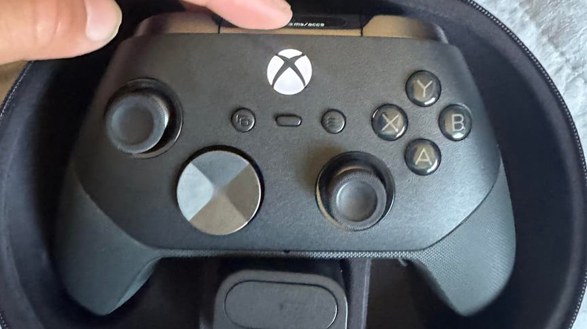
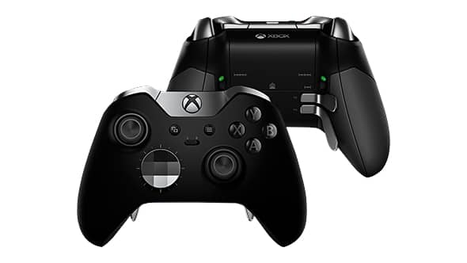

The Xbox Elite Series 3 has surfaced once again, and this time the trail comes from inside Microsoft itself. A data scrape of the Xbox Design Lab, picked up by KitGuru, has exposed references to Hall Effect and TMR thumbsticks, haptics described as "advanced" and a scroll wheel for audio control. There is no official announcement, no date and no price: everything that follows should be read as a leak, not as confirmation.

## What has leaked

The trail starts at the Xbox Design Lab customisation storefront: according to the data circulating on Reddit and reported by KitGuru, Windows Central and El Chapuzas Informático, the next Elite controller would adopt two types of anti-drift sensor at once, Hall Effect and TMR, inside swappable thumbstick modules with standard, loose and tight tension variants. On top of that would come a "silent" or low-friction travel option, meant to reduce the rub and the noise of the stick against its ring.

On customisation, the leak describes 27 different combinations of toppers and rear paddles, with standard, classic, doublewide, short, long and butterfly-style paddles. The D-pads split into standard, cross and grippy/faceted designs, at last separating the purely cosmetic ones from those the material lists as "Performance D-pad". Metal faceplates, named finishes, more colours and custom engraving also appear.

The vibration section is the one that most resembles what Sony introduced with the DualSense: the list mentions "advanced" haptics that combine impulse trigger motors (ERMs) with VCA actuators, a recipe that points to a smoother, more precise response than a conventional motor. Rounding it out is a dedicated scroll wheel for volume control, the piece that earlier leaks already hinted at.

## Why the Xbox Elite Series 3 could end drift

For players, the story is not in the list but in a single word: drift. Wear on analogue potentiometers makes the character move on its own, and it affects the official controllers of all three big platform holders. Hall and TMR magnetic sensors remove that physical contact, so drift stops being a matter of time. It is not unheard-of technology in the field: the [Turtle Beach Rematch for Switch 2](/noticias/turtle-beach-rematch-switch-2-review/) already bet on TMR sticks, and the [Nacon Revolution 5 Unlimited](/en/news/consolas/nacon-revolution-5-unlimited-ps5-controller/) made clear that official premium controllers have no qualms about charging more for extras that used to be third-party territory. Xbox adopting them as standard on its flagship controller would be the change with the most real impact on the experience, above any number on paper.

## What changes for the player

For now, little is tangible: there is no price or date. KitGuru notes that Elite Series 2 controllers go for around £150 in the UK and that the new features could push the Series 3 a little higher. The leak itself mentions four SKUs — two with full haptic motors and two without them, split between base and "complete" versions — which suggests advanced haptics will be a paid extra.

Windows Central also points to direct Wi-Fi connectivity to cut latency in Xbox Cloud Gaming and to smoother device switching between Xbox, Bluetooth and other sources, although those features are not part of the leaked list and its author presents them as something he has heard, not as fact. The same outlet claims reliability and repairability would have been design priorities, a promise that can only be checked with the controller in hand.

And one thing is clear: the Elite Series 2 earned a reputation for quality problems that the Series 3 would have to break. The buying decision, as always, will not come with the feature list: it will come with the price, with support across the generation and with whether this controller finally lasts for years without its predecessor's troubles returning.
