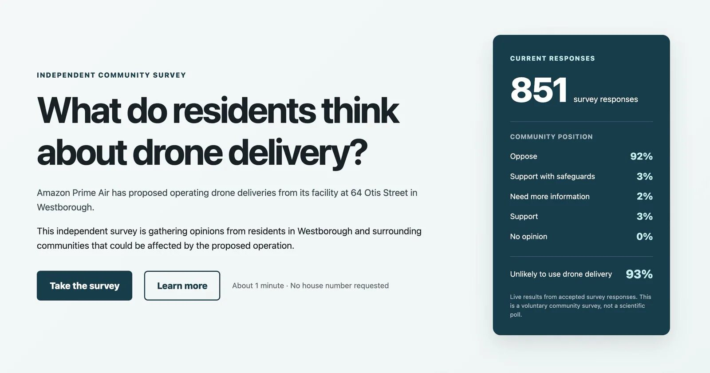
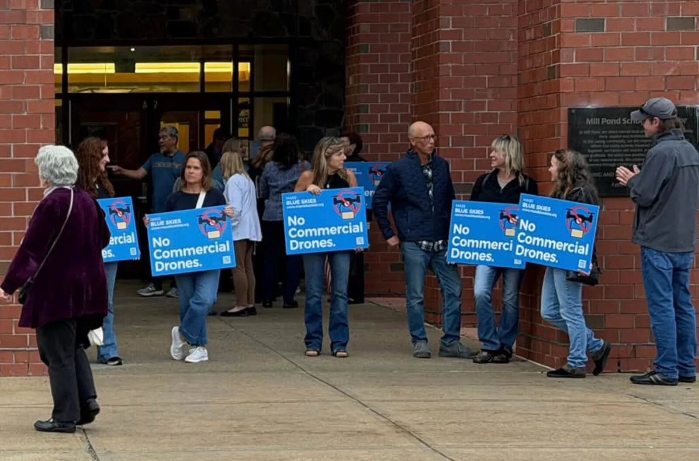

Amazon Prime Air's drone delivery rollout in the United States is advancing through an administrative route that more and more communities are contesting. In Westborough, Massachusetts, an independent survey run by a resident with no ties to Amazon or the town had 853 responses on September 28 and 1,211 by October 2, with 92% opposing the launch hub proposed for the Otis Street parking lot. The company, meanwhile, has asked to delay the only local vote it needs.

## A residents' survey with 1,211 responses and 92% opposition

The poll, hosted at dronefeedback.com, is not a scientific survey and its own methodology says so: residency is self-reported and respondents are self-selected. Even so, it records something hard to fabricate. Of the responses, 477 came from Westborough itself — a town of 21,567 people — 86 from Grafton, 82 from Northborough, 74 from Hopkinton and 32 from Marlborough. The 7.5-mile (12-kilometer) circle the hub would cover reaches 15 municipalities, according to the map published by the group Mass Blue Skies; only Westborough votes, because the pad sits on its land.

Amazon presented the plan to the Select Board on August 18 and held a community meeting in a packed hotel on September 23. There, Tareq Wafaie of Prime Air said the company hoped to start flying "possibly by the end of October." That same night the company admitted it held none of the three approvals required: the local site-plan permit, the FAA's site-specific environmental review, and the inspection and registration of the landing area with MassDOT Aeronautics. Wafaie also put at 80% the share of communities where Amazon has won approval administratively, with no public hearing: Westborough is the remaining 20%.

## Amazon asks to delay the vote and the Select Board takes it to the state capital

The Planning Board had been due to vote on October 6 on application 26-02275, the only local decision the project needs. The town's revised agenda carries a request to continue the matter to November 10, signed by Wafaie, a date that puts local approval at least ten days past the end-of-October target the company had set. The board decides the postponement at its own session, so the calendar is not settled.

The town's other board, the Select Board, met on October 1 in the Mill Pond School auditorium before more than a hundred residents, according to WHDH, and none spoke in favor of the drones. The body voted unanimously to oppose the project, draft a letter to the state legislative delegation and study more restrictive bylaws, citing North Reading as a reference. Amazon sent no one.

It is worth measuring what a town can do. North Reading's 2017 bylaw bans interfering with emergency services, recording people where they expect privacy and flying within 25 feet of a bystander, and requires the aircraft to stay in sight. Those are rules for a hobbyist's drone in a park: Amazon's MK30 flies under a Part 135 air carrier certificate and, by design, beyond the operator's line of sight. In Singer v. City of Newton (2017), a federal judge struck down a ban on that kind of flight, along with a registration rule and an altitude limit, as preempted by federal law. The Planning Board's vice chair, John Gelcich, put it this way: "we are almost required to approve it."

## In Pflugerville, Amazon says its drones take no pictures; its own site disagrees

Privacy is where the argument shows the most cracks. In Pflugerville, Texas, Sam Bailey, Amazon's senior manager of economic policy, told the city council on September 22 that the MK30s "can't scan faces, look at license plates, or take pictures or images," as Community Impact reported. The Prime Air operations page the company keeps published says the MK30's cameras may record "people, pets, cars, and objects near the delivery or landing location" and that those images are used to improve its services. It offers an opt-out at your own address, none for your neighbor's.

The local context makes the answer harder. On August 25, that same council voted unanimously not to renew its license-plate-reader contract with Flock Safety — $87,500 a year — after an open-records request revealed that outside agencies searched the city's data nearly 1.6 million times in six months. Council member Kimberly Holiday answered Bailey with the line the council could afford: "We're going to need you to prove that for us."

Pflugerville sits inside the environmental decision the FAA signed on February 5, 2026 for 22 delivery centers in Texas, with two addresses in the city (STX6, on Schultz Lane, and AUS2, on East Pecan Street) and up to 1,000 flights a day per site between 7 a.m. and 10 p.m. The noise figures do not line up either: the federal assessment puts an MK30 overflight at 50 feet at roughly 74.2 decibels, comparable to a leaf blower at that distance, while Amazon's presentation described it as "soft to moderate." Three documents, three sets of numbers.

## From North Haven to Castle Rock: the same pattern with another operator

The pattern repeats in every market. In North Haven, Connecticut, the permit under review describes an envelope of 1,000 flights a day. In North Myrtle Beach, South Carolina, city staff this month asked to postpone the pad vote for a second time — six launch pads, one divert pad and an 8-foot perimeter wall — to October 20, and scheduled a public workshop for October 7, according to the Planning Commission's report. The operation is classed as accessory to an already-approved warehouse, which keeps the decision with five commissioners and off the city council's agenda; the state drone law taking effect on January 1, 2027 (Act 150) leaves the municipality the authority over takeoff and landing sites.

In Colorado, Castle Rock passed an emergency ordinance on July 20 freezing drone delivery hub applications for six months after a pre-application for an 18-aircraft port, and Parker followed on July 21 with a nine-month pause. Northglenn is drafting the state's first dedicated ordinance: it regulates the parking lot the drone leaves from — a 200-foot setback from homes and schools, a 65-decibel cap at the property line, 7 a.m. to 10 p.m. hours and an annually reviewed special permit — and its own report acknowledges it has no authority over the flight once the aircraft is airborne. The difference between towns is not in the text but in how much it covers. In parallel, [fifteen states have sued the FAA](/en/news/drones/states-sue-faa-drone-delivery/) over the environmental clearance that underpins this rollout.

For Amazon, cost per delivery and coverage are the sales pitch; for communities, noise, privacy and land use are the terms of the negotiation. The figure the company should watch is not the 92% opposition but the 94% of respondents who say they would not use the service even if it reached their address. A hub almost none of those polled intend to use flies, above all, over others.
