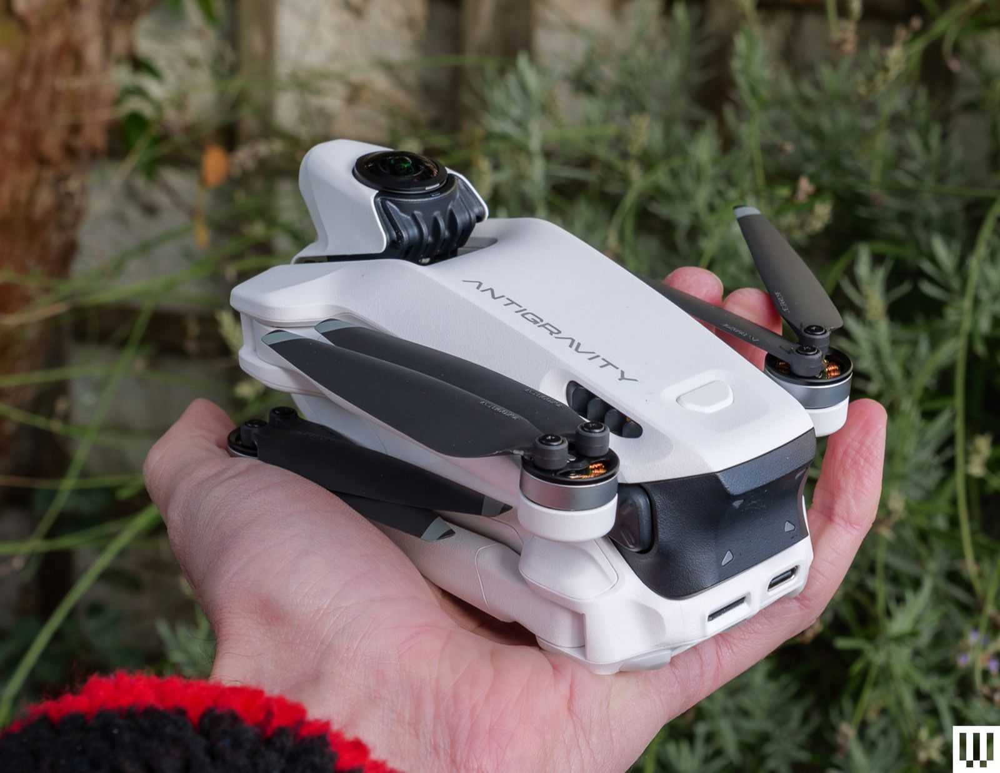
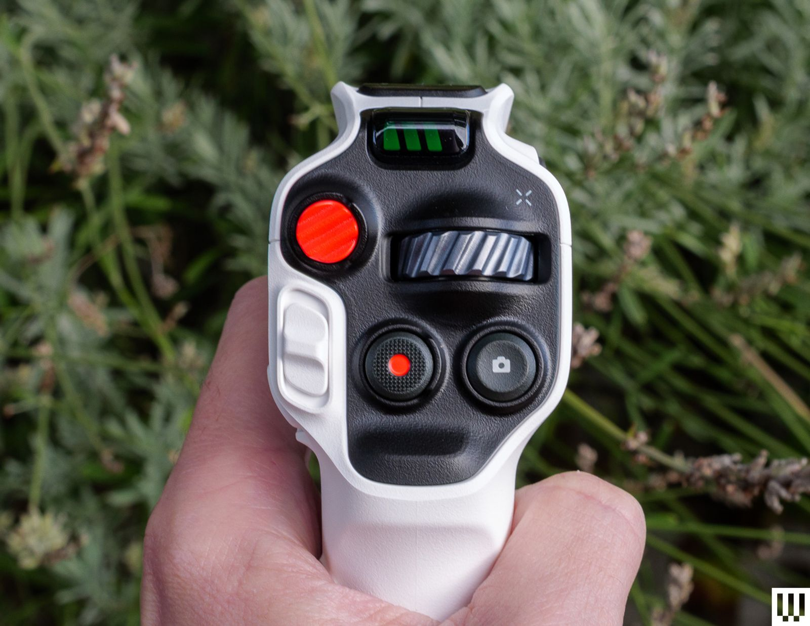

The Antigravity A1 is the first consumer 360 drone: the camera is built into the airframe itself, not attached to it. It comes from Antigravity, a new brand, with Insta360's stitching technology behind it, and its pitch is as simple as it is ambitious: capture everything around the aircraft in a single flight and decide the framing later, back on the ground. It weighs 249 g with the standard battery, folds for transport, and is not flown with two sticks but with a motion controller and a pair of goggles.

## A 360 drone that records everything and vanishes from the shot

The A1 carries four cameras. Two fisheye lenses, one on top and one on the bottom, each cover a hemisphere and are stitched into a single spherical video; the other two face forward and handle obstacle detection rather than recording. The algorithm inherited from Insta360 does something we already know from its action cameras: it erases the drone and its propellers from the result, so the aircraft becomes invisible in the shot, just as a selfie stick disappears.

The sensor is 1/1.28-inch with an f/2.2 aperture, a common combination in lightweight 360 cameras. In video it offers 8K (7680×3840) at 30, 25 and 24 fps, 5.2K at 60 fps and 4K at 100 fps for slow motion. Photos reach 55 megapixels, and files are saved in Antigravity's proprietary formats, exported from the mobile app or from Antigravity Studio. There is 20 GB of internal storage and a microSD slot for cards up to 1 TB.

The practical consequence is the one the maker keeps repeating: fly first, frame later. From a single flight you can pull front, top-down, side or rear views, something a conventional camera drone forces you to solve mid-flight.

## Flying with the Vision goggles: the part that truly changes things

What sets the A1 apart from a drone with a 360 camera strapped to it is the live view inside the goggles. The Vision Goggles use two 2560×2560 micro-OLED screens per eye at 72 Hz with pancake optics, and they follow head movement: you can look up, down or behind you while the drone stays still or travels in another direction. They weigh around 340 grams, last about two and a half hours, adjust interpupillary distance between 59 and 72 mm and correct from −5 to +2 diopters. One of the two front lenses is actually a display so whoever is with the pilot can see the same thing.

Control is handled by the Grip Motion Controller: you point where you want to go, press the trigger and the drone flies that way. There are no sticks and no acro mode. Antigravity has announced a conventional dual-stick controller for a future update, but for now the A1 is flown only with the motion controller and the goggles. There are two flight modes —FreeMotion, point-and-fly, and FPV, twist-your-wrist— plus a virtual cockpit with dragons or spaceships that only works in the latter.

The OmniLink 360 transmission claims up to 10 km under ideal conditions on the US FCC standard, but in Europe the approved figure drops to 6 km, with average latency around 150 ms. The live view reaches 2K at 30 fps.

## Battery life, availability and price in Spain

The maker claims 24 minutes of flight with the standard battery and 39 minutes with the high-capacity one. In real testing the figures drop: Oscar Liang's review measured between 15 and 17 minutes with the standard battery and between 25 and 28 with the high-capacity one, which is typical because official measurements are taken with no wind and no recording. Even so, the battery life is notable for a drone under 250 grams.

One important detail for Spanish buyers: the high-capacity battery raises the weight to 291 grams and, according to Antigravity itself, is not sold in European regions. In Spain, then, the A1 ships with the standard battery, inside class C0 and below the 250-gram threshold.

The drone is available in Spain through retail chains and specialist stores such as MediaMarkt, Amazon.es, Camaralia and MurciaDrones. It comes in three packs —Standard, Explorer and Infinity— and the starting price of the standard bundle is around 849 euros according to price comparison sites. In the United States, WIRED puts the entry point at 1,599 dollars.

Other specs worth noting: level 5 wind resistance (10.7 m/s) and automatic return to the take-off point. At launch, obstacle avoidance was limited to the front and the bottom; the spring 2026 update extended it to every direction, added a mode that steers around obstacles instead of just braking, and brought voice control and timelapse recording.

## What doesn't convince: price, mandatory controls and an "8K" with caveats

WIRED itself, which gave it 7 out of 10, sums up the product's balance well. It praises the innovative camera setup, the quality of the goggles and well-executed mobile and desktop apps, but flags the high price, the unintuitive flight controls, the obligation to use goggles and a motion controller —with no stick alternative for now— and the awkwardness for people who already wear glasses.

Other caveats join that list. Activation requires registering the drone in the Antigravity app. There is no LOG profile and no physical ND filters, so colour grading is more limited and motion blur is handled in software. And latency, above 100 ms, is high by what FPV flying is used to, though it does not hold back calm cruising.

Then there is the "8K" matter. That figure is the sum of the two sensors, not the resolution you get in any single direction: each lens covers 180 degrees and delivers around 4K, and when you reframe, the effective resolution drops even further. As a pure image drone it does not replace a Mini 5 Pro or a Mavic, and anyone who buys it expecting that will be disappointed. Its value lies elsewhere: letting you film yourself while flying forward, capturing several angles in a single pass and setting the framing without repeating the shot.

Is it worth it? For a content creator who wants aerial 360 without rigging an external camera, the A1 is a unique option today and it is on sale in Spain. For anyone after a travel drone that is easy to pull out and fly in five minutes, it remains more expensive and more cumbersome than DJI's alternatives. The innovation is real; the price and the controller's ergonomics do not keep up yet. If you want to follow the section, you can browse the rest of our [drone coverage](/en/news/drones/).
