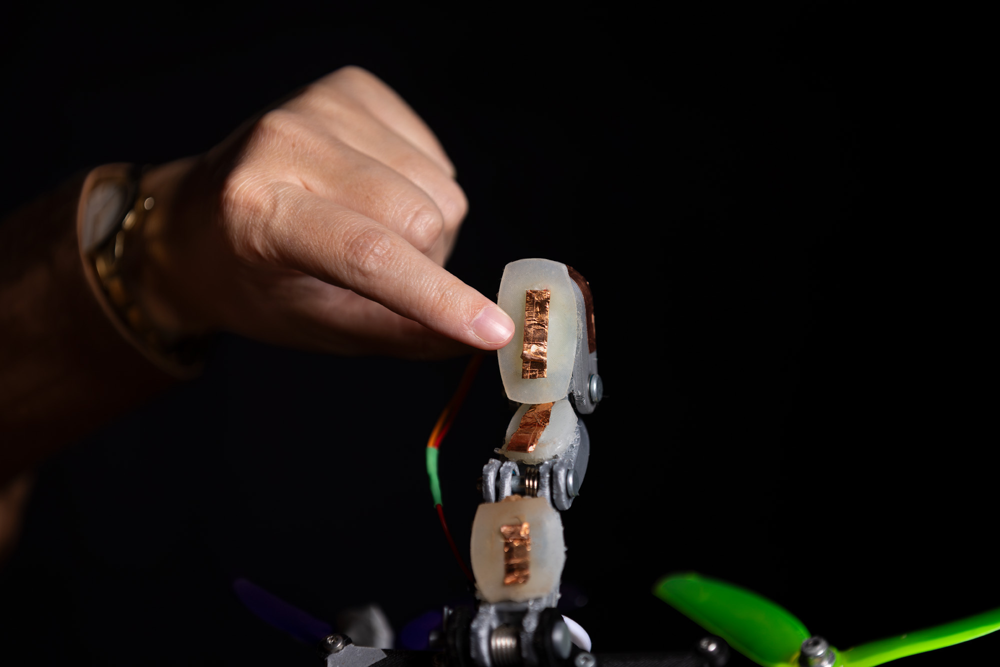

Drones have learned to perch on sloped or icy surfaces, but gripping a branch remains an unsolved problem. A team at Delft University of Technology (TU Delft) has presented a prototype that locates and holds branches by relying on touch, not just on its camera. In tests, the system achieved a landing success rate above 99 %.

## Landing where the camera cannot see

Landing is one of the most delicate moments of any drone operation, and in a forest things get harder. The usual approaches lean on a camera to work out where and how to touch down, but branches and leaves block the sensor's view, and the estimate stops being reliable.

The alternative would be to stay in the air, but holding a hover has two clear costs: it drains the battery quickly and produces constant noise. To observe wildlife, researchers need the opposite: a discreet, quiet machine that does not scare animals away. Grippers inspired by bird claws already exist for grabbing branches, but knowing exactly where the branch is accounts for half the problem.

## How the drone grips branches with touch

The inspiration comes from birds, which feel the branch with their feet before perching. The prototype translates that idea into three flexible fingers, each split into three sections, or phalanges, like a human finger. That shape makes it possible to wrap around the branch and increase the contact area.

At first the drone still uses its camera to estimate the branch's position, but after that it does not trust it completely: it reaches out its fingers and feels for the branch until physical contact happens. Each finger carries three tactile sensors on a soft silicone surface, nine in total, and each one answers a very simple question: whether it is touching the object or not.

Because the system knows which of the nine sensors has been triggered, it can refine its estimate of the branch's size, position and orientation. It is a process similar to recognising an object with your hands and your eyes closed. "Each sensor only tells us 'something is here.' But if you know the shape of your own hand, that is enough to reconstruct where the branch is and how it is oriented. The drone builds up an increasingly accurate picture of the target purely by bumping into it," explains Anton Bredenbeck, one of the project's authors.

Once contact is confirmed, the drone adjusts its grip, wraps its fingers around the branch, locks them together and holds its position. Gripping consumes no extra energy thanks to springs built into the fingers, so range does not suffer while it is perched.

## What it means for real flight

The system's figures are solid: more than 99 % successful landings and the ability to correct itself when the initial visual estimate is off by as much as 60 cm. The project's goal is not to replace the camera but to complement it with touch when visual information is unreliable, which is common in dense vegetation.

The work, led by associate professor Salua Hamaza, was published in Nature's *npj Robotics* journal. For real-world use, the proposal points to operations where perching and watching in silence makes the difference: wildlife monitoring, inspection in obstructed areas and missions that require staying in place without draining the battery. For now it is a laboratory prototype, so its arrival in commercial products will depend on how well the finger-and-spring mechanics hold up in the field.

While this line advances in the lab, the consumer market remains focused on imaging, with offerings such as the [Antigravity A1 and its integrated 360 camera](/en/news/drones/antigravity-a1-360-drone/).
