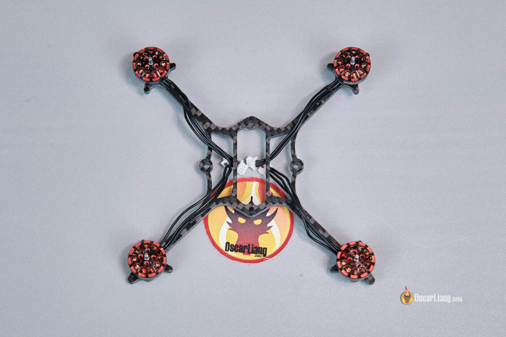

A 1S 3-inch toothpick is one of the most practical platforms for flying close to home: it weighs under 50 g, it is quiet and it does not need much space. The build reproduced in this guide comes in at **49 g with the battery**, delivers a little over **5 minutes of flight time** and goes together in about **30 minutes**, with no soldering or complicated wiring. The trick is to reuse the electronics from a Tiny Whoop — the 5-in-1 flight controller, the camera and the canopy of an Air65 — and move them onto a 3-inch frame.

## What the build consists of

The whole setup is plug and play. If you use the same parts, you will not need a soldering iron. This list is the exact combination from Oscar Liang's analog build:

- **Matrix 5-in-1 flight controller**: choose the version with motor connectors.
- **Air65 II canopy**.
- **C03 FPV camera**: the Air camera works fine too.
- **Lava II 1S LiHV battery**: in 480, 580 or 680 mAh versions.
- **Crux3 frame, motors and propellers kit**: it can be bought as a set, and it is the option with the best value for money.
- Bought separately instead: a **Crux3 frame**, **Happymodel 1202.5 11500 KV motors** and **Gemfan 3018-2 propellers**.

You will also need a few loose pieces of hardware: 4 M2x10 screws for the canopy, 4 M2 nylon nuts, a rubber band to secure the battery and a small piece of foam to rest it on.

## Steps to build the 1S 3-inch toothpick

The order barely matters because there is no soldering, but it is worth following it so you do not have to take anything apart later. Every step is reversible.

1. **Mount the motors on the frame.** They are attached with the supplied screws. Two diagonal screws instead of all four is enough: it is secure enough and saves a little weight.

2. **Wrap the rubber band around the frame.** It will be used to secure the battery. It also doubles as a holder for the motor wires. If you prefer, you can 3D print a battery holder for the Crux3; free designs are available.
3. **Attach the Matrix 5-in-1 flight controller to the frame** with the M2x10 screws.
4. **Insert the camera into the canopy**, checking that the orientation is correct. You do not want to mount it upside down.
5. **Plug the camera into the flight controller.**
6. **Install the canopy with the nylon nuts.** To bend the plastic without breaking it, heat it first with an air dryer. Do not overtighten the nuts: if the grommets are compressed too much, the soft mounting loses effectiveness.
7. **Plug the motors into the flight controller.**
8. **Stick a small piece of foam under the frame** as a battery pad. Any soft foam will do; the important thing is that nothing sharp can dig into the battery.
9. **Secure the battery with the rubber band.**
10. **Check the weight.** The dry build comes to 36.3 g; with a 1S 480 mAh battery, the all-up weight is 49 g.
11. **Check the propellers.** Depending on how tightly they fit on the motor shaft, they may not need screws. If they are loose and come off in crashes, secure them with M2x7 screws.

## Setting it up in Betaflight

There is no need to update the firmware: the stock version works fine and all you have to do is configure it. These are the settings worth reviewing:

1. In the **Sensors** tab, place the quad on a flat surface and click **Calibrate** under Accelerometer.
2. In **Configuration**, enable both options under **DShot Beacon Configuration**.
3. In **Power & Battery**, set the minimum voltage to 3.2 V and the warning voltage to 3.4 V.
4. In **PID Tuning**, go to **Rateprofile** and enter your own rates. The defaults can be left as they are.
5. In **Modes**, set up the switches for Arming, Angle mode, Beeper, etc.
6. In **OSD**, set up the elements you want to see on screen.
7. In **Motors**, set **Motor Poles** to 12. You can optionally enable "Motor direction is reversed" to run props out; the default also works.
8. Again in **Motors**, click **Reorder motors** and go through the process to check the order is correct.
9. Once more in **Motors**, click **Motor Direction** and go through the process to confirm each motor spins the right way.

One critical point: check the board alignment in Betaflight (the **Sensor** tab). If in doubt, the safest option is to use the **Auto-detect board alignment** wizard. The reference values are **Roll 0, Pitch 0, Yaw 315** and **CW180 First Gyro**.

Then bind the ExpressLRS receiver to your radio. The easiest method is to press the **Bind receiver** button in the receiver tab of Betaflight. Finally, install the propellers.

## How to verify it worked

- In Betaflight, the motors spin in the correct order and direction after steps 8 and 9.
- The board alignment matches the reference values or whatever the wizard returns.
- The quad arms and takes off without odd pitching on the first test flight.
- Flight time is around 5 minutes and the all-up weight stays near 49 g with the 480 mAh battery.

## Caveats and limitations

A 1S build does not stand out for raw power, and that is not what you are after here: the appeal is in how light, efficient and easy to fly it is. It is not a tough drone either. On grass it can take a beating, but on concrete you should know its limit. Securing the battery with a rubber band is simple and effective; if you want something firmer, a 3D-printed holder solves it. And before bending the canopy, heating it with air keeps it from breaking.

The stock PID and filter tune works correctly on this quad, although there is always room for improvement. For anyone approaching micro FPV for the first time, it is a simple build, cheap to maintain and fun to fly: simple hardware, low noise, enough flight time and no need for a big flying area. If micro FPV interests you, you can follow the rest of our [drone coverage](/en/news/drones/).
