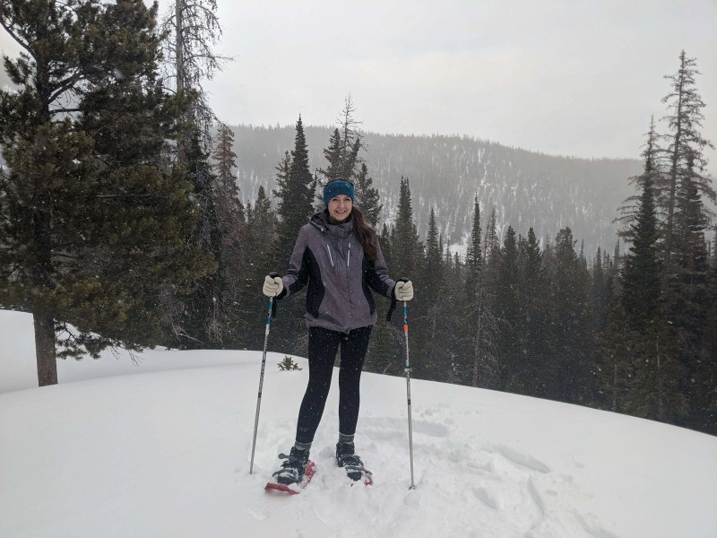

Aerial imagery has stopped being a flashy extra and become a sales tool. Detroit Regional Partnership (DRP) uses it to identify and present industrial land across an 11-county region, and it has turned the drone into one more part of the investment-attraction process. That area is led by Julia Pilarski, the organisation's Project Manager of Real Estate & GIS and a pilot certified under the FAA's Part 107.

Her work consists of locating industrial properties, maintaining the Verified Industrial Properties (VIP) portal and coordinating aerial operations. In practice, that means translating flight and mapping into something an investor can understand and compare.

## Why the aerial view with drones changes the decision

Pilarski sums up the argument without embellishment: an aerial image lets people **visualise** the site. During the pandemic, when moving domestic and international buyers to visit a plot in person became far harder, that capability went from convenience to necessity.

The problem it solves is concrete. Someone weighing a large investment is not satisfied with data points on a map or a spreadsheet: they want to see the property and picture what could happen there. Offering drone video, overlaying the plot's data on the aerial image or placing a 3D model on top adds the layer that was previously missing. The result is that a site selector in another state or another country can form a much more accurate idea of the location before travelling, a factor the manager places within the competition to attract industry.

## The technical challenge: from footage to usable data

Turning raw material into actionable information is not automatic. According to Pilarski, much of the difficulty lies in capturing and editing the image so that both the site and the data stay **accurate and understandable** at once.

Industrial properties tend to be large, so a single, complete shot of the land is not always possible. From there, the work is not only about stitching the footage together so that plot boundaries or the location of infrastructure are correctly represented, but also about presenting the whole without letting the viewer get lost among data and references.

## The pipeline: high-school students flying real missions

The VIP x CODE313 programme is the training side of this strategy. CODE313 students do not do lab exercises: they **fly real missions** for DRP and capture the aerial material of industrial areas and assets that is later used in the organisation's promotion.

The curriculum goes beyond flying and earning the Part 107 licence. Participants study aerodynamics, flight geometry, GIS and applicable software, so they come away with a set of technical skills, not just a credential. For Pilarski, a high-school student earning their Part 107 is notable in itself; what really weighs is what comes next: building a real portfolio, working with a client instead of a hypothetical assignment and gaining access to opportunities that people their age are usually shut out of.

That approach fits the idea that the drone is an entry point. A young person can start with the licence and flying and later branch out into GIS, LiDAR, IT, software, manufacturing, real estate or logistics. Part 107 itself provides a base of knowledge that applies across sectors, which makes it possible to combine flying skill with any other professional interest.

Detroit and the state of Michigan have chosen to treat drones and advanced air mobility as an economic opportunity, not just an emerging technology. Governor Gretchen Whitmer signed an executive directive creating the Michigan Advanced Air Mobility Initiative, and the city has the Advanced Aerial Innovation Region, an urban corridor for testing drones in a real environment. The regulatory framework, by contrast, is not moving at the same pace: in the United States, [drone delivery regulation is still in the courts](/en/news/drones/states-sue-faa-drone-delivery/), with fifteen states facing the FAA over the environmental approval of commercial operations. The question Pilarski leaves open is not which drone will fly tomorrow, but when integration stops being exceptional and becomes a normal part of operations.
