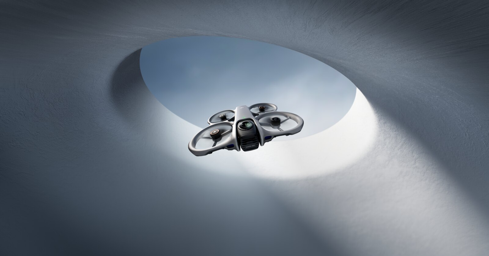

The DJI Avata 360 weighs 455 grams and shoots in 360 degrees, but it has no manual or acro mode. FPV pilot Kai Vertigoh, whose YouTube channel has 260,000 subscribers, published a test on September 28 in which he puts it through five jobs he normally splits across several aircraft: a camera drone for someone flying for the first time, an autonomous follow drone, a dual-operator rig, close-proximity FPV and a chase camera for drift karts. His conclusion is that, for most buyers, the Avata 360 can replace more than one drone. His own analysis also marks the limit: to learn FPV, an aircraft that does not fly acro is no use.

## What the Avata 360 is and how it flies

The Avata 360 is DJI's flagship 360 drone. It weighs 455 grams at takeoff, measures 246 × 199 × 55.5 mm and sits in the European C1 class. It carries two square 1/1.1-inch sensors with 64 effective megapixels each and a 200-degree lens that combine into a single 8K HDR spherical video at 60 frames per second, plus photos of up to 120 megapixels. The prop guards are built into the airframe.

On the flight side, DJI lists omnidirectional detection with a forward-facing LiDAR and a downward infrared sensor, O4+ transmission, about 23 minutes of flight time, a 13.5 km maximum flight distance and level 5 wind resistance (10.7 m/s). Internal storage is 42 GB. There are two working modes: 360-degree capture and single-lens.

Control is handled by the DJI Goggles 3 or N3 paired with the DJI RC Motion 3 or the FPV Remote Controller 3, although single-lens mode also accepts the RC 2, RC-N2 and RC-N3 controllers. There is no manual or acro mode: the fastest mode, Sport, reaches 18 m/s (about 40 mph) and switches off obstacle avoidance.

## What it does well: tracking a subject and shooting 360

Vertigoh's case for an aircraft without acro rests on its tracking software. ActiveTrack 360 and the mode DJI calls Spotlight Free let a single pilot steer the flight while the aircraft keeps the subject framed. The pilot compares it to a dual-operator Inspire 3, which he puts at about $16,000. Spotlight Free is the feature he singles out: the drone flies in any direction while the screen keeps an indicator on the marked subject, so he can swing back to it like a beacon. In his video he acknowledges that it sounded good on paper and that it won him over in the air.

360 capture also changes follow shots. The drone can fly nose-first, leaning on its forward-facing LiDAR, while recording a rider behind it, so the subject appears in the footage without the aircraft having to fly backward. A single-camera follow drone has to fly backward to film a rider's face, and Vertigoh notes that some he has used bumped into things doing it. At Battle Aero, the drift-kart builder run by a friend of his, the Avata 360 simply hovered and logged the passes, and the exported clips came out already framed.

The crew also tested the entry barrier. A friend who had never flown a drone learned the stick inputs in a few minutes and flew the pass while Vertigoh backflipped over the prop-guarded aircraft. Shooting 8K at 60 fps let them slow the flip to 40% speed on a 24 fps timeline.

## The limits: no acro, a split-up 8K and a closed ecosystem

Vertigoh ranks the Avata 360 behind the best FPV drone and the best camera drone. Its 8K image is spread across two lenses —roughly 4K each by his count— and behind a fixed ultra-wide field of view; anything beyond automatic tracking needs keyframing in DJI Studio afterward. For image quality, he points to single-lens drones such as the Mini 5 Pro, the Air 3S or the Mavic 4.

On top of that is the absence of a manual or acro mode: the Avata 360 does not compete on speed with 5-inch quads, which by the pilot's account sit around 100 mph (about 160 km/h) against the 18 m/s of Sport mode. And Sport switches off obstacle avoidance, which is how the golden-hour kart chase was flown. Asked whether it is the best follow drone, his answer is "possibly."

The video does not compare the Avata 360 with the Avata 2. Jeven Dovey did that in April, and DroneXL's report on that back-to-back shootout found that the 360's obstacle avoidance made FPV footage stutter, while the 377-gram Avata 2 felt far sharper on the motion controller.

## Who is it for?

The Avata 360 competes in the same category as the [Antigravity A1, the first consumer drone with a built-in 360 camera](/en/news/drones/antigravity-a1-360-drone/). Against it, DJI accepts conventional controllers in single-lens mode, in addition to the goggle-and-motion-controller ecosystem, and it arrives with the brand's support and accessory network. In the United States the choice is narrower: the FCC authorized the drone in November 2025 and months later DJI was added to the covered list, so DroneXL describes it as probably the last new drone from the brand buyers there can get.

DroneXL itself sums it up as "a follow camera with prop guards, and a very good one." Its value lies in filming yourself while flying forward and in deciding the framing afterward, not in being the fastest drone or the one with the best image. For a creator who wants aerial 360 without mounting an external camera, it may be enough; for anyone who wants to learn FPV, a drone that does not fly acro does not teach. Is it worth it? As a generalist replacement it convinces most buyers, according to this test; as an FPV drone, it does not.
