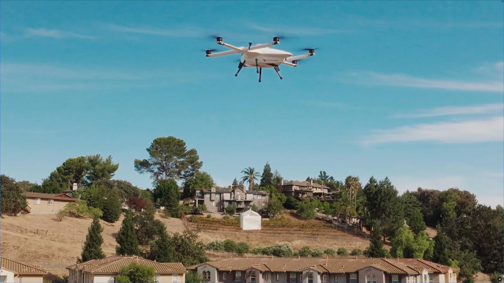
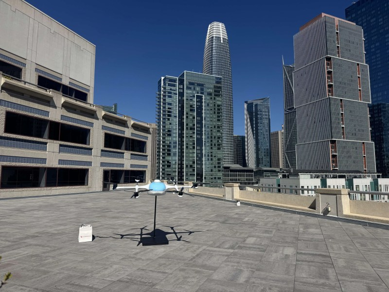

DoorDash has stopped leasing the sky from others. At its annual product event, the company unveiled DoorDash Air, its own drone delivery system, covering the aircraft, the ground infrastructure and the software that assigns orders. Until now the platform relied on outside operators such as Wing and Flytrex; from now on it will also fly its own hardware.

The first pilot will be in Northern California, in the East Bay area, "in the coming months," with no specific city or date. Early partners include Chipotle Mexican Grill, Popeyes Louisiana Kitchen and the local restaurant Momo N Curry.

## From partners to DoorDash Air: aerial delivery goes in-house

DoorDash has spent years testing air delivery with third parties: it worked with Wing — the drone delivery arm associated with Google — and with Flytrex in the Dallas-Fort Worth area. What is new is the degree of control. The company obtained its FAA Part 135 air carrier certificate on July 29, and it now adds its own aircraft, infrastructure and software.

The company insists the partners are not going away. A spokesperson, Eli Scheinholtz, told FreightWaves that Wing and Flytrex will keep flying for DoorDash, and that having more than one aircraft option makes the network more resilient. Harrison Shih, head of DoorDash Air, framed the goal this way: any local business should be able to reach its customers by air.

## Six rotors, a winch and under five minutes

The drone is a multirotor with six propellers mounted at the ends of two cross booms and a pointed white fuselage. DoorDash says it spins the propellers slowly and separates them from the structural arms to reduce vibration and noise. The comparison the company offers is that, at delivery altitude, it sounds like a passing car; it does not publish the decibel level or the exact altitude of that measurement.

The order is not delivered by landing, but with a winch: the drone stays in the air and lowers the bag to the agreed spot, whether that is a backyard, a driveway or a designated area. DoorDash says the system includes several failsafe mechanisms and that, in rare situations, it can lower the aircraft itself to the ground in a controlled way.

The time figure DoorDash gave in initial tests is under five minutes on average from the restaurant to the customer's door. It is a test figure, based on limited distance and size samples, not a promise for every order.

## The figures DoorDash is not publishing

DoorDash says about 80% of typical restaurant orders on its platform are light and small enough for the drone to carry. It is the company's own estimate, drawn from its order history, and it does not mean eight out of ten orders will be able to fly: weather, range, distance and the contents of each order all weigh on the decision.

The problem for anyone who wants to plan — and for anyone living under the route — is that the company has published no hard capacity figure. There is no payload weight, no range, no cruise speed and no maximum takeoff weight. Only a percentage about its own business. For comparison, in Wing's delivery in Matthews, North Carolina, Lowe's customers fly with a limit of about 2.5 pounds, roughly 1.1 kg per flight: a number anyone can use to decide what to order.

## Built in San Francisco and what changes for the business

The drones are assembled in San Francisco and, according to Shih, use mostly domestically sourced parts, as part of a long-term commitment to local manufacturing. The aircraft does not live on restaurant rooftops, but in nearby "nests" where it recharges and stands by.

The least visible part is perhaps the most decisive. Orders are not dispatched from a separate app: the drone feeds into the same Autonomous Delivery Platform (ADP) that already decides when a human Dasher goes and when the sidewalk robot Dot does. The algorithm weighs weather, flight range and traffic before sending an order by air. The restaurant receives the order on its usual tablet, packs it and leaves the bag on a smart scale or drop station; because DoorDash controls the order data, the system knows when it is ready and times the drone's arrival to the moment of packaging.

DoorDash makes clear this does not replace human couriers, who will keep handling the vast majority of orders. The ambition is a network in which drones, robots and people cover whatever suits each of them best. Next to the race among consumer drones, such as the [Antigravity A1 with its 360 camera](https://www.techspain24.com/en/news/drones/antigravity-a1-360-drone/), the business here is not image quality but how much each delivery costs and how much coverage it adds. And that, today, DoorDash does not put a number on.
